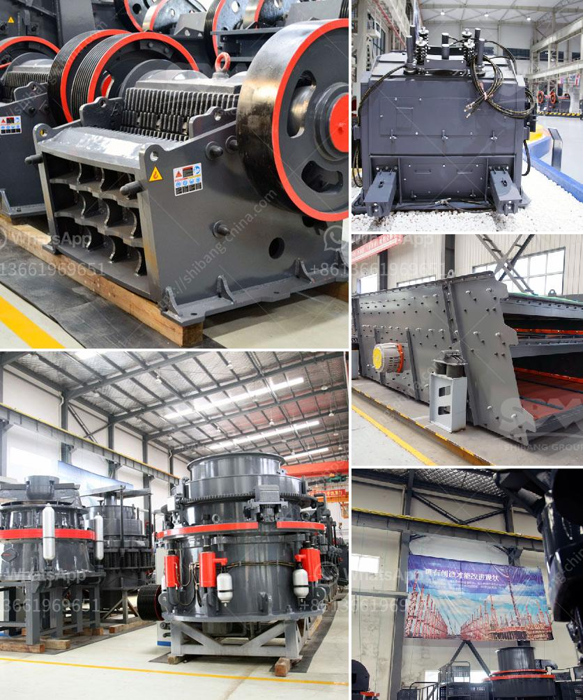

<h3>How to change the toggle plate and toggle seat in a jaw crusher?</h3>
The toggle plate is a crucial structural component in a jaw crusher, supporting the moving jaw and transmitting the crushing force to the pitman. It is often overlooked when it comes to regular maintenance and wear management of the crusher. However, proper maintenance of the toggle plate and toggle seat can significantly extend the service life of the jaw crusher.

To change the toggle plate, the first step is to loosen the nuts that hold it in place. This can be done using a socket wrench on the side of the crusher or by using hydraulic equipment to lift the toggle plate. Once the toggle plate has been removed, inspect it for any signs of wear or damage. If necessary, replace the toggle plate with a new one.

The next step is to remove the toggle seat from the toggle plate. The toggle seat is a temporary support in the toggle plate, which is used to transmit the crushing force from the pitman to the toggle plate. However, over time, the toggle seat can become worn, loose, or even break. To remove the toggle seat, you will need to remove the toggle plate first.

Once the toggle seat has been removed, inspect it for any signs of wear or damage. If necessary, replace the toggle seat with a new one. It is essential to ensure that the new toggle seat is properly aligned and securely fastened to the toggle plate. Failure to do so may result in excessive wear or even failure of the toggle seat.

To install the new toggle seat, reverse the steps used to remove the old one. Place the toggle seat onto the toggle plate, align it properly, and tighten the bolts or screws that secure it. Again, it is crucial to ensure that the toggle seat is securely fastened to the toggle plate to prevent any operational issues.

Regular maintenance and inspection of the toggle plate and toggle seat is necessary to ensure the efficient operation of the jaw crusher. This includes checking for any signs of wear or damage, as well as regularly lubricating the toggle plate and toggle seat. Adequate lubrication is essential to reduce friction and prevent premature wear of the components.

In conclusion, the toggle plate and toggle seat are essential components in a jaw crusher, responsible for supporting the moving jaw and transmitting the crushing force. Regular maintenance, inspection, and replacement of these components are necessary to ensure the efficient and reliable operation of the crusher. By following the steps outlined above, you can change the toggle plate and toggle seat in a jaw crusher, extending its service life and optimizing its performance.
<h3>Contact us</h3><ul><li><strong>Whatsapp:&nbsp;<a href="https://wa.me/8613661969651">+8613661969651</a></strong></li><li><a href="https://swt.shibang-china.com/?git&amp;zhl&amp;How to change the toggle plate and toggle seat in a jaw crusher"><strong>Online Service(chat now)</strong></a></li></ul><h3>Related</h3><ul><li><a href='How to setting up of stone crusher unit in maharashtra and order there of .md'>How to setting up of stone crusher unit in maharashtra and order there of ?</a></li><li><a href='how to wash stone chippings ？.md'>how to wash stone chippings ？</a></li><li><a href='How to set up a limestone processing plant.md'>How to set up a limestone processing plant?</a></li><li><a href='How do belt conveyors work.md'>How do belt conveyors work?</a></li><li><a href='How to select a reversible hammer crusher as a coal crusher.md'>How to select a reversible hammer crusher as a coal crusher?</a></li></ul>