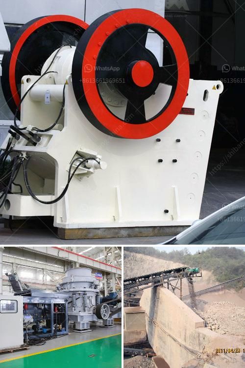

<h3>How to choose a basalt crusher？</h3>
Basalt is a common extrusive volcanic rock that is formed by the rapid cooling of basaltic lava exposed at or very near the surface of the earth. Basalt is popular in construction due to its durability, strength, and natural beauty. When it comes to choosing a basalt crusher for your project, there are several factors to consider to ensure you select the right machine for your needs. In this article, we will discuss the key points to help you make an informed decision.

Before you begin your search for a basalt crusher, it is essential to define the purpose for which you need it. Basalt crushers are used in various industries, including mining, construction, road building, metallurgy, and more. Understanding the specific requirements of your project will help you narrow down the options and select the most suitable crusher.

The crushing capacity of the crusher is an important factor to consider. It determines how efficiently the crusher can process the desired material. If you have a large project with high production demands, you need to choose a crusher that can handle high volumes effectively. On the other hand, if your project is smaller, a crusher with lower capacity may be sufficient and cost-effective.

Efficiency is crucial to ensure that your crusher can process the material effectively while minimizing energy consumption. Look for a basalt crusher that offers a high reduction ratio, which means it can effectively reduce the size of the material. This will result in better overall crushing performance and improved productivity.

Crushers require regular maintenance to ensure optimal performance and longevity. It is essential to choose a crusher that is easy to maintain and offers convenient access to its key components. Additionally, consider the operating costs associated with the crusher, such as power consumption and wear parts. Opting for a crusher with lower operating costs can help save expenses in the long run.

Versatility is crucial if you plan to use the crusher for multiple applications. A versatile basalt crusher will be able to handle various types of materials and adjust to different settings. This flexibility allows you to use the crusher in different projects without the need for purchasing additional equipment.

Safety is paramount in any project, and your crusher should comply with the relevant safety standards. Look for safety features such as emergency stops, protective guards, and proper ventilation systems. These features will ensure the safety of your operators and the surrounding environment.

In conclusion, choosing the right basalt crusher is essential for the success of your project. Consider the purpose, crushing capacity, efficiency, maintenance costs, versatility, and safety features of the crusher. By evaluating these factors, you can make an informed decision and select a crusher that best fits your specific requirements. Remember to consult with industry experts or equipment manufacturers to get expert advice and guidance.
<h3>Contact us</h3><ul><li><strong>Whatsapp:&nbsp;<a href="https://wa.me/8613661969651">+8613661969651</a></strong></li><li><a href="https://swt.shibang-china.com/?git&amp;zhl&amp;How to choose a basalt crusher？"><strong>Online Service(chat now)</strong></a></li></ul><h3>Related</h3><ul><li><a href='How to get a sandmaking mini machine.md'>How to get a sand-making mini machine?</a></li><li><a href='How to improve the output of stone crushing plant .md'>How to improve the output of stone crushing plant ?</a></li><li><a href='how the mine crusher operate .md'>how the mine crusher operate ?</a></li><li><a href='How to install a secondary crusher.md'>How to install a secondary crusher?</a></li><li><a href='how to choose mobile jaw crusher machinery ？.md'>how to choose mobile jaw crusher machinery ？</a></li></ul>