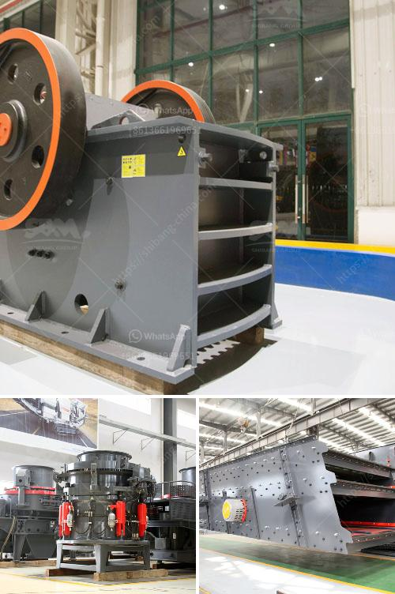

<h3>How to choose a cone crusher equipment manufacturer ?</h3>
When it comes to choosing a cone crusher equipment manufacturer, there are numerous factors that need to be considered. In this article, we will discuss the essential criteria for selecting the right manufacturer for your cone crusher equipment needs.

Firstly, it is important to evaluate the reputation of the manufacturer. Look for a company that has a good track record in producing high-quality cone crushers. You can start by checking online reviews, customer testimonials, and industry feedback. A reputable manufacturer will have a strong reputation and positive feedback from satisfied customers.

Secondly, consider the experience and expertise of the manufacturer. Look for a company that has been in the industry for several years and has extensive experience in manufacturing cone crusher equipment. A manufacturer with a long history usually indicates that they have been able to consistently deliver reliable and efficient equipment.

In addition, it is important to consider the technological capabilities of the manufacturer. Look for a company that invests in research and development to continuously improve their cone crushers. Top manufacturers often incorporate advanced technologies into their equipment to enhance performance, efficiency, and safety. It is also worth considering if the manufacturer offers customization options to meet your specific requirements.

Furthermore, it is crucial to assess the manufacturer's after-sales service and support. A reliable manufacturer should provide comprehensive technical support, including installation guidance, operation training, and maintenance services. This will ensure that you receive assistance whenever you encounter any issues with the cone crusher equipment. Additionally, it is advantageous to choose a manufacturer that offers a warranty for their equipment as it demonstrates their confidence in the quality and durability of their products.

Price is another important factor to consider. While it may be tempting to opt for the cheapest option, it is crucial to carefully evaluate the overall value for money. Consider the initial investment, as well as long-term costs such as maintenance and spare parts. A cone crusher equipment that is priced too low may indicate lower quality or lack of necessary features.

Lastly, it is beneficial to consider the manufacturer's network and availability. Look for a manufacturer that has a wide distribution network and sufficient stock of spare parts to ensure timely delivery and availability. This will help avoid unnecessary downtime and delays in case any replacement parts are needed.

In conclusion, choosing the right cone crusher equipment manufacturer requires careful evaluation of reputation, experience, technological capabilities, after-sales service, price, and availability. By considering these factors, you can ensure that you select a manufacturer that will provide reliable and efficient cone crusher equipment to meet your specific needs.
<h3>Contact us</h3><ul><li><strong>Whatsapp:&nbsp;<a href="https://wa.me/8613661969651">+8613661969651</a></strong></li><li><a href="https://swt.shibang-china.com/?git&amp;zhl&amp;How to choose a cone crusher equipment manufacturer "><strong>Online Service(chat now)</strong></a></li></ul><h3>Related</h3><ul><li><a href='How to extract copper from tailings.md'>How to extract copper from tailings?</a></li><li><a href='How to operate a coal crusher machine.md'>How to operate a coal crusher machine?</a></li><li><a href='How to remove pyrite stones from coal.md'>How to remove pyrite stones from coal?</a></li><li><a href='How is the cone crusher working.md'>How is the cone crusher working?</a></li><li><a href='How does a spring cone crusher work.md'>How does a spring cone crusher work?</a></li></ul>