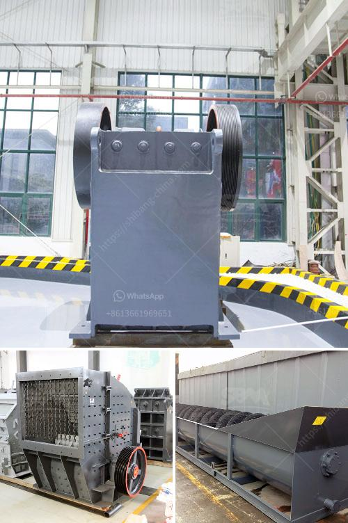

<h3>How to choose a crusher for crushing rock?</h3>
When it comes to crushing rock, the options can seem overwhelming. There are hundreds of different types of crushers in the market today, each with its own specifications and unique features. To ensure that you choose a crusher that is suitable for your specific needs, it is important to consider certain factors. In this article, we will discuss some key points to help you make an informed decision when choosing a crusher for crushing rock.

First and foremost, you need to determine the type of rock you will be crushing. Different rocks have different hardness levels and characteristics, which ultimately affect the choice of crusher. For instance, jaw crushers are ideal for crushing hard and abrasive materials, while impact crushers are suitable for softer rocks. Therefore, identifying the type of rock will help narrow down your options and ensure that you choose a crusher that is capable of efficiently handling the material.

Next, you need to consider the required output size. Jaw crushers, cone crushers, and gyratory crushers are commonly used to reduce the size of rocks to the desired size. However, each type of crusher has its own limitations. For instance, jaw crushers are designed to produce a maximum feed size of 800mm, whereas cone crushers can accept feed sizes of up to 300mm. Therefore, you need to carefully assess your production requirements and select a crusher that can deliver the desired output size.

Additionally, it is crucial to evaluate the operating costs associated with the crusher. The initial cost of the machine is one aspect to consider, but it is equally important to analyze the long-term expenses. Factors such as energy consumption, maintenance requirements, and spare parts availability can significantly impact the overall cost. To make an informed decision, you should research the market and compare the operating costs of different crushers.

Furthermore, it is advisable to select a crusher that is durable and reliable. Crushing rocks can be a demanding task, and the chosen crusher should be capable of withstanding high levels of stress and heavy usage. Look for a crusher that is constructed with high-quality materials and has a robust design. Reading customer reviews and seeking recommendations from industry professionals can help identify reliable crusher manufacturers.

Lastly, consider the versatility and adaptability of the crusher. As your business grows and requirements change, having a crusher that can accommodate various types of rocks and adjust to different settings can be highly beneficial. Look for crushers with adjustable settings and diverse applications to ensure maximum flexibility.

In conclusion, choosing the right crusher for crushing rock can be a complex task. It requires careful consideration of factors such as rock type, desired output size, operating costs, durability, and versatility. By carefully evaluating these aspects and conducting thorough research, you can make an informed decision and select a crusher that will effectively meet your crushing needs.
<h3>Contact us</h3><ul><li><strong>Whatsapp:&nbsp;<a href="https://wa.me/8613661969651">+8613661969651</a></strong></li><li><a href="https://swt.shibang-china.com/?git&amp;zhl&amp;How to choose a crusher for crushing rock"><strong>Online Service(chat now)</strong></a></li></ul><h3>Related</h3><ul><li><a href='how to choose a jaw crusher malaysia.md'>how to choose a jaw crusher malaysia?</a></li><li><a href='How to choose a cone crusher equipment manufacturer .md'>How to choose a cone crusher equipment manufacturer ?</a></li><li><a href='How to install ore jaw crusher.md'>How to install ore jaw crusher?</a></li><li><a href='How to plan to build a rock crusher production line.md'>How to plan to build a rock crusher production line?</a></li><li><a href='How to balance a cement mill separator.md'>How to balance a cement mill separator?</a></li></ul>