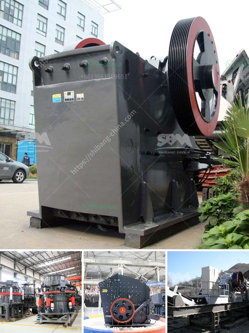

<h3>How to choose a generator for a crusher plant ?</h3>
When operating a crusher plant, it is crucial to have a reliable power source that helps ensure uninterrupted operation. A generator plays a vital role in providing the necessary electrical power to keep the machinery running efficiently. Choosing the right generator for your crusher plant is essential to maximize productivity and minimize disruptions. Here are a few factors to consider when selecting a generator for your crusher plant:

The first step in choosing a generator for your crusher plant is assessing your power requirements. Consider the total power consumption of all the machinery in your plant to determine the minimum power capacity required. It is advisable to consult an electrical engineer or generator specialist to accurately determine the power demand and avoid purchasing an undersized or oversized generator.

Generators can be powered by different fuels, including diesel, natural gas, propane, and gasoline. Each fuel type has its advantages and drawbacks. Diesel generators are the most commonly used in crusher plants due to their high energy density, durability, and fuel efficiency. However, availability and cost of fuel should also be considered while selecting the fuel type for your generator.

Noise pollution is a significant concern in industrial settings. Generator noise can affect worker productivity, cause discomfort, and disrupt communication. To ensure a pleasant and safe working environment, choose a generator with a low noise level. Some generators are designed with sound-dampening materials and mufflers to reduce noise emission. Check the noise levels specified by the manufacturer before making a decision.

In today's environmentally conscious world, it is essential to consider the emissions and environmental impact of your generator. Diesel generators are known for their high emissions, so it is crucial to select generators equipped with emission control systems to comply with local regulations. Some generator models are designed with advanced technologies to minimize emissions, making them an eco-friendly choice.

Regular maintenance is crucial to ensure the longevity and efficient operation of your generator. Choose a generator with accessible and easily replaceable parts for quick and hassle-free maintenance. Opt for a brand or model that offers excellent customer support and has an easily accessible service network. Proper maintenance will help prevent unexpected breakdowns and ensure uninterrupted power supply to your crusher plant.

Consider the portability and installation requirements of the generator. If your crusher plant operates at multiple sites, a portable generator might be ideal. Portable generators are compact, easy to transport, and can be quickly set up at different locations. However, if your crusher plant is stationary, a fixed or standby generator might be a more suitable option.

In conclusion, choosing a generator for your crusher plant involves careful consideration of several factors, such as power requirements, fuel type, noise levels, emissions compliance, maintenance needs, and installation requirements. It is essential to consult with experts and consider the specific needs of your crusher plant before making a decision. A well-selected generator will provide reliable power, minimize downtime, and contribute to the overall productivity of your crusher plant.
<h3>Contact us</h3><ul><li><strong>Whatsapp:&nbsp;<a href="https://wa.me/8613661969651">+8613661969651</a></strong></li><li><a href="https://swt.shibang-china.com/?git&amp;zhl&amp;How to choose a generator for a crusher plant "><strong>Online Service(chat now)</strong></a></li></ul><h3>Related</h3><ul><li><a href='How to overhaul a jaw crusher.md'>How to overhaul a jaw crusher?</a></li><li><a href='how to set up stone crusher unit ？.md'>how to set up stone crusher unit ？</a></li><li><a href='How to plan to build a rock crusher production line.md'>How to plan to build a rock crusher production line?</a></li><li><a href='How to make sand from rocks.md'>How to make sand from rocks?</a></li><li><a href='How to choose the useful sand making machine.md'>How to choose the useful sand making machine?</a></li></ul>