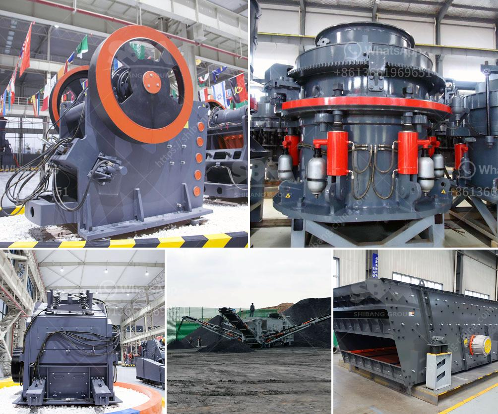

<h3>How to choose a high-technology and correct mine sand washing machine?</h3>
The mining industry heavily relies on sand washing machines to efficiently clean and separate sand particles, which are essential in various processes such as building construction, concrete production, and ore beneficiation. With the constant advancements in technology, it is crucial to choose a high-technology and correct mine sand washing machine to ensure optimal performance and productivity. Here are some key considerations to keep in mind when selecting the right equipment.

1. Determine your requirements: Before exploring the options available in the market, clearly define your requirements. Consider the type and quantity of materials you will be processing, the desired output, and the specific features you need. This will help narrow down your choices and ensure that you select a sand washing machine that is most suitable for your mine's needs.

2. Look for advanced technology: High-technology sand washing machines come with a range of innovative features that enhance efficiency and performance. Look for equipment that incorporates advanced technologies such as intelligent control systems, automated operations, and energy-saving mechanisms. These features not only improve productivity but also reduce maintenance requirements and operating costs in the long run.

3. Consider the capacity: The capacity of a mine sand washing machine is a critical aspect to consider. It determines the amount of sand that can be processed within a given time frame. Ensure that you choose a machine with a capacity that matches your production requirements. Opting for an undersized or oversized machine can result in inefficiency, increased operational costs, and potential damage to the equipment.

4. Evaluate the cleaning and separating efficiency: The primary purpose of a sand washing machine is to effectively clean and separate sand particles of different sizes and densities. Identify the efficiency of the equipment in terms of removing impurities, such as clay, silt, and organic matters, as well as the degree of sand grading achieved. A high-efficiency machine will ensure that the sand meets the desired quality standards and reduces the need for additional processing steps.

5. Assess durability and maintenance requirements: To maximize the lifespan of your sand washing machine, it is essential to choose a durable and reliable model. Consider the materials used in its construction, as well as the quality of its components and parts. Additionally, inquire about the recommended maintenance procedures and the availability of spare parts and technical support. A machine that requires frequent repairs or lacks proper support can significantly impact your productivity and overall operational costs.

6. Seek reputable suppliers: When investing in a mine sand washing machine, opt for well-established and reputable suppliers. Research their track record in the market, read customer reviews, and request references. A reliable supplier will offer comprehensive after-sales support, including installation, training, and ongoing technical assistance.

In conclusion, selecting a high-technology and correct mine sand washing machine is crucial for achieving efficient and effective sand processing in the mining industry. By considering factors such as capacity, advanced technology, cleaning and separating efficiency, durability, and reputable suppliers, you can make an informed decision that aligns with your specific mine requirements.
<h3>Contact us</h3><ul><li><strong>Whatsapp:&nbsp;<a href="https://wa.me/8613661969651">+8613661969651</a></strong></li><li><a href="https://swt.shibang-china.com/?git&amp;zhl&amp;How to choose a hightechnology and correct mine sand washing machine"><strong>Online Service(chat now)</strong></a></li></ul><h3>Related</h3><ul><li><a href='How to fit a jaw crusher flywheel.md'>How to fit a jaw crusher flywheel?</a></li><li><a href='How to reduce vibration in a jaw crusher.md'>How to reduce vibration in a jaw crusher?</a></li><li><a href='How to build granite crusher machine Australia.md'>How to build granite crusher machine Australia?</a></li><li><a href='how to  granite rocks in double toggle jaw crusher.md'>how to  granite rocks in double toggle jaw crusher</a></li><li><a href='how to improve the jaw crusher working efficiency？.md'>how to improve the jaw crusher working efficiency？</a></li></ul>