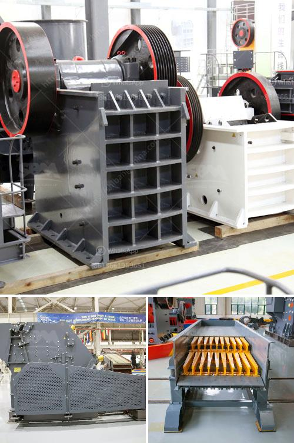

<h3>How to choose a jaw crusher?</h3>
A jaw crusher is a crucial piece of machinery for your construction or mining project. It helps in breaking down big rocks into manageable sizes, making them easier for transportation and further processing. However, choosing the right jaw crusher can be a challenging task, as there are numerous factors you need to consider.

1. Determine your needs: Before you start looking for a jaw crusher, you must first determine the specific requirements for the machine. What will be the maximum size of the rocks you need to crush? What is the required output size? How much capacity do you need? Answering these questions will give you a clear idea of the type and size of jaw crusher you need.

2. Consider the raw materials: The type of material you intend to crush is another crucial factor in selecting the jaw crusher. Different materials have varying resistance levels, hardness, and abrasiveness. For instance, granite is a hard and abrasive material, and a jaw crusher designed for crushing hard and abrasive materials should be chosen.

3. Maintenance requirements: In order to ensure the crusher operates as efficiently as possible, regular maintenance and servicing is essential. Consider the maintenance requirements of the jaw crusher before buying. Are there easy-to-reach parts that can be easily replaced? How often should the machine be serviced? Make sure you have a clear understanding of the maintenance needs to avoid any unexpected surprises.

4. Size and portability: The size and weight of the jaw crusher will have a significant impact on its performance and overall efficiency. Weighing more than 80 tons, the jaw crusher will require a considerable amount of space. Also, it is essential to ensure the crusher can be transported effortlessly and easily.

5. Budget: A jaw crusher’s price is not fixed, given the different types and models available on the market. Aim to get quotes from at least three manufacturers to give yourself a range of prices to compare. But keep in mind that the cheapest option may not always be the best in terms of quality and performance. Don't compromise on the quality for the sake of saving a few bucks.

6. Read customer reviews: Customer reviews and testimonials can provide valuable insights into the performance and reliability of a jaw crusher. Look for feedback from individuals or companies that have already used the model or brand you are considering. This will give you an idea of the pros and cons of that particular crusher.

In conclusion, choosing the right jaw crusher for your construction or mining project is crucial for maximizing efficiency and output. Consider your needs, materials, maintenance requirements, size/portability, budget, and customer reviews before making a final decision. By taking the time to do thorough research, you can ensure you invest in a jaw crusher that will serve your needs effectively for years to come.
<h3>Contact us</h3><ul><li><strong>Whatsapp:&nbsp;<a href="https://wa.me/8613661969651">+8613661969651</a></strong></li><li><a href="https://swt.shibang-china.com/?git&amp;zhl&amp;How to choose a jaw crusher"><strong>Online Service(chat now)</strong></a></li></ul><h3>Related</h3><ul><li><a href='How to separate iron from manganese.md'>How to separate iron from manganese?</a></li><li><a href='how does a stone crushing quarry work .md'>how does a stone crushing quarry work ?</a></li><li><a href='how to increase the amplitude of vibrating screen ？.md'>how to increase the amplitude of vibrating screen ？</a></li><li><a href='How to analyze the critical frequency of a vibrating screen.md'>How to analyze the critical frequency of a vibrating screen?</a></li><li><a href='How to make talcum powder.md'>How to make talcum powder?</a></li></ul>