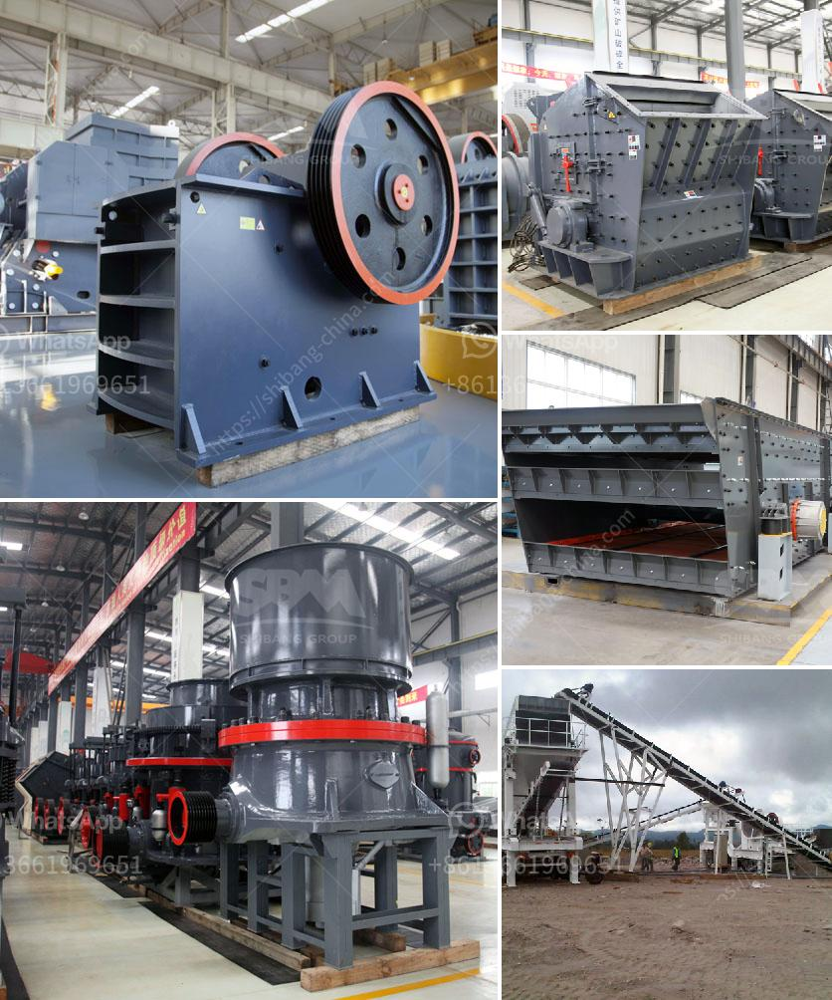

<h3>How to choose a limestone hammer mill ？</h3>
Limestone is a sedimentary rock commonly used in building materials and industrial raw materials. With its wide distribution and hard texture, limestone has been widely used in various fields. To effectively process limestone, a hammer mill is often used. A hammer mill is a machine used to crush or shred materials into smaller pieces, often resembling gravels. When it comes to choosing a limestone hammer mill, several factors need to be considered to ensure the equipment's efficiency and suitability for the application. In this article, we will discuss some key aspects that need to be taken into account when choosing a limestone hammer mill.

Firstly, it is important to evaluate the capacity requirements. The capacity of a hammer mill is determined by factors such as the rotor speed, the size and shape of the hammer, and the screen opening size. It is crucial to choose a hammer mill with a capacity that matches the desired output. If the chosen hammer mill is underpowered for the application, it may result in inefficient operations and reduced productivity. On the other hand, if the chosen hammer mill is overpowered, it may lead to excessive wear and tear, higher energy consumption, and unnecessary expenses.

Secondly, the quality and durability of the hammer mill play a significant role in its performance and lifespan. The hammer mill should be made of high-quality materials that can withstand the abrasive nature of limestone. Look for hammer mills that are constructed with hardened steel hammers and wear-resistant screens. This will ensure that the equipment can withstand the constant pounding and impact forces involved in limestone crushing, and it will also minimize maintenance and replacement costs.

Furthermore, the ease of maintenance and accessibility for repairs should also be considered. Choose a hammer mill that is designed with easy access to critical components such as the hammers, screens, and bearings. This will make it easier to perform routine maintenance, inspections, and repairs, minimizing downtime and increasing productivity.

In addition to the technical aspects, it is also essential to consider the overall cost-effectiveness of the hammer mill. Compare the prices and features of different models available in the market. While it may be tempting to choose the cheapest option, it is crucial to strike a balance between cost and quality. Consider the long-term benefits and potential savings that a high-quality hammer mill can provide in terms of improved productivity, reduced maintenance costs, and extended lifespan.

Lastly, it is advisable to consult with experts or professionals in the field of crushing and grinding equipment. They can provide valuable insights and recommendations based on their experience and expertise. They can help evaluate the specific requirements of the application and suggest suitable hammer mills accordingly, ensuring that the chosen equipment is well-suited to the specific needs.

In conclusion, choosing a limestone hammer mill requires careful consideration of capacity requirements, quality and durability, ease of maintenance, and overall cost-effectiveness. By taking these factors into account and seeking advice from experts, one can make an informed decision and select a hammer mill that will efficiently process limestone and provide long-term value.
<h3>Contact us</h3><ul><li><strong>Whatsapp:&nbsp;<a href="https://wa.me/8613661969651">+8613661969651</a></strong></li><li><a href="https://swt.shibang-china.com/?git&amp;zhl&amp;How to choose a limestone hammer mill ？"><strong>Online Service(chat now)</strong></a></li></ul><h3>Related</h3><ul><li><a href='how jaw crusher working .md'>how jaw crusher working ?</a></li><li><a href='How to change the HP cone crusher mantle.md'>How to change the HP cone crusher mantle?</a></li><li><a href='How is iron ore crushed ready for processing.md'>How is iron ore crushed ready for processing?</a></li><li><a href='How to Build a Marble Mill ？.md'>How to Build a Marble Mill ？</a></li><li><a href='How crusher crushes rock .md'>How crusher crushes rock ?</a></li></ul>