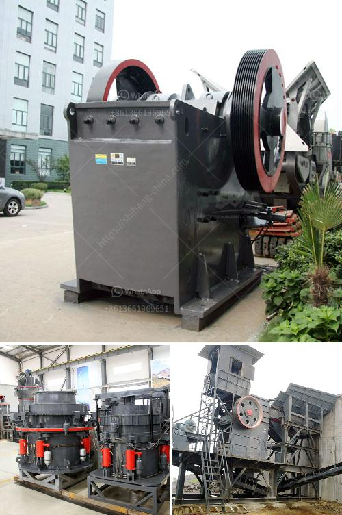

<h3>How to choose a motor for a ball mill?</h3>
Many factors will dictate the type of motor that you choose for a ball mill. Some of these factors include the environment (ambient temperature, humidity, etc.), the amount of load to be moved, and the size and type of the mill. It is important to consider all these factors and choose the right motor that suits your specific needs. Here is a step-by-step guide on how to choose a motor for a ball mill:

1. Calculate the load: Before selecting a motor, the first step is to determine the total load that the motor will be required to move. This includes the mass of the grinding media, the mass of the material to be ground, and any auxiliary equipment such as conveyors or pumps. Accurate load calculations are crucial to ensure that the motor is capable of handling the required workload.

2. Understand the duty cycle: The duty cycle refers to the percentage of time the motor will be running at full load. If the ball mill is a continuous operation, then a consistent run time will be required to ensure that sufficient power is delivered to the grinding media. For a batch operation, a momentary load will be required to ensure that all the ore is ground properly.

3. Consider the environment: The environment in which the motor will be operating is an important factor to consider. Extreme temperatures, excessive dust, or moisture can affect the performance and lifespan of the motor. It is important to choose a motor that is designed to withstand the specific environmental conditions of the ball mill, such as a totally enclosed fan-cooled (TEFC) motor in dusty environments.

4. Determine the required speed and torque: Different mills require different speeds and torques to operate efficiently. The type of ball mill and the required motor power dictate the operating speed and torque. For example, a ball mill that operates at a low speed or with large grinding media requires a high torque motor to ensure optimal performance.

5. Consider energy efficiency: Energy efficiency is an important factor in motor selection. A more energy-efficient motor can help reduce operational costs and contribute to sustainability efforts. Look for motors that meet or exceed energy efficiency standards, such as those certified by organizations like the US Department of Energy's Motor Master+ software.

6. Consult with experts: If you are unsure about any of the factors mentioned above or need further assistance, it is recommended to consult with experts in the field. Motor manufacturers or specialized engineering consultants can provide valuable guidance and help you choose the right motor for your specific ball mill application.

In conclusion, choosing the right motor for a ball mill is a crucial decision that depends on a multitude of factors. By considering the load, duty cycle, environment, required speed and torque, as well as energy efficiency, you can select a suitable motor that will ensure optimal performance and durability. Consulting with experts can also provide additional insights and expertise in making the right choice.
<h3>Contact us</h3><ul><li><strong>Whatsapp:&nbsp;<a href="https://wa.me/8613661969651">+8613661969651</a></strong></li><li><a href="https://swt.shibang-china.com/?git&amp;zhl&amp;How to choose a motor for a ball mill"><strong>Online Service(chat now)</strong></a></li></ul><h3>Related</h3><ul><li><a href='How to build a gravel crusher.md'>How to build a gravel crusher?</a></li><li><a href='How to build a manganese ore concentrator What crushing machinery do you need.md'>How to build a manganese ore concentrator? What crushing machinery do you need?</a></li><li><a href='How to adjust an impactor crusher.md'>How to adjust an impactor crusher?</a></li><li><a href='how to set up screening and crushing plant .md'>how to set up screening and crushing plant ?</a></li><li><a href='How does a crusher work to make different types of sand.md'>How does a crusher work to make different types of sand?</a></li></ul>