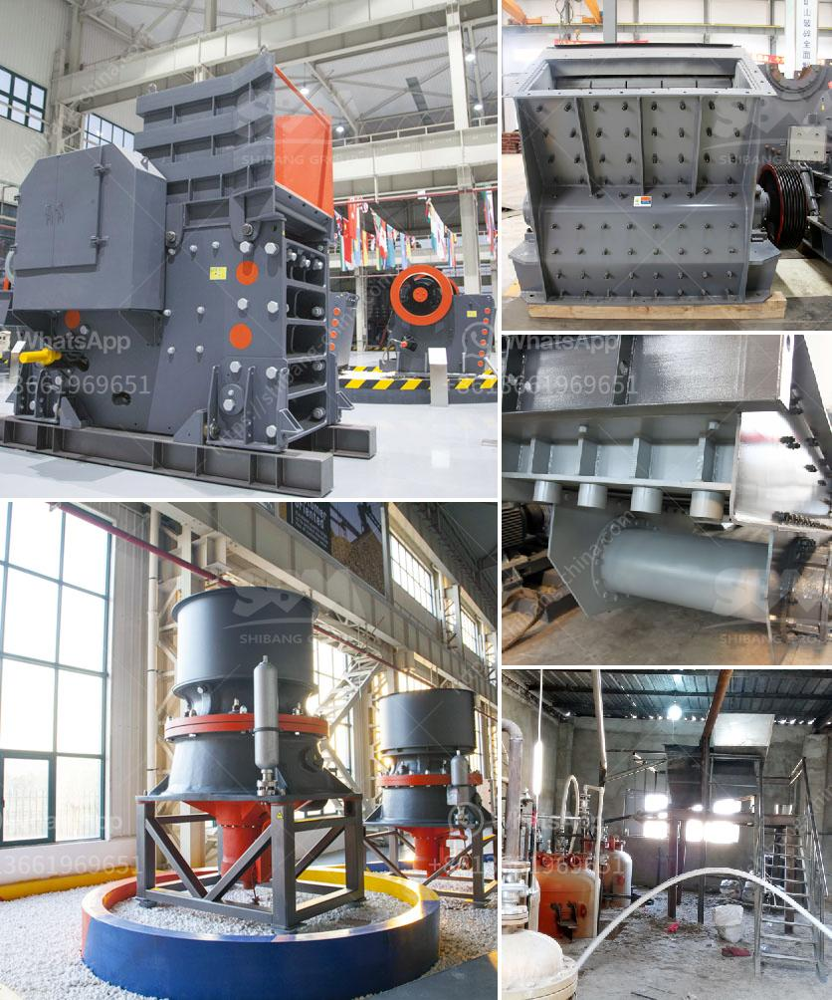

<h3>How to choose a stone grinding machine ？</h3>
When it comes to stone grinding, having the right machine is essential. A stone grinding machine is used to smooth and shape stones, whether they are natural or man-made. Whether you are a professional stone fabricator or a homeowner looking to do some DIY stone polishing, choosing the right machine can make a significant difference in the quality of your finished product. Here are some factors to consider when choosing a stone grinding machine.

The first thing you need to consider is the type of stone you will be working with. Different stones have different hardness levels, which will determine the type of machine you need. For instance, softer stones like marble and limestone require a machine with lower horsepower, while harder stones like granite require a machine with higher horsepower. Make sure to match the machine's power to the hardness of the stone you will be grinding.

The size and weight of the machine are also important factors. You want a machine that is compact and lightweight enough to easily move around and operate. At the same time, it should have a stable base and be sturdy enough to handle the grinding process without shaking or vibrating excessively. Consider the size of the stones you will be working with and make sure the machine can accommodate them comfortably.

The speed and RPM (rotations per minute) of the grinding wheel are crucial in achieving the desired finish on your stone. Higher speeds generally result in a smoother finish, while lower speeds provide more control and precision. Look for a machine that offers variable speed options, allowing you to adjust the RPM to suit your specific needs. This will give you more flexibility in achieving the desired finish for different types of stones.

Consider the grinding wheel options that come with the machine. Different grinding wheels are designed for specific types of stones and finishes. Diamond grinding wheels are commonly used for grinding harder stones like granite, while resin-bonded grinding wheels are suitable for softer stones like marble. Make sure the machine you choose has the appropriate grinding wheel options for the stones you will be working with.

Water is essential in the stone grinding process as it helps cool down the grinding wheel and prevent excessive heat buildup. Look for a machine that has a built-in water supply system or the ability to connect to an external water source. This will ensure that you can work continuously without interruptions and achieve better grinding results.

In conclusion, choosing the right stone grinding machine is crucial for achieving the desired finish on your stones. Consider factors like the type of stone, size and weight of the machine, speed and RPM, grinding wheel options, and water supply. By taking these factors into account, you can select a machine that meets your specific requirements and helps you achieve professional-quality results.
<h3>Contact us</h3><ul><li><strong>Whatsapp:&nbsp;<a href="https://wa.me/8613661969651">+8613661969651</a></strong></li><li><a href="https://swt.shibang-china.com/?git&amp;zhl&amp;How to choose a stone grinding machine ？"><strong>Online Service(chat now)</strong></a></li></ul><h3>Related</h3><ul><li><a href='how limestone is mined in kenya.md'>how limestone is mined in kenya</a></li><li><a href='How to calculate the payback period for a coal mine.md'>How to calculate the payback period for a coal mine?</a></li><li><a href='How to effectively improve the production capacity of the crusher.md'>How to effectively improve the production capacity of the crusher?</a></li><li><a href='Procedures on how to mine nickel ore .md'>Procedures on how to mine nickel ore ?</a></li><li><a href='How do they grind phosphate in a ball mill.md'>How do they grind phosphate in a ball mill?</a></li></ul>