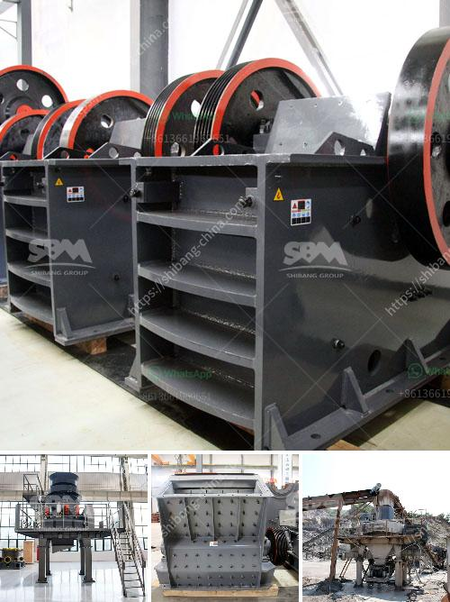

<h3>How to choose a supplier of stone crushers?</h3>
Stone crushers are machines used to crush stones into smaller sizes for various construction purposes. These machines come in different sizes and types, ranging from handheld devices to industrial machines. Choosing the right supplier of stone crushers is crucial since it determines the quality and reliability of the equipment that you purchase.

1. Reputation and Experience: Start by researching and evaluating the reputation and experience of potential suppliers. Look for suppliers that have been in the industry for a considerable amount of time and have a positive track record. Read customer reviews and testimonials to gain insights into their performance, reliability, and customer service.

2. Quality of Equipment: Stone crushers are heavy-duty equipment subjected to intense wear and tear. Therefore, it is essential to choose a supplier known for providing high-quality machines that are durable and long-lasting. Request detailed specifications and inquire about the materials used in the construction of the crushers. Ensure that the supplier complies with industry standards and has appropriate certifications for quality assurance.

3. Range of Products: Every construction project has specific requirements. Therefore, choose a supplier that offers a wide range of stone crushers to cater to different needs and budgets. This ensures that you have multiple options to choose from and enables you to select the most suitable equipment for your project.

4. After-Sales Service and Technical Support: Purchasing stone crushers is a significant investment, and it is vital to have access to excellent after-sales service and technical support. Inquire about the supplier's warranty policy, availability of spare parts, and maintenance services. A reliable supplier should have a dedicated and responsive customer service team to address any queries or concerns promptly.

5. Price and Cost-effectiveness: While the price is an important consideration, it should not be the sole determining factor when choosing a supplier of stone crushers. Evaluate the overall cost-effectiveness by considering the quality of equipment, after-sales service, and technical support offered by the supplier. It is better to invest in a slightly more expensive but reliable machine than to save money on an inferior product.

6. Environmental Considerations: Stone crushers often produce a significant amount of dust and noise during operation. Therefore, it is essential to choose a supplier that prioritizes environmental considerations and implements measures to minimize pollution. Check if the supplier complies with environmental regulations and offers additional features or equipment to mitigate noise and dust emissions.

7. Recommendations and Referrals: Seek recommendations and referrals from industry professionals and colleagues who have prior experience with stone crushers. Their insights and feedback can be invaluable in choosing the right supplier for your specific requirements.

In conclusion, selecting a supplier of stone crushers involves careful consideration of factors such as reputation, equipment quality, after-sales service, and price. Conduct thorough research, obtain multiple quotes, and compare the offerings of different suppliers before making a final decision. By choosing a reputable supplier that provides high-quality equipment, excellent customer service, and cost-effectiveness, you can ensure the success of your construction projects.
<h3>Contact us</h3><ul><li><strong>Whatsapp:&nbsp;<a href="https://wa.me/8613661969651">+8613661969651</a></strong></li><li><a href="https://swt.shibang-china.com/?git&amp;zhl&amp;How to choose a supplier of stone crushers"><strong>Online Service(chat now)</strong></a></li></ul><h3>Related</h3><ul><li><a href='How is limestone processed flowchart.md'>How is limestone processed flowchart?</a></li><li><a href='How to do manganese mining .md'>How to do manganese mining ?</a></li><li><a href='how to replace dryer bearing ？.md'>how to replace dryer bearing ？</a></li><li><a href='How to set up a limestone processing plant.md'>How to set up a limestone processing plant?</a></li><li><a href='How iron ore is mined.md'>How iron ore is mined</a></li></ul>