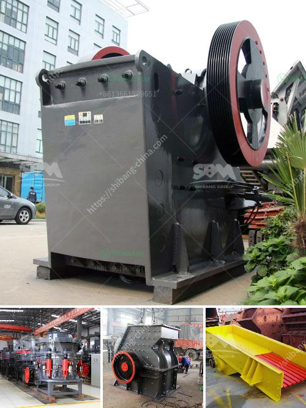

<h3>How to choose a vibration motor?</h3>
Vibration motors are widely used in various industries such as automotive, medical, consumer electronics, and many others. They are essential components for creating vibration or oscillation in devices, enabling haptic feedback, alerting users, or inducing motion in mechanical systems. Choosing the right vibration motor for your specific application is crucial to ensure optimum performance and efficiency. Here are some factors to consider when selecting a vibration motor:

1. Vibration force: The vibration force is one of the most critical parameters to consider. It determines the strength of the vibration produced by the motor. Higher vibration force is generally desirable for applications requiring stronger haptic feedback or larger motion amplitude. However, be cautious not to choose a motor with excessive force, as it may cause excessive noise or even damage other components.

2. Voltage and current: Understanding the voltage and current requirements of your application is crucial. Ensure that the motor's voltage and current specifications match the power supply available in your system. Operating the motor outside its recommended voltage range can lead to reduced performance or even damage the motor.

3. Size and weight: The size and weight of the vibration motor are essential considerations, especially when space is limited. Smaller motors are often preferred for compact electronic devices. Additionally, the weight should be optimal for the application, as excessive weight can impact portability or cause imbalance in mechanical systems.

4. Operational lifespan: The operational lifespan of a vibration motor depends on factors such as bearing quality, motor design, usage conditions, and maintenance. Consider the expected lifespan requirement of your application and choose a motor with a suitable lifespan. Motors with better material quality and robust construction tend to have longer operational lifespans.

5. Mounting options: Different vibration motors come with various mounting options. Some motors have adhesive pads for easy attachment, while others require screw mounting. Consider the type of attachment required for your application and choose a motor that provides the necessary mounting options.

6. Operating temperature range: Ensure that the vibration motor can operate within the specified temperature range of your application. Some motors are designed for high-temperature environments, while others are suitable for low-temperature applications. Operating the motor outside its recommended temperature range may lead to reduced performance or even failure.

7. Cost-efficiency: Evaluate the cost-effectiveness of the vibration motor. Compare the performance and features of different models available in the market, considering the price-to-performance ratio. Beware of extremely inexpensive options, as they might lack quality or durability, leading to frequent replacements or repairs.

8. Supplier reputation: Research the reputation and reliability of the supplier or manufacturer before making a purchase. Look for customer reviews, certifications, and the supplier's track record in delivering high-quality products.

Selecting the right vibration motor is crucial for achieving optimal performance and efficiency in your application. Consider factors such as vibration force, voltage and current requirements, size and weight, operational lifespan, mounting options, operating temperature range, cost-efficiency, and supplier reputation. By carefully evaluating these aspects, you can choose a vibration motor that aligns with your specific needs and ensures the smooth operation of your devices or systems.
<h3>Contact us</h3><ul><li><strong>Whatsapp:&nbsp;<a href="https://wa.me/8613661969651">+8613661969651</a></strong></li><li><a href="https://swt.shibang-china.com/?git&amp;zhl&amp;How to choose a vibration motor"><strong>Online Service(chat now)</strong></a></li></ul><h3>Related</h3><ul><li><a href='How to size grinding mills.md'>How to size grinding mills?</a></li><li><a href='how the mine crusher operate .md'>how the mine crusher operate ?</a></li><li><a href='How to Build a Sand Screening Plant.md'>How to Build a Sand Screening Plant?</a></li><li><a href='How does a stone crushing plant work.md'>How does a stone crushing plant work?</a></li><li><a href='How mobile crushing plant can realize the recycling of construction waste .md'>How mobile crushing plant can realize the recycling of construction waste ?</a></li></ul>