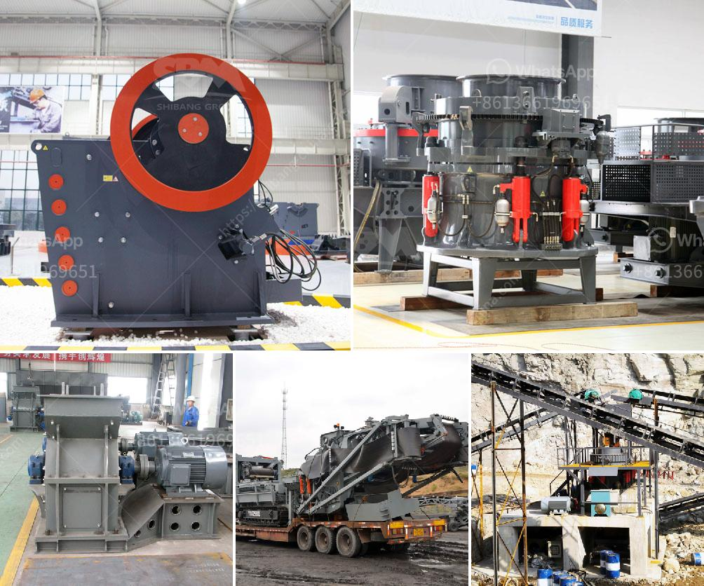

<h3>How to choose crusher for limestone?</h3>
Limestone is a sedimentary rock composed mainly of calcium carbonate (CaCO3), usually in the form of calcite or aragonite. It is a widely used building material and industrial raw material. Limestone is usually mined on site, and the mined limestone is usually transported to the processing plant for crushing by various crushing equipment.

When it comes to choosing a crusher for limestone, there are several factors to consider. These factors will help you choose the right type of crusher for your specific application and ensure efficient and economical crushing.

Firstly, it is essential to understand the characteristics of the limestone. Limestone can vary in density, hardness, and moisture content. These parameters will affect the performance and efficiency of different crushers. For example, high moisture content may cause sticking and clogging in certain types of crushers. Therefore, it is crucial to analyze and understand your limestone's characteristics before selecting a crusher.

Secondly, consider the required output size of the crushed limestone. Different crushers are suitable for different output sizes. If your application requires fine or ultra-fine crushed limestone, a specific type of crusher, such as a hammer mill or impact crusher, may be more suitable. On the other hand, if your desired output size is coarser, a jaw crusher or cone crusher might be more appropriate.

Thirdly, evaluate your production capacity and throughput requirements. Some crushers have higher capacities and can process larger amounts of limestone in a shorter time. If you need to process a significant amount of limestone daily, you may need a crusher with a higher capacity. Additionally, consider other equipment, such as conveyors or screens, that may be required for a complete crushing system.

Fourthly, take into account the operating and maintenance costs of the crusher. Different types of crushers have different operating costs. For example, a jaw crusher requires less maintenance than a cone crusher. Evaluate the energy consumption, wearing parts replacement frequency, and other maintenance requirements. A thorough cost analysis will help you choose a crusher that offers the best value in the long run.

Lastly, consider the environmental impact of the crusher. Some crushers, like cone crushers, generate more dust and noise compared to others. If environmental regulations are strict in your region, you may need to select a crusher that meets these regulations or invest in additional dust control measures.

In conclusion, choosing the right crusher for limestone involves careful consideration of various factors. Analyzing the limestone's characteristics, determining the required output size, evaluating production capacity and throughput requirements, assessing operating and maintenance costs, and considering environmental impact are all crucial steps in the decision-making process. By taking these factors into account, you can select a crusher that will meet your specific needs and deliver high-quality crushed limestone for your applications.
<h3>Contact us</h3><ul><li><strong>Whatsapp:&nbsp;<a href="https://wa.me/8613661969651">+8613661969651</a></strong></li><li><a href="https://swt.shibang-china.com/?git&amp;zhl&amp;How to choose crusher for limestone"><strong>Online Service(chat now)</strong></a></li></ul><h3>Related</h3><ul><li><a href='How is manganese extracted.md'>How is manganese extracted?</a></li><li><a href='How to choose a basalt crusher？.md'>How to choose a basalt crusher？</a></li><li><a href='how does the jaw crusher works.md'>how does the jaw crusher works</a></li><li><a href='How to install ore jaw crusher.md'>How to install ore jaw crusher?</a></li><li><a href='How do belt conveyors work.md'>How do belt conveyors work?</a></li></ul>