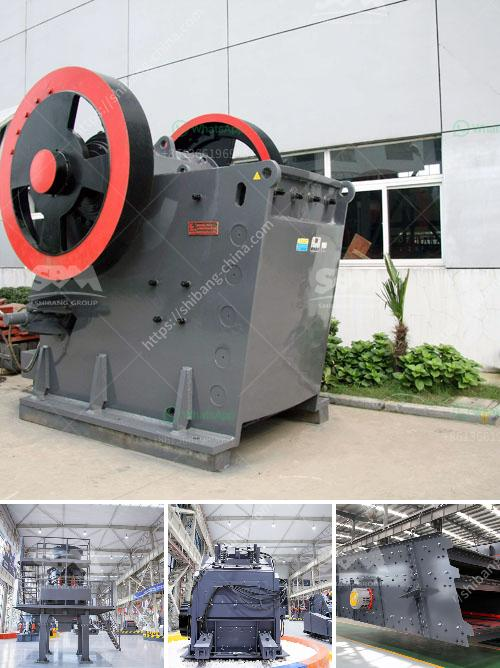

<h3>How to choose crusher manufacturer?</h3>
Choosing the right crusher manufacturer is essential for efficient and effective crushing operations. With so many options available, it can be overwhelming to select the best one for your specific needs. However, by following a few key factors, you can ensure that you make an informed decision and invest in the right crusher manufacturer. This article will guide you through the process, highlighting the necessary considerations.

Firstly, it is crucial to identify your specific requirements and the type of material you will be crushing. Different crushers excel at handling different types of materials, such as hard rock, soft rock, or abrasive materials like mining ores. Understanding your material characteristics will help you narrow down your options and focus on manufacturers who specialize in the relevant crusher models.

Once you narrow down your choices, it is important to evaluate the manufacturer's reputation and credibility. Look for companies that have been in the industry for a long time and have a proven track record of manufacturing high-quality crushers. Online reviews and testimonials from existing customers can provide valuable insights into a manufacturer's reliability and customer satisfaction.

The next factor to consider is the range of products offered by the manufacturer. A reputable crusher manufacturer will provide a diverse range of crushers suitable for different applications and capacities. This ensures that you have a wide choice and can select the most suitable crusher for your specific needs. Additionally, a manufacturer with a comprehensive product range indicates their expertise in different crusher designs and technologies.

Another crucial aspect to evaluate is the after-sales support provided by the manufacturer. A reliable manufacturer will offer excellent customer service, including technical support, spare parts availability, and on-site or remote assistance when needed. Investing in a crusher is a long-term commitment, and having prompt and reliable after-sales support is crucial to ensure smooth operations and minimize downtime.

Furthermore, it is essential to assess the manufacturer's innovation and commitment to research and development. With the constant advancements in crushing technology, it is important to partner with a manufacturer that continues to invest in improving their products' performance and efficiency. Manufacturers with a strong focus on innovation are more likely to provide crushers with better energy efficiency, reduced maintenance requirements, and enhanced productivity.

Finally, it is vital to consider the manufacturer's pricing and overall cost-effectiveness. While it may be tempting to opt for the cheapest option, it is crucial to strike a balance between cost and quality. Ensure that the manufacturer offers competitive pricing without compromising on the crusher's performance or durability. Evaluate the long-term operational costs, including energy consumption, maintenance, and spare parts availability, to gauge the crusher's overall cost-effectiveness.

In conclusion, selecting the right crusher manufacturer is a critical decision that can impact the efficiency and productivity of your crushing operations. By considering factors such as material requirements, reputation, product range, after-sales support, innovation, and cost-effectiveness, you can make an informed choice. Remember, investing in a reliable and high-quality crusher manufacturer will result in long-term benefits and a smoother crushing process.
<h3>Contact us</h3><ul><li><strong>Whatsapp:&nbsp;<a href="https://wa.me/8613661969651">+8613661969651</a></strong></li><li><a href="https://swt.shibang-china.com/?git&amp;zhl&amp;How to choose crusher manufacturer"><strong>Online Service(chat now)</strong></a></li></ul><h3>Related</h3><ul><li><a href='How will the bauxite crusher work.md'>How will the bauxite crusher work?</a></li><li><a href='How to Adjust a Cone Crusher ？.md'>How to Adjust a Cone Crusher ？</a></li><li><a href='How to calculate the cemnet grinding aid requirement for cement .md'>How to calculate the cemnet grinding aid requirement for cement ?</a></li><li><a href='How to extract iron ore flow chart.md'>How to extract iron ore flow chart?</a></li><li><a href='how to remove fines from stone crush.md'>how to remove fines from stone crush?</a></li></ul>