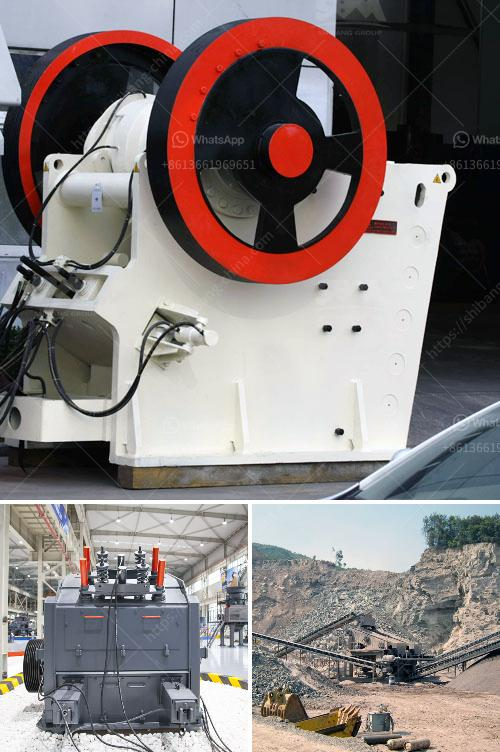

<h3>How to choose crushing machinery for sand making plant？</h3>
Sand making plants are becoming increasingly popular in the construction and mining industry. These plants use a variety of machinery to crush large stones into smaller pieces, ultimately transforming them into sand that is used in the production of concrete, asphalt, and other building materials. Choosing the right crushing machinery for your sand making plant is crucial to ensure maximum productivity, efficiency, and cost-effectiveness. Here are some essential factors to consider when making this decision:

The first step in choosing the right crushing machinery is to understand the type of material you will be working with. Different rocks and stones have different properties, such as hardness, abrasiveness, and moisture content. Some machinery may be better suited for hard and abrasive materials, while others may be designed for softer and less abrasive materials. Determine the characteristics of the material you will be processing to choose the most suitable machinery.

Consider the desired production capacity of your sand making plant. This includes both the maximum hourly output and the total amount of crushed material per day or per week. The machinery you choose should be able to handle the required production capacity without causing bottlenecks or excessive downtime. Look for crushing machinery with high throughput and efficient operation to maximize productivity and minimize operational costs.

The size of the final product is another crucial factor to consider. Sand making plants typically produce various sizes of sand for different applications. Determine the desired size range and consistency of the final product to select the appropriate crushing machinery. Some machines allow for adjustable settings to achieve different output sizes, while others are designed for specific size ranges. Make sure the machinery you choose can produce the desired final product size.

Regular maintenance and service are essential to keep your crushing machinery running smoothly and prevent costly breakdowns. Before making a decision, consider the maintenance requirements and ease of serviceability of the machinery. Look for features such as easy access to critical components, user-friendly maintenance procedures, and availability of spare parts. Choosing machinery from reputable manufacturers known for their quality and after-sales support can help ensure reliable operation and minimize downtime.

In today's environmentally conscious world, it is essential to consider the environmental impact of your sand making plant. Look for crushing machinery that complies with emission regulations and incorporates technologies to reduce dust and noise levels. Additionally, consider the energy efficiency of the machinery to minimize energy consumption and reduce greenhouse gas emissions.

In conclusion, choosing the right crushing machinery for your sand making plant requires careful consideration of factors such as material type, production capacity, final product size, maintenance requirements, and environmental impact. By selecting the most suitable machinery, you can ensure maximum productivity, efficiency, and cost-effectiveness, ultimately leading to the success of your sand making plant.
<h3>Contact us</h3><ul><li><strong>Whatsapp:&nbsp;<a href="https://wa.me/8613661969651">+8613661969651</a></strong></li><li><a href="https://swt.shibang-china.com/?git&amp;zhl&amp;How to choose crushing machinery for sand making plant？"><strong>Online Service(chat now)</strong></a></li></ul><h3>Related</h3><ul><li><a href='How to maintain stone crusher equipment.md'>How to maintain stone crusher equipment?</a></li><li><a href='How to manage a limestone quarry.md'>How to manage a limestone quarry?</a></li><li><a href='How to calculate the efficiency of a jaw crusher.md'>How to calculate the efficiency of a jaw crusher?</a></li><li><a href='How to separate the gold from the powdered sand .md'>How to separate the gold from the powdered sand ?</a></li><li><a href='How to crush aggregates.md'>How to crush aggregates?</a></li></ul>