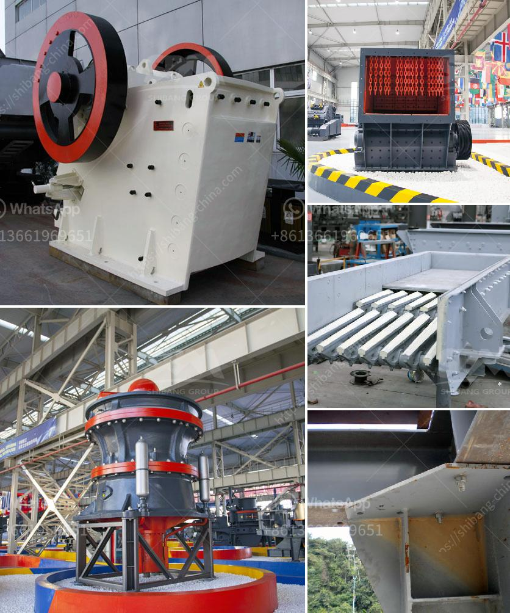

<h3>How to choose granite mining machinery in Nigeria ？</h3>
Granite is a natural stone that is widely used in construction and other industries. In Nigeria, granite is commonly mined from quarries, processed into slabs, and used in various applications such as countertops, tiles, and monuments. To extract granite efficiently, it is crucial to have the right machinery and equipment. This article will guide you on how to choose the appropriate granite mining machinery in Nigeria.

1. Assess Your Mining Needs: Before investing in any machinery, it is crucial to assess your specific mining needs. Determine the volume of granite you intend to mine, the expected production capacity, and the size of the mining operation. This will help you determine the type and size of machinery required to meet your production goals.

2. Research Reliable Manufacturers: Once you have assessed your mining needs, research reliable manufacturers and suppliers of granite mining machinery in Nigeria. Look for companies with a good reputation, extensive experience in the industry, and positive customer reviews. Quality machinery is essential for efficient and safe mining operations.

3. Consider the Type of Machinery: There are various types of machinery used in granite mining, each designed for specific tasks. Some of the common types of machinery include stone cutting machines, loaders, excavators, crushers, and conveyor systems. Consider the tasks you need to perform and choose machinery that is specifically designed for those tasks.

4. Evaluate the Performance and Efficiency: Efficiency and performance are essential factors to consider when choosing granite mining machinery. Look for machinery that offers a high level of productivity and can handle the desired workload. Consider the machinery's power, speed, and durability, as these factors will impact the efficiency of your mining operations.

5. Assess Safety Features: Granite mining can be a hazardous activity, so it is crucial to prioritize safety when choosing machinery. Look for machinery with safety features such as operator cabins with proper ventilation and visibility, emergency shut-off buttons, and protective guards. Additionally, ensure that the machinery complies with relevant safety standards and regulations.

6. Consider Maintenance and Support: Regular maintenance is crucial to keep your machinery running efficiently and to minimize downtime. Before making a purchase, consider the availability of spare parts and maintenance services. Choose manufacturers that provide comprehensive support, including training for operators, troubleshooting assistance, and timely supply of spare parts.

7. Budget Considerations: Finally, consider your budget when choosing granite mining machinery. While it is important to invest in quality machinery, be mindful of your financial limitations. Compare prices from different manufacturers and suppliers to find the best value for your money. Remember to factor in the long-term operating costs, including fuel consumption, maintenance, and repairs.

In conclusion, choosing the right granite mining machinery in Nigeria requires careful consideration of your specific needs, researching reliable manufacturers, evaluating performance and efficiency, prioritizing safety features, assessing maintenance and support, and considering your budget. By following these guidelines, you can make an informed decision and ensure efficient and profitable granite mining operations in Nigeria.
<h3>Contact us</h3><ul><li><strong>Whatsapp:&nbsp;<a href="https://wa.me/8613661969651">+8613661969651</a></strong></li><li><a href="https://swt.shibang-china.com/?git&amp;zhl&amp;How to choose granite mining machinery in Nigeria ？"><strong>Online Service(chat now)</strong></a></li></ul><h3>Related</h3><ul><li><a href='How to overhaul a jaw crusher.md'>How to overhaul a jaw crusher?</a></li><li><a href='How to replace the bearing of the jaw crusher machine.md'>How to replace the bearing of the jaw crusher machine?</a></li><li><a href='How to calculate the cost of grinding .md'>How to calculate the cost of grinding ?</a></li><li><a href='How to operate ball mills.md'>How to operate ball mills?</a></li><li><a href='how to make a ball mill .md'>how to make a ball mill ?</a></li></ul>