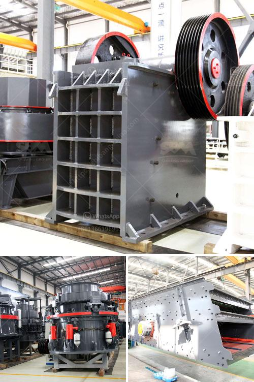

<h3>How to choose jaw crusher in Malaysia? 7 suggestions for you</h3>
Choosing the right jaw crusher can be a challenging task. With so many options available in the market, it is essential to carefully analyze the features and specifications of different models to ensure that you make an informed decision. In Malaysia, where the demand for jaw crushers is considerable, understanding the key aspects of choosing a jaw crusher will greatly help you make the best choice. In this article, we bring you seven suggestions to help you choose the right jaw crusher in Malaysia.

1. Determine your needs: Before embarking on the journey of selecting a jaw crusher, it is crucial to define your specific requirements. Consider factors such as the type and size of the materials you intend to crush, the desired output size, and the average production capacity you expect from the crusher. Understanding your needs will guide you towards the right jaw crusher model.

2. Size and weight: Jaw crushers come in varying sizes and weights. Consider the space available in your facility and the transportation requirements. If you have limited space or need to move the crusher frequently, a compact and lightweight model might be the right choice. On the other hand, larger models might offer higher capacity and overall efficiency.

3. Power and efficiency: Look for jaw crushers that offer high power and efficiency. These features will ensure that you achieve maximum productivity while minimizing energy consumption. A powerful motor combined with the right design can significantly improve the crushing process and reduce the overall operating costs.

4. Durability and maintenance: The durability of the jaw crusher is crucial, as it directly affects the lifespan of the equipment. Look for models made from high-quality materials and with robust construction. Additionally, consider the ease of maintenance and availability of spare parts. A jaw crusher that requires frequent maintenance or has limited access to spare parts can become a costly investment in the long run.

5. Safety features: Safety should be a top priority when choosing a jaw crusher. Look for models with safety features such as automatic overload protection, emergency stop buttons, and safety shields. These features will protect both the operator and the machine during operation and maintenance.

6. Price and after-sales service: Determine your budget and compare the prices of different jaw crusher models. However, it is important to remember that the lowest price does not always translate to the best value for money. Consider the reputation of the manufacturer and the after-sales service they provide. A reliable manufacturer will offer support, warranty, and readily available technical assistance to ensure a smooth operation.

7. Read reviews and seek expert advice: Finally, read reviews of different jaw crusher models and seek advice from industry experts. Reviews from other customers can provide valuable insights into the performance, reliability, and overall satisfaction with a specific model. Consult an expert, such as a mining engineer or a crushing equipment specialist, who can guide you through the selection process based on your specific needs.

Choosing the right jaw crusher in Malaysia can significantly impact your crushing operations' efficiency and productivity. By following the suggestions mentioned above, you will be able to make an informed decision and select a jaw crusher that meets your requirements perfectly. Remember to consider factors such as size, power, durability, safety, and after-sales service to make the best choice.
<h3>Contact us</h3><ul><li><strong>Whatsapp:&nbsp;<a href="https://wa.me/8613661969651">+8613661969651</a></strong></li><li><a href="https://swt.shibang-china.com/?git&amp;zhl&amp;How to choose jaw crusher in Malaysia 7 suggestions for you"><strong>Online Service(chat now)</strong></a></li></ul><h3>Related</h3><ul><li><a href='How to select a Highquality sand making machine.md'>How to select a High-quality sand making machine?</a></li><li><a href='How to produce silica sand 7 steps.md'>How to produce silica sand? 7 steps</a></li><li><a href='how limestone is mined in kenya.md'>how limestone is mined in kenya</a></li><li><a href='How to start a sand and gravel business.md'>How to start a sand and gravel business?</a></li><li><a href='how jaw crusher working .md'>how jaw crusher working ?</a></li></ul>