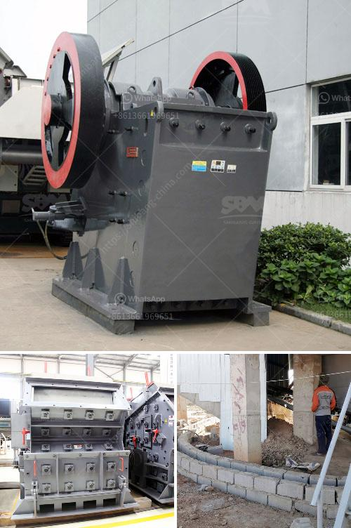

<h3>How to choose manganese ore crushing machinery?</h3>
Manganese ore plays a crucial role in various industries, especially the iron and steel industry. Therefore, choosing suitable crushing equipment is vital for manganese ore processing. Manganese ore is a hard and abrasive material. It is widely used in the metallurgical industry, but when crushed, it tends to generate a lot of fines, which cause problems during ore beneficiation. To overcome these issues, it is crucial to choose the right crushing equipment.

The hardness, toughness, and abrasiveness of the ore will determine the type of crusher that is required. Hard and abrasive ores require heavy-duty machinery for efficient crushing. On the other hand, softer ores can be crushed using less vigorous equipment.

The crushing stage in manganese ore processing can be divided into three phases: primary crushing, secondary crushing, and tertiary crushing. Each stage requires different types of crushers to achieve the desired size reduction. For instance, a jaw crusher is recommended for primary crushing, while a cone crusher or impact crusher is used for secondary crushing.

Consider the desired production capacity when choosing the crushing machinery. Different types of crushers have different production capacities, and it is important to select one that can meet the required output. Assess the capacity in terms of tons per hour and ensure it aligns with your operation's needs.

Operating costs are a crucial factor in any crushing operation. High energy consumption can lead to increased expenses. Therefore, it is important to choose crushing machinery that offers high efficiency and low power consumption. Look for crushers with advanced technology and features that minimize energy usage.

Regular maintenance is essential to keep any machinery functioning optimally. Consider the maintenance requirements and the associated costs when selecting a crushing machine. Choose equipment that is easy to maintain, with readily available spare parts. Additionally, factor in the operating costs to ensure that the chosen machinery fits within your budget.

Crushing equipment should be reliable and durable to ensure smooth and uninterrupted production. Consider the reputation of the manufacturer and select crushers that are known for their reliability. Look for high-quality materials and robust construction, as they contribute to the machine's durability.

Ensure that the chosen crushing machinery includes necessary safety features to protect operators and prevent accidents. Look for features such as automatic overload protection, emergency stop buttons, and proper guarding to ensure the safety of all personnel involved.

In conclusion, choosing the right manganese ore crushing machinery is crucial to ensure efficient and cost-effective processing. Consider the nature of the ore, crushing stage, production capacity, energy consumption, maintenance costs, reliability, and safety features when making your selection. By taking these factors into account, you can find the ideal crushing equipment that meets your specific requirements and maximizes productivity.
<h3>Contact us</h3><ul><li><strong>Whatsapp:&nbsp;<a href="https://wa.me/8613661969651">+8613661969651</a></strong></li><li><a href="https://swt.shibang-china.com/?git&amp;zhl&amp;How to choose manganese ore crushing machinery"><strong>Online Service(chat now)</strong></a></li></ul><h3>Related</h3><ul><li><a href='How can we prevent rocks from coming out of the impact crushers work.md'>How can we prevent rocks from coming out of the impact crusher's work?</a></li><li><a href='How to turn off crushing and screening plant.md'>How to turn off crushing and screening plant?</a></li><li><a href='How to crush metallurgical coke.md'>How to crush metallurgical coke?</a></li><li><a href='How to choose the specification of jaw crusher？.md'>How to choose the specification of jaw crusher？</a></li><li><a href='How does investing in a cone crusher benefit.md'>How does investing in a cone crusher benefit?</a></li></ul>