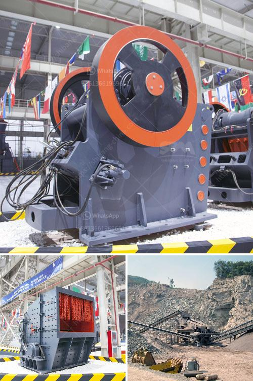

<h3>How to choose the best mining equipment?</h3>
Mining plays a crucial role in various industries, from extracting minerals to constructing infrastructure. One of the key factors that determine the success of mining operations is the quality and efficiency of the equipment used. Choosing the best mining equipment may seem like a daunting task, given the vast array of options available in the market. However, by considering a few key factors, you can make an informed decision that ensures the smooth operation of your mining activities. Here are some essential tips on how to choose the best mining equipment.

1. Define your requirements: Before beginning your search for mining equipment, it is essential to clearly define your specific requirements. Consider the type of minerals you will be mining, the depth and size of your mining operation, the geographical location, and the specific challenges you may face. Understanding your needs will help you narrow down your options and choose equipment that is specifically designed for your purposes.

2. Conduct thorough research: Once you have defined your requirements, it is crucial to conduct in-depth research on the available equipment options. Compare different brands, models, and prices. Pay attention to factors such as reliability, durability, efficiency, and maintenance requirements. Look for customer reviews and seek recommendations from experienced miners or industry experts. This research will provide valuable insights and help you identify the most suitable equipment for your mining operations.

3. Consider safety features: Mining can be a hazardous profession, so safety features should be a top priority when choosing mining equipment. Look for equipment that adheres to safety standards and regulations. Check if the equipment has built-in safety features, such as emergency stop buttons, fire suppression systems, and operator safety devices. Investing in equipment that prioritizes the safety of your workforce will not only protect your employees but also minimize downtime due to accidents or injuries.

4. Assess maintenance and operational costs: Mining equipment requires regular maintenance and incurs operational costs. Before making a purchase, carefully evaluate the maintenance and operational costs associated with the equipment you are considering. Factors such as fuel consumption, energy efficiency, and replacement part availability should be taken into account. Opting for equipment with low maintenance and operating costs will help you maximize profitability and reduce downtime.

5. Test before buying: Whenever possible, try to test the equipment before finalizing the purchase. This will allow you to assess its performance, efficiency, and ease of use firsthand. You can also use this opportunity to train your operators on how to operate the equipment effectively and safely. Testing the equipment will provide you with essential information that will help you make a confident decision.

In conclusion, choosing the best mining equipment requires careful consideration of your specific requirements, thorough research, and assessing safety features, maintenance costs, and operational costs. By investing time and effort in the selection process, you can ensure that your mining operations run smoothly and efficiently, increasing productivity and profitability.
<h3>Contact us</h3><ul><li><strong>Whatsapp:&nbsp;<a href="https://wa.me/8613661969651">+8613661969651</a></strong></li><li><a href="https://swt.shibang-china.com/?git&amp;zhl&amp;How to choose the best mining equipment"><strong>Online Service(chat now)</strong></a></li></ul><h3>Related</h3><ul><li><a href='how to choose mill and crusher ？.md'>how to choose mill and crusher ？</a></li><li><a href='How to improve the output of stone crushing plant .md'>How to improve the output of stone crushing plant ?</a></li><li><a href='How to electrify a ball mill.md'>How to electrify a ball mill?</a></li><li><a href='How to calculate the charge volume of a ball mill.md'>How to calculate the charge volume of a ball mill?</a></li><li><a href='How can you tell the head has come up on of cone crusher.md'>How can you tell the head has come up on of cone crusher?</a></li></ul>