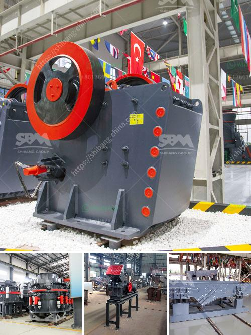

<h3>How to choose the jaw crusher motor ？</h3>
The jaw crusher is an essential piece of equipment in many industries, including mining, construction, and demolition. Like all machinery, the jaw crusher relies on a motor to drive the crushing process. Therefore, it is important to choose the right motor for your jaw crusher to ensure efficient and effective operation. In this article, we will discuss some factors to consider when selecting a jaw crusher motor.

1. Power requirements: One of the most critical factors in choosing a jaw crusher motor is determining the power requirements of the crusher. The power required will depend on the size and hardness of the material being crushed, as well as the desired output size. Generally, larger and harder materials will require a more powerful motor. It is advisable to consult the manufacturer or an expert to accurately determine the power requirements for your specific application.

2. Speed and rotation: The speed and rotation of the jaw crusher motor are crucial for its performance. Generally, a higher speed allows for finer crushing, while a lower speed results in coarser crushing. The rotation should be in the direction that ensures the material flows smoothly through the crushing chamber. Consult the manufacturer or an expert to determine the optimal speed and rotation for your jaw crusher.

3. Motor type: There are various types of motors that can be used for a jaw crusher, such as AC motors, DC motors, and synchronous motors. AC motors are widely used due to their simplicity and reliability. However, if you have specific requirements, such as variable speed control or high torque at low speeds, you may consider other motor types. Again, consult the manufacturer or an expert to select the most suitable motor type for your jaw crusher.

4. Motor efficiency: The efficiency of the motor is an important consideration as it affects the overall energy consumption of the jaw crusher. A more efficient motor will result in lower energy costs and environmental impact. Look for motors with high efficiency ratings, such as those with an Energy Star certification. This will ensure that your jaw crusher operates optimally while minimizing energy consumption.

5. Motor protection: Lastly, it is essential to consider motor protection features to ensure the longevity and reliability of your jaw crusher. Look for motors with built-in thermal protection to prevent overheating. Additionally, consider investing in motor overload protection devices, such as circuit breakers or motor starters, to safeguard against excessive current or voltage fluctuations.

In summary, choosing the right motor for your jaw crusher is crucial for its performance and longevity. Consider factors such as power requirements, speed, rotation, motor type, efficiency, and motor protection when making your selection. Consulting the manufacturer or an expert in the field will help ensure that you choose a motor that meets your specific needs. With the right motor, your jaw crusher will deliver efficient and effective crushing operations, improving productivity and profitability in your industry.
<h3>Contact us</h3><ul><li><strong>Whatsapp:&nbsp;<a href="https://wa.me/8613661969651">+8613661969651</a></strong></li><li><a href="https://swt.shibang-china.com/?git&amp;zhl&amp;How to choose the jaw crusher motor ？"><strong>Online Service(chat now)</strong></a></li></ul><h3>Related</h3><ul><li><a href='How to design a rotor for a VSI crusher.md'>How to design a rotor for a VSI crusher?</a></li><li><a href='How much does an 800ton jaw crusher cost.md'>How much does an 800-ton jaw crusher cost?</a></li><li><a href='How does a raw mill work in a cement plant.md'>How does a raw mill work in a cement plant?</a></li><li><a href='How to install a secondary crusher.md'>How to install a secondary crusher?</a></li><li><a href='How to improve stone crusher production.md'>How to improve stone crusher production?</a></li></ul>