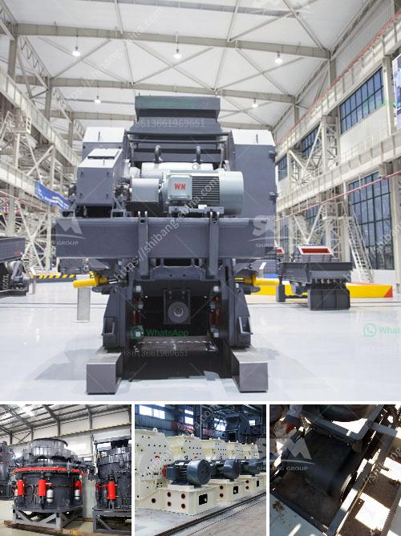

<h3>How to choose the model of jaw crusher ？</h3>
Choosing the right model of jaw crusher can be a difficult task. There are several factors that you need to consider when you are looking for a jaw crusher. In this article, we will discuss the essential factors that should be taken into account before buying a jaw crusher.

The first factor that you need to consider is the type and hardness of the material that you are going to crush. Different types of crushers are designed to work with different materials. For example, jaw crushers are suitable for crushing materials such as granite, basalt, limestone, and river gravel. On the other hand, cone crushers are suitable for crushing materials such as bauxite, iron ore, and gypsum.

The second factor that you need to consider is the production capacity requirement. It is important to know how much material you need to process in an hour or a day. This will help you determine the size of the jaw crusher that you need. Jaw crushers come in different sizes, and each size is designed to handle a certain amount of material. Therefore, it is important to choose a jaw crusher that can handle the capacity you require.

The third factor that you need to consider is the final product size requirement. Different crushers can produce different sizes of the final product. If you want to produce smaller-sized material, you should choose a jaw crusher that can produce a smaller final product. On the other hand, if you want to produce larger-sized material, you should choose a jaw crusher that can produce a larger final product.

The fourth factor that you need to consider is the maintenance and operating costs. It is important to choose a jaw crusher that is easy to maintain and has low operating costs. You should consider factors such as the price of spare parts, the availability of spare parts, and the cost of electricity when choosing a jaw crusher. This will help you minimize the maintenance and operating costs in the long run.

The fifth factor that you need to consider is the reliability and durability of the jaw crusher. You should choose a jaw crusher that is built with high-quality materials and has a sturdy construction. A reliable and durable jaw crusher will ensure that you can continue your operations without any interruptions.

In conclusion, choosing the right model of jaw crusher is essential for achieving the desired results. Before making a purchase, you should consider factors such as the type and hardness of the material, the production capacity requirement, the final product size requirement, the maintenance and operating costs, and the reliability and durability of the jaw crusher. By taking these factors into account, you can choose a jaw crusher that suits your needs and budget.
<h3>Contact us</h3><ul><li><strong>Whatsapp:&nbsp;<a href="https://wa.me/8613661969651">+8613661969651</a></strong></li><li><a href="https://swt.shibang-china.com/?git&amp;zhl&amp;How to choose the model of jaw crusher ？"><strong>Online Service(chat now)</strong></a></li></ul><h3>Related</h3><ul><li><a href='How does Raymond Mill work.md'>How does Raymond Mill work?</a></li><li><a href='How to operate a coal crusher machine.md'>How to operate a coal crusher machine?</a></li><li><a href='How to crush the California sandstone .md'>How to crush the California sandstone ?</a></li><li><a href='How to remove iron from zinc ore.md'>How to remove iron from zinc ore?</a></li><li><a href='how to remove the roller of  vertical roller mill.md'>how to remove the roller of  vertical roller mill</a></li></ul>