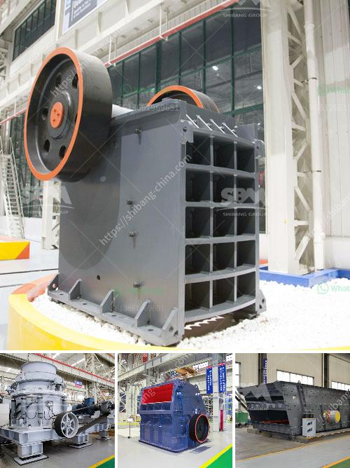

<h3>How to choose the right grinder for the processing mineral materials?</h3>
When it comes to processing mineral materials, choosing the right grinder is crucial. A grinder is a machine that is used to reduce the size of various materials into smaller particles. In the mineral processing industry, grinders are widely used to grind and crush materials such as ores, rocks, and minerals to finer sizes. Selecting the appropriate grinder for your specific needs can greatly impact the efficiency and productivity of your processing operations. Here are some factors to consider when choosing the right grinder for processing mineral materials:

Determining the purpose of grinding is essential in selecting the right grinder. Are you looking to achieve a specific particle size distribution, or do you need to reduce the material to a particular size for further processing? Understanding the required final product will help determine the type and configuration of grinder you need.

Different mineral materials vary in hardness and abrasiveness. Harder materials such as metals or certain rocks may require grinders with higher horsepower and more robust construction to handle the tougher grinding tasks. Abrasive materials, on the other hand, can cause excessive wear on the grinder parts. In such cases, choosing a grinder with wear-resistant materials and parts becomes critical.

Consider the size of the materials you are working with and the desired throughput rate. Grinders have specific feed size limitations, and exceeding them can result in inefficiencies or damage to the machine. Similarly, if you have high-volume processing requirements, selecting a grinder with a higher capacity and faster throughput is essential to meet production needs.

Energy consumption is a significant operating cost in mineral processing. Opting for a grinder with high energy efficiency can help reduce overall operational expenses. Look for grinders that are designed with energy-saving features, such as efficient motor drives and advanced control systems that optimize energy usage without compromising processing performance.

Maintenance and serviceability are important considerations when selecting a grinder. Regular maintenance is necessary to keep the machine operating at peak performance. Choosing a grinder with easily accessible parts and a straightforward maintenance process will save time and effort in the long run. Additionally, consider the availability of spare parts and the proximity of service centers for prompt support if needed.

The mineral processing industry involves working with potentially hazardous materials, making safety a top priority. Look for grinders with built-in safety features, such as safety interlocks, emergency stop buttons, and protective guards. Ensure that the chosen grinder complies with industry safety standards and regulations to guarantee a safe working environment for your operators.

Lastly, consider your budget and cost constraints. Grinders vary in price according to their size, capacity, features, and brand. While it may be tempting to choose the least expensive option, it is important to balance cost with quality and performance. Investing in a reliable and durable grinder may prove more cost-effective in the long term, as it reduces maintenance and replacement expenses.

In conclusion, choosing the right grinder for processing mineral materials is a critical decision that can significantly impact the overall efficiency and productivity of your operations. By considering factors such as purpose of grinding, material hardness, feed size, energy efficiency, maintenance, safety features, and budget, you can make an informed choice that meets your specific requirements. Always consult with industry experts or suppliers for personalized advice tailored to your unique processing needs.
<h3>Contact us</h3><ul><li><strong>Whatsapp:&nbsp;<a href="https://wa.me/8613661969651">+8613661969651</a></strong></li><li><a href="https://swt.shibang-china.com/?git&amp;zhl&amp;How to choose the right grinder for the processing mineral materials"><strong>Online Service(chat now)</strong></a></li></ul><h3>Related</h3><ul><li><a href='How to beneficiation tungsten ore.md'>How to beneficiation tungsten ore?</a></li><li><a href='How to separate gold from iron ore.md'>How to separate gold from iron ore?</a></li><li><a href='How to build crushing plant foundation .md'>How to build crushing plant foundation ?</a></li><li><a href='How to design a crushing plant .md'>How to design a crushing plant ?</a></li><li><a href='how to load cone crusher .md'>how to load cone crusher ?</a></li></ul>