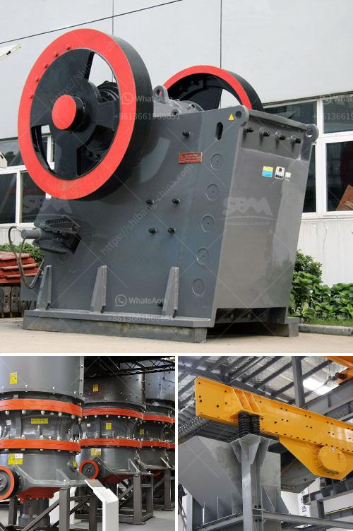

<h3>How to choose the right primary crusher for your plant?</h3>
Choosing the right primary crusher for your plant is essential because it determines the productivity and efficiency of your entire operation. The primary crusher serves as the entrance for any material that starts at the quarry and then goes through further processing. A primary crusher plays a crucial role in reducing large-sized rocks into smaller pieces, making them more manageable and suitable for subsequent crushing stages.

To choose the right primary crusher for your plant, you need to consider several factors. Here are some key points to help you make an informed decision:

1. Material characteristics: Understand the characteristics of the material you will be processing. Different materials have varying hardness, abrasiveness, and moisture content, which affect the choice of the crusher. For example, a hard and abrasive material may require a different type of crusher than a soft and non-abrasive one.

2. Capacity requirements: Determine the required capacity of your primary crusher. This will depend on the production goals of your plant. You need to make sure that the crusher can handle the anticipated throughput and meet the desired product specifications without causing any bottlenecks in the process flow.

3. Size reduction ratio: Consider the desired size reduction ratio for your material. The reduction ratio is the ratio of the top size of the input material to the final product's size. Select a primary crusher that can achieve the desired reduction ratio while producing a uniform product shape.

4. Maintenance requirements: Evaluate the ease of maintenance for the primary crusher. Opt for a machine that allows for easy access to critical components and has a robust design to withstand heavy-duty applications. A crusher with fewer moving parts and a simplified maintenance routine will save you time and reduce downtime.

5. Safety considerations: Ensure that the primary crusher is designed with safety in mind. Look for features such as safety guards, emergency stops, and advanced automation systems that prioritize worker safety. A safe working environment is crucial for minimizing accidents and ensuring the well-being of your plant's operators.

6. Cost-effectiveness: Compare the initial purchase cost, operational costs, and potential maintenance expenses of different primary crushers. While the initial cost is important, the long-term operational efficiency and reliability of the crusher are equally significant. Consider the total cost of ownership over the lifespan of the machine to make a cost-effective choice.

7. Expert advice: Seek advice from industry experts and equipment manufacturers. They can provide valuable insights based on their experience and help you select the most suitable primary crusher for your specific application. They can also guide you on the best practices for installation, maintenance, and maximizing productivity.

In conclusion, choosing the right primary crusher for your plant is a critical decision that affects the overall efficiency and profitability of your operation. Consider the material characteristics, capacity requirements, size reduction ratio, maintenance requirements, safety features, cost-effectiveness, and seek expert advice. By carefully evaluating these factors, you will be able to make an informed decision and achieve optimal results in your crushing operations.
<h3>Contact us</h3><ul><li><strong>Whatsapp:&nbsp;<a href="https://wa.me/8613661969651">+8613661969651</a></strong></li><li><a href="https://swt.shibang-china.com/?git&amp;zhl&amp;How to choose the right primary crusher for your plant"><strong>Online Service(chat now)</strong></a></li></ul><h3>Related</h3><ul><li><a href='How to manufacture artificial sand.md'>How to manufacture artificial sand?</a></li><li><a href='How to configure a granite gravel production line.md'>How to configure a granite gravel production line?</a></li><li><a href='How to calibrate the belt conveyor.md'>How to calibrate the belt conveyor</a></li><li><a href='How does a spring cone crusher work.md'>How does a spring cone crusher work?</a></li><li><a href='How to set up a quarry business in india.md'>How to set up a quarry business in india?</a></li></ul>