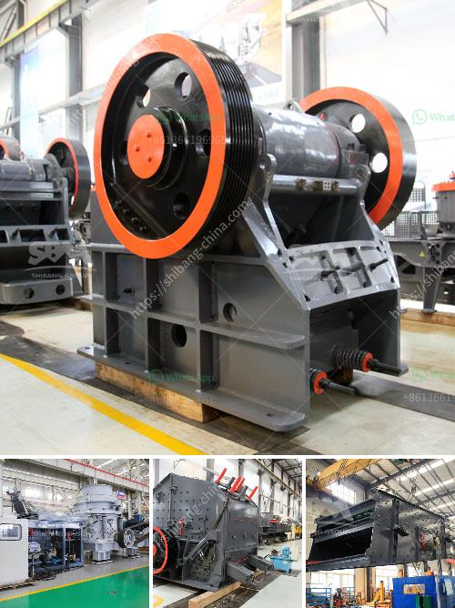

<h3>How to choose the size of jaw crusher ？</h3>
The jaw crusher is a crucial piece of equipment in the mining and quarrying industry, as it is used to break down large stones into smaller pieces. There are various factors that you need to consider when choosing the right size of jaw crusher for your operations. In this article, we will discuss these factors and provide you with some tips on how to make an informed decision.

The first factor to consider is the feed size. The jaw crusher should be able to receive and crush material that is within the specified range. Typically, the maximum feed size is specified by the manufacturer and should be adhered to ensure optimal performance of the crusher. Oversized materials can cause blockages and put unnecessary strain on the crusher, leading to decreased efficiency and potential damage. Conversely, if the feed size is too small, the crusher may not be able to efficiently process the material, resulting in low productivity. Therefore, it is important to determine the average size of the materials you will be crushing and select a jaw crusher that can handle that size range.

The second factor to consider is the capacity required. The capacity of the jaw crusher is the maximum amount of material that can be processed in a given time period. It is important to select a jaw crusher that can handle the anticipated capacity to avoid overloading the machine and potentially causing damage. Additionally, if the crusher is underutilized, it may not deliver optimal performance, resulting in inefficiency. To determine the required capacity, you should consider the production goals, the processing rate of the material, the size distribution, and the density of the material. By understanding these factors, you can make an informed decision on the appropriate capacity of the jaw crusher.

Another factor to consider is the desired final product size. The jaw crusher will produce different sizes of crushed materials based on the gap between the jaws. If the gap is set too wide, larger pieces of material may not be adequately crushed, resulting in a coarser final product. On the other hand, if the gap is set too narrow, the crusher may produce an excessive amount of fines, which may not meet the desired specifications. It is important to determine the required final product size and select a jaw crusher that can achieve that size range.

Additionally, you should consider the operating conditions and environment in which the jaw crusher will be used. Factors such as the type and hardness of the material, the moisture content, and the temperature can affect the performance of the crusher. It is crucial to choose a jaw crusher that is designed to operate efficiently in the specific conditions of your operation.

In conclusion, choosing the right size of jaw crusher is crucial to ensure efficient and productive crushing operations. Factors such as feed size, capacity, desired final product size, and operating conditions should be carefully considered when making this decision. By taking these factors into account, you can select a jaw crusher that meets your specific requirements and maximizes productivity.
<h3>Contact us</h3><ul><li><strong>Whatsapp:&nbsp;<a href="https://wa.me/8613661969651">+8613661969651</a></strong></li><li><a href="https://swt.shibang-china.com/?git&amp;zhl&amp;How to choose the size of jaw crusher ？"><strong>Online Service(chat now)</strong></a></li></ul><h3>Related</h3><ul><li><a href='How to design a belt feed bin .md'>How to design a belt feed bin ?</a></li><li><a href='How does a jaw crusher crush limestone.md'>How does a jaw crusher crush limestone?</a></li><li><a href='How does Raymond Mill work.md'>How does Raymond Mill work?</a></li><li><a href='How to enter into a business of stone crusher plant in Malaysia .md'>How to enter into a business of stone crusher plant in Malaysia ?</a></li><li><a href='How to improve the output of stone crusher .md'>How to improve the output of stone crusher ?</a></li></ul>