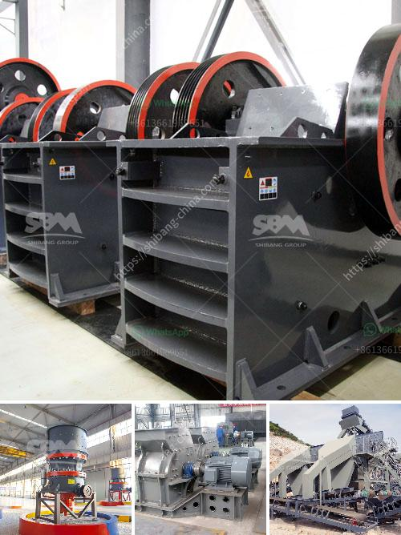

<h3>How to choose the specification of jaw crusher？</h3>
The jaw crusher is a crucial piece of equipment in many industries, including mining, construction, and infrastructure projects. It is used to crush large rocks and ores into smaller particles to be used in further processing. However, choosing the right jaw crusher specification can be a daunting task, as there are numerous factors to consider. In this article, we will guide you through the process of selecting the appropriate specifications for your jaw crusher.

1. Feed Size: One of the most important factors to consider is the maximum feed size the jaw crusher can handle. The feed size determines the size of the material that can be processed by the crusher. It should be chosen based on the desired final product size and the properties of the material being crushed. If the feed size is too large for the crusher's capacity, it may lead to jamming or reduced productivity.

2. Capacity: The capacity of a jaw crusher refers to the maximum amount of material it can process in a given time period. It is usually measured in tons per hour. The required capacity should be determined based on the expected production rate and the size and hardness of the material. A higher capacity jaw crusher can handle more material efficiently, but it may also require a larger and more expensive crusher.

3. Motor Power: The motor power of a jaw crusher determines its crushing efficiency and energy consumption. Higher power motor allows the crusher to exert more force on the material, resulting in better crushing performance. However, a larger motor also consumes more electricity and increases the cost of operation. Therefore, it is essential to strike a balance between power and cost.

4. Jaw Plate Material: The jaw plates are the main wearing parts of a jaw crusher, and their material affects the crusher's performance and lifespan. Different materials have different properties, such as wear resistance, toughness, and cost. Common materials for jaw plates include manganese steel, high chrome alloy steel, and composite materials. The choice of material should be based on the application and expected wear conditions.

5. Eccentric Shaft Speed: The speed of the eccentric shaft of the jaw crusher affects its crushing capacity and product size distribution. A higher speed results in finer product size but may also increase the wear on the crusher. Conversely, a lower speed may reduce the fines content of the product but may result in coarser particles. The optimal speed should be determined based on the properties of the material and the desired product specifications.

6. Maintenance and Servicing: It is crucial to consider the ease of maintenance and servicing when selecting a jaw crusher specification. A crusher that requires frequent and complex maintenance can increase downtime and reduce productivity. Look for features such as easily accessible parts, good sealing arrangements, and a reliable lubrication system.

In conclusion, choosing the right specification for a jaw crusher involves considering factors such as feed size, capacity, motor power, jaw plate material, eccentric shaft speed, and maintenance requirements. It is important to strike the right balance between these factors to ensure optimal performance and productivity. Consulting with a reputable manufacturer or supplier can help you make an informed decision and select the most suitable jaw crusher specification for your specific needs.
<h3>Contact us</h3><ul><li><strong>Whatsapp:&nbsp;<a href="https://wa.me/8613661969651">+8613661969651</a></strong></li><li><a href="https://swt.shibang-china.com/?git&amp;zhl&amp;How to choose the specification of jaw crusher？"><strong>Online Service(chat now)</strong></a></li></ul><h3>Related</h3><ul><li><a href='How to get the best aggregates after crushing and screening.md'>How to get the best aggregates after crushing and screening?</a></li><li><a href='How to replace a broken bearing in a jaw crusher.md'>How to replace a broken bearing in a jaw crusher?</a></li><li><a href='How does Raymond Mill work.md'>How does Raymond Mill work?</a></li><li><a href='How to determine the size of the conveyor belt in mining？.md'>How to determine the size of the conveyor belt in mining？</a></li><li><a href='How to calculate the cost of grinding .md'>How to calculate the cost of grinding ?</a></li></ul>