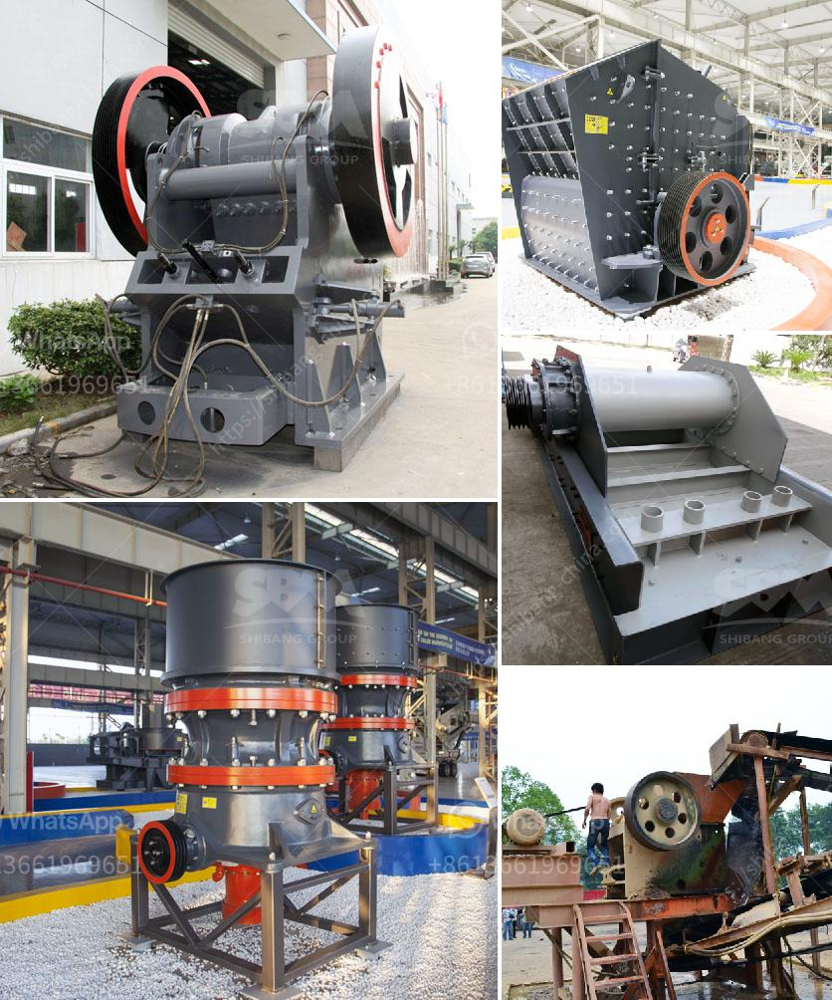

<h3>How to choose the suitable jaw crusher model?</h3>
When it comes to the crushing process, the jaw crusher is one of the most common equipment used for coarse crushing. However, not all jaw crushers are alike. Choosing the right jaw crusher model is crucial for the success of any crushing project. Here are a few factors to consider when selecting a jaw crusher model.

One of the most important factors to consider is the maximum feed size of the crusher. This is an important parameter that defines the maximum size of the material that the crusher can handle. You need to ensure that the selected jaw crusher model can comfortably handle the size of the material you will be feeding into it. It is usually recommended to choose a jaw crusher that can handle slightly larger feed size than the anticipated maximum size to allow some flexibility.

The capacity of the jaw crusher is another important factor to consider. This refers to the maximum amount of material the crusher can process in a given time period. The capacity should match your required production rate. It is advisable to choose a jaw crusher with a capacity that is slightly higher than your production needs to prevent any bottleneck in the crushing process.

Different materials have different hardness levels. It is important to choose a jaw crusher model that is capable of crushing the material you will be working with. Harder materials require a more robust and powerful jaw crusher. Consider the hardness of the material you will be crushing to ensure the selected jaw crusher model is suitable.

The desired product size is also an important consideration when choosing a jaw crusher. Different jaw crusher models can produce different product sizes. You must determine the desired product size as per your project requirements. You may need to adjust the jaw crusher's settings to achieve the desired product size.

Maintenance and operating costs are crucial for any crushing operation. Different jaw crusher models have varying maintenance requirements and operational costs. Consider the availability and cost of spare parts, ease of maintenance, and energy consumption when selecting a jaw crusher model. It is advisable to choose a jaw crusher model that offers a good balance between initial investment and long-term operational costs.

In conclusion, choosing the suitable jaw crusher model is essential to ensure efficient and effective crushing operations. Always consider factors such as feed size, capacity, material hardness, desired product size, and maintenance and operating costs when selecting a jaw crusher. Taking the time to evaluate and select the right jaw crusher model will result in a successful crushing process and optimize your overall productivity.
<h3>Contact us</h3><ul><li><strong>Whatsapp:&nbsp;<a href="https://wa.me/8613661969651">+8613661969651</a></strong></li><li><a href="https://swt.shibang-china.com/?git&amp;zhl&amp;How to choose the suitable jaw crusher model"><strong>Online Service(chat now)</strong></a></li></ul><h3>Related</h3><ul><li><a href='How to remove calcium oxide from manganese ore.md'>How to remove calcium oxide from manganese ore?</a></li><li><a href='How to crush drain rock using a crusher.md'>How to crush drain rock using a crusher?</a></li><li><a href='How to extract manganese from ore.md'>How to extract manganese from ore?</a></li><li><a href='How to separate gold from sand with machine .md'>How to separate gold from sand with machine ?</a></li><li><a href='How to improve grinding efficiency of a mill.md'>How to improve grinding efficiency of a mill?</a></li></ul>