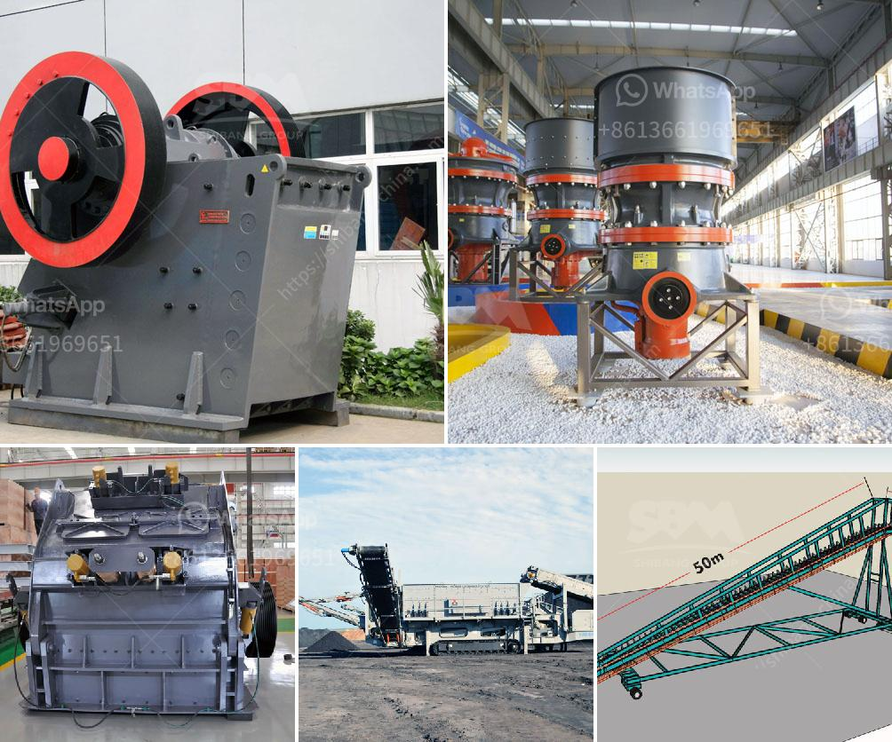

<h3>How to choose the useful sand making machine?</h3>
The process of choosing the right sand making machine can be overwhelming, as there are numerous options available in the market. However, by considering certain factors, you can make an informed decision. Selecting a suitable sand making machine is crucial as it directly affects the quality and efficiency of the final product. In this article, we will discuss some key points that will help you choose the most useful sand making machine for your needs.

Before starting your search for a sand making machine, it is essential to determine your specific requirements. Consider factors such as the type and size of the raw material, the desired output size, and the capacity requirements. Understanding these factors will help you narrow down your choices and focus on machines that are suitable for your needs.

Investing in a sand making machine is a significant decision, so it is crucial to choose a machine that offers high-quality and durability. Look for machines that are built using high-quality materials and components. Ensure that the machine is designed to withstand heavy usage and can handle the abrasive nature of the materials being processed. Choosing a durable machine will result in less downtime, lower maintenance costs, and improved productivity.

The efficiency and productivity of a sand making machine are vital considerations. Look for machines that offer high production rates and low energy consumption. Machines with automatic systems that ensure continuous operation and optimum efficiency are preferred. Additionally, consider the ease of operation and maintenance, as this will affect the overall productivity of the machine.

A reputable manufacturer with a good track record is more likely to offer high-quality machines. Research about the manufacturer's reputation, customer reviews, and previous projects to get an idea of their expertise. Additionally, inquire about the after-sales service provided by the manufacturer. A machine that comes with reliable after-sales support, spare parts availability, and maintenance services will ensure that any issues or downtime can be quickly resolved.

It is important to consider the price and your budget when choosing a sand making machine. While it is tempting to opt for the cheapest option, it is crucial to remember that quality and performance should not be compromised solely based on price. Compare prices offered by different manufacturers and weigh them against the machine's features, quality, and reputation. Consider the long-term benefits and return on investment that the machine can provide.

In conclusion, choosing the right sand making machine requires careful consideration of various factors such as your specific requirements, quality and durability, efficiency and productivity, reputation and after-sales service, as well as price and budget. By following these guidelines, you can select a useful sand making machine that meets your needs and helps you achieve high-quality sand production.
<h3>Contact us</h3><ul><li><strong>Whatsapp:&nbsp;<a href="https://wa.me/8613661969651">+8613661969651</a></strong></li><li><a href="https://swt.shibang-china.com/?git&amp;zhl&amp;How to choose the useful sand making machine"><strong>Online Service(chat now)</strong></a></li></ul><h3>Related</h3><ul><li><a href='How to break material using a hammer crusher.md'>How to break material using a hammer crusher?</a></li><li><a href='How to install quarry equipment.md'>How to install quarry equipment?</a></li><li><a href='How to separate gold ore from rock.md'>How to separate gold ore from rock?</a></li><li><a href='How can we prevent rocks from coming out of the impact crushers work.md'>How can we prevent rocks from coming out of the impact crusher's work?</a></li><li><a href='How to extend the working life of a jaw crushing plate.md'>How to extend the working life of a jaw crushing plate?</a></li></ul>