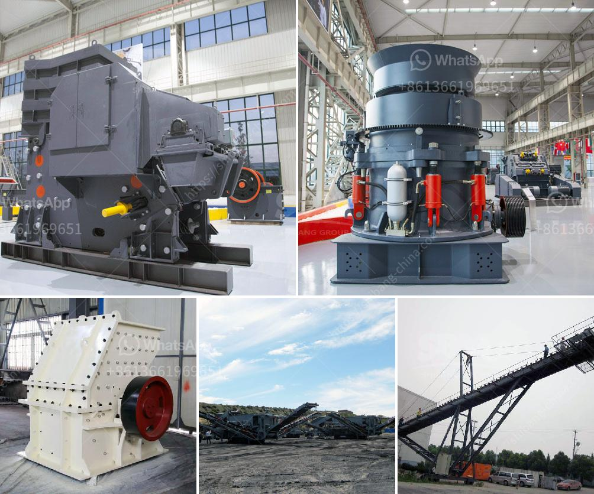

<h3>How to choose type of crusher?</h3>
When it comes to crushing rocks, there is a wide array of options to choose from. There are several factors to consider when purchasing a crusher, such as technical specifications, feed size, capacity, and material hardness. This article will explore the different types of crushers available and guide you in choosing the right one for your application.

Jaw crushers are durable machines that use compressive force to crush materials. They are commonly used in the mining and construction industry for crushing hard minerals and rocks. Jaw crushers have a fixed jaw and a movable jaw pivoted at the top, giving them a slight horizontal movement.

Cone crushers are popular for their ability to crush hard materials and provide a fine and uniform product. They are suitable for crushing various ores and rocks with medium and above hardness, offering high production rates and a consistent particle shape.

Impact crushers are versatile machines that can process materials with a side length of less than 500mm and a compressive strength of up to 350Mpa. This type of crusher is widely used in construction, mining, and recycling applications.

Gyratory crushers are primarily used for ore crushing and are capable of handling very hard rocks with a compressive strength of up to 6000 kg/cm². They are generally used as primary crushers in large-scale mining operations.

Hammer crushers operate on the principle of impact, where the material is hit by hammers fixed on a spinning rotor. These crushers are suitable for crushing brittle materials such as limestone, coal, and clay.

Roll crushers consist of two rotating cylinders that grind the material between them. They are commonly used for reducing the size of minerals and are ideal for secondary and tertiary crushing stages.

VSI crushers use a high-speed rotor and anvils for impact crushing. They are designed to produce cubical particles, making them well-suited for shaping applications in the construction industry.

Mobile crushers are portable machines that are designed to crush rocks and reduce their size into aggregates. They are widely used in the mining and construction industry due to their high mobility and efficiency.

When choosing a crusher, it is essential to consider the specific requirements of your application. Some key factors to consider include the feed size, desired product size, capacity, and material hardness. Additionally, it is important to evaluate the maintenance requirements, operating costs, and environmental impact of the chosen crusher.

In conclusion, selecting the right crusher is crucial for achieving the desired end product and maximizing efficiency. Understanding the different types of crushers available and their specific features will help you make an informed decision. By carefully analyzing your needs and consulting with experts, you can choose the most suitable crusher for your application, ensuring optimal performance and productivity.
<h3>Contact us</h3><ul><li><strong>Whatsapp:&nbsp;<a href="https://wa.me/8613661969651">+8613661969651</a></strong></li><li><a href="https://swt.shibang-china.com/?git&amp;zhl&amp;How to choose type of crusher"><strong>Online Service(chat now)</strong></a></li></ul><h3>Related</h3><ul><li><a href='How to build sand and gravel wash plant.md'>How to build sand and gravel wash plant?</a></li><li><a href='How to operate a commercial crushing plant in Pakistan.md'>How to operate a commercial crushing plant in Pakistan</a></li><li><a href='how to rebuild cone crusher .md'>how to rebuild cone crusher ?</a></li><li><a href='How to adjust a singletoggle jaw crusher.md'>How to adjust a single-toggle jaw crusher?</a></li><li><a href='How to judge how much power the jaw crusher needs？.md'>How to judge how much power the jaw crusher needs？</a></li></ul>