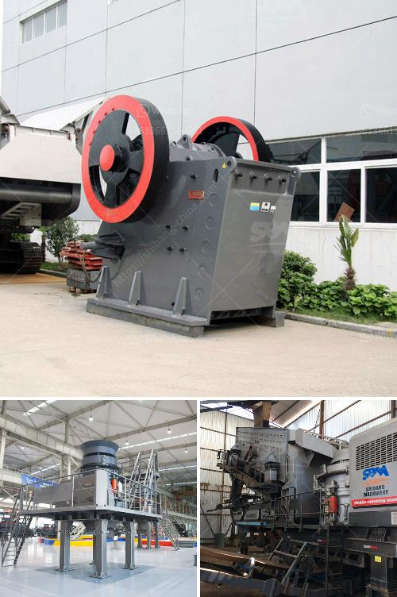

<h3>How to clean copper ore with equipment ?</h3>
Copper ore is an important natural resource and a valuable commodity. It is used in various industries, including electronics, construction, and manufacturing. Before it can be utilized for these purposes, copper ore needs to be cleaned and processed to remove impurities. This article will discuss the equipment and techniques used to clean copper ore.

The first step in cleaning copper ore is to crush and grind it to a fine powder. This helps in exposing the copper particles and separating them from the surrounding rock. This can be done using a jaw crusher or a ball mill. The crushed ore is then screened to remove any oversized particles.

Once the ore is finely ground, it is ready for cleaning. One common method of cleaning copper ore is froth flotation. In froth flotation, chemicals are added to the crushed ore to create a slurry. Air bubbles are then introduced into the slurry, which attach to the copper particles. These bubbles rise to the surface, and the copper-rich froth is skimmed off. This process is repeated several times to increase the purity of the copper concentrate.

To carry out froth flotation, several pieces of equipment are required. First, a conditioning tank is used to mix the chemicals with water and create the slurry. This tank also ensures an even distribution of the chemicals throughout the slurry. The slurry is then transferred to a flotation cell, where it is agitated to promote the attachment of air bubbles to the copper particles. Finally, a skimmer or froth crowder is used to collect the copper concentrate from the top of the cell.

Another method used to clean copper ore is gravity separation. This method relies on the differences in density between copper and other minerals present in the ore. By subjecting the crushed ore to a series of shaking or rotating motions, the denser copper particles settle to the bottom, while the lighter gangue minerals are carried away. This process is known as gravity concentration.

Gravity concentration equipment includes shaking tables, spirals, and centrifugal concentrators. Shaking tables consist of a flat deck with riffles or grooves running across it. As the slurry flows over the deck, the copper particles settle into the riffles, while the gangue minerals are washed away. Spirals and centrifugal concentrators operate on similar principles but use rotational motion to separate the copper ore from the gangue.

In addition to froth flotation and gravity separation, there are other methods available to clean copper ore, depending on the specific characteristics of the ore deposit. These methods include magnetic separation, leaching, and electrowinning, among others. Each method has its advantages and limitations, and the choice of equipment and technique will depend on factors such as the ore grade, size, and mineralogy.

In conclusion, cleaning copper ore involves crushing, grinding, and separating the copper particles from the surrounding rock. Froth flotation and gravity separation are two commonly used methods. Froth flotation relies on the attachment of air bubbles to the copper particles, while gravity separation exploits differences in density. Other methods, such as magnetic separation and leaching, may also be employed depending on the ore characteristics. By utilizing appropriate equipment and techniques, the cleaning of copper ore can be achieved efficiently and effectively.
<h3>Contact us</h3><ul><li><strong>Whatsapp:&nbsp;<a href="https://wa.me/8613661969651">+8613661969651</a></strong></li><li><a href="https://swt.shibang-china.com/?git&amp;zhl&amp;How to clean copper ore with equipment "><strong>Online Service(chat now)</strong></a></li></ul><h3>Related</h3><ul><li><a href='How to determine the size of the conveyor belt in mining？.md'>How to determine the size of the conveyor belt in mining？</a></li><li><a href='how to install stone crusher plant ？.md'>how to install stone crusher plant ？</a></li><li><a href='How to do the maintenance of crushing screening plant.md'>How to do the maintenance of crushing screening plant?</a></li><li><a href='How do highpressure grinding rolls mills work.md'>How do high-pressure grinding rolls mills work?</a></li><li><a href='How to manage a quarry plant 10 suggestions.md'>How to manage a quarry plant? 10 suggestions</a></li></ul>