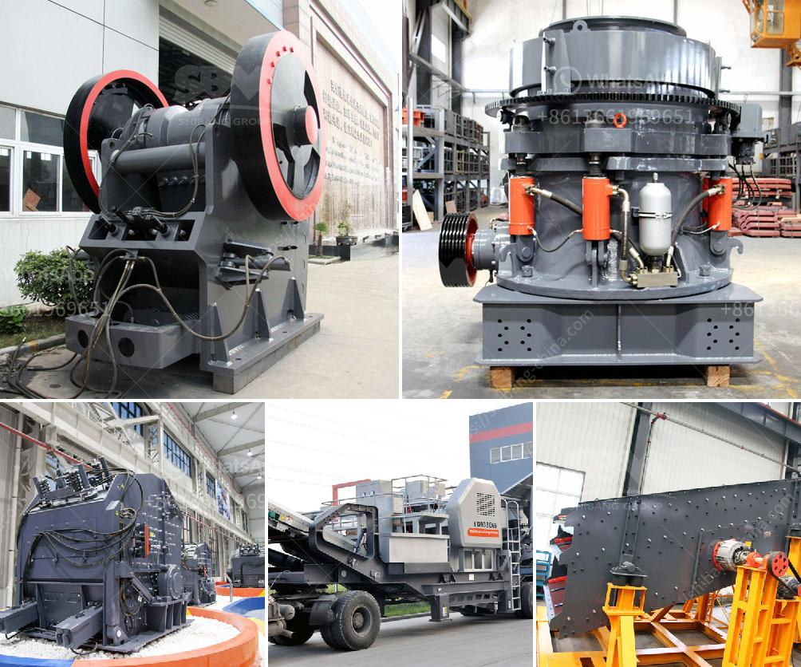

<h3>How to clean manganese ore ?</h3>
Manganese ore is a valuable mineral found in abundance in various regions around the world. With its multiple industrial applications, it is widely used in the production of steel, batteries, ceramics, and fertilizers. However, before it can be used in these industries, manganese ore needs to undergo a cleaning process to remove impurities and unwanted materials.

Cleaning manganese ore requires a combination of physical and chemical processes to separate the valuable manganese from the undesirable impurities. Here are the steps involved in efficiently cleaning manganese ore:

1. Crushing and screening: The first step in the cleaning process is to crush the manganese ore into smaller pieces. This can be done using a jaw crusher or cone crusher. After crushing, the ore is further screened to separate it into different sizes.

2. Washing and scrubbing: Once the ore is crushed and screened, it needs to be washed and scrubbed to remove clay and other impurities. This can be achieved using water and mechanical scrubbers. The ore is mixed with water in a scrubber to create a slurry, and then vigorously agitated to break down the clay and release the manganese particles.

3. Gravity separation: After the washing and scrubbing process, gravity separation techniques are used to separate the valuable manganese from the unwanted materials. Gravity separation relies on the differences in density between the manganese ore and the gangue minerals. This can be achieved by using dense media separation, jigging, or shaking tables.

4. Magnetic separation: In some cases, magnetic separation is employed to remove magnetic materials such as magnetite or hematite from the manganese ore. This process involves passing the ore through a magnetic field, and the magnetic materials are attracted to the magnets, leaving the non-magnetic manganese behind.

5. Flotation: Flotation is another method of cleaning manganese ore, especially when the ore contains high levels of silicate or carbonate impurities. In this process, chemicals such as fatty acids or sodium oleate are added to the slurry to selectively float the manganese particles, while the impurities sink to the bottom.

6. Drying and filtering: After the cleaning process, the ore is dried using rotary dryers or other drying equipment to remove any remaining moisture. It is then filtered to separate the manganese concentrate from the water or other liquids.

7. Product storage: Once the manganese ore concentrate is obtained, it is stored in appropriate containers or stockpiles until it is ready to be transported to its intended destination, such as a steel plant or a battery manufacturer.

In conclusion, cleaning manganese ore is a complex process that involves various steps to remove impurities and unwanted materials. These steps include crushing and screening, washing and scrubbing, gravity separation, magnetic separation, flotation, drying, and filtering. By following these steps, the valuable manganese can be separated and purified, making it suitable for use in various industries.
<h3>Contact us</h3><ul><li><strong>Whatsapp:&nbsp;<a href="https://wa.me/8613661969651">+8613661969651</a></strong></li><li><a href="https://swt.shibang-china.com/?git&amp;zhl&amp;How to clean manganese ore "><strong>Online Service(chat now)</strong></a></li></ul><h3>Related</h3><ul><li><a href='How does a line ball mill working.md'>How does a line ball mill working?</a></li><li><a href='How To Build Your Own Rock Crusher Plant？.md'>How To Build Your Own Rock Crusher Plant？</a></li><li><a href='How to Operate a Portable Cone Crusher.md'>How to Operate a Portable Cone Crusher?</a></li><li><a href='How to open a crusher plant in Fujairah.md'>How to open a crusher plant in Fujairah?</a></li><li><a href='how to increase life of shaft in jaw crusher？.md'>how to increase life of shaft in jaw crusher？</a></li></ul>