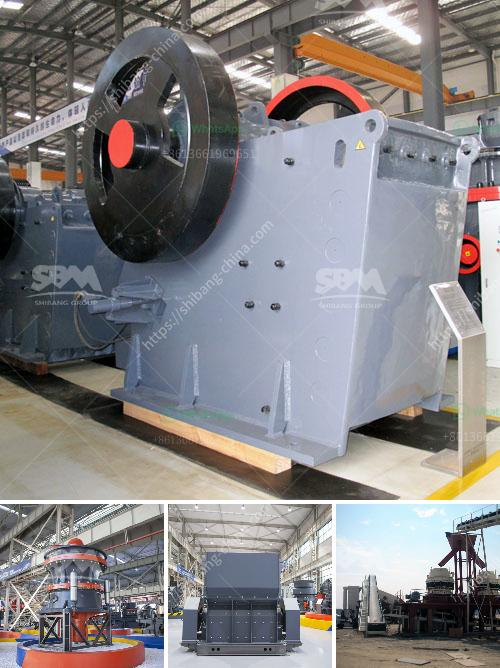

<h3>How to commission a limestone crusher first?</h3>
When it comes to commissioning a limestone crusher, it is important to follow a few steps to ensure the machine is functioning properly and efficiently. Limestone crushers play a vital role in the production process of limestone, so it is necessary to choose the right one and ensure its proper operation. Here are some key steps to commission a limestone crusher successfully:

Before commissioning the crusher, it is crucial to prepare the site properly. This involves clearing the area and ensuring there is a suitable foundation for the machine. The site should be level and stable, with enough space for the crusher and any necessary accessories.

The next step is to choose the right limestone crusher for the specific job. There are various types of limestone crushers available, including jaw crushers, impact crushers, and cone crushers. The choice will depend on factors such as the size and hardness of the limestone, the desired output size, and the capacity requirements.

Once the crusher has been selected, it needs to be properly installed. This includes connecting the necessary electrical and hydraulic systems, as well as any other auxiliary equipment. It is essential to follow the manufacturer's instructions and guidelines for installation to ensure the crusher functions correctly.

After installation, it is important to thoroughly test the crusher before commissioning it. This involves running the machine with no load to check for any abnormalities or issues. It is also crucial to adjust the crusher settings according to the specific requirements, such as the desired output size and crushing capacity.

When commissioning a limestone crusher, safety should be a top priority. Ensure that all safety measures are in place, such as installing safety guards, providing proper signage, and training operators on safe handling procedures. Regular maintenance and inspections should also be scheduled to keep the crusher in optimal condition and minimize any potential hazards.

Once the crusher is in operation, it is important to monitor its performance regularly. This can be done through regular inspections, testing, and monitoring of key parameters such as power consumption, feed size, and crushing efficiency. Any deviations or issues should be addressed promptly to ensure continuous and efficient operation.

Commissioning a limestone crusher requires careful planning, preparation, and attention to detail. By following these steps, you can ensure that the crusher is properly installed, tested, and commissioned, resulting in efficient and reliable limestone crushing. Remember to prioritize safety and ongoing maintenance to prolong the lifespan and maximize the performance of the crusher.
<h3>Contact us</h3><ul><li><strong>Whatsapp:&nbsp;<a href="https://wa.me/8613661969651">+8613661969651</a></strong></li><li><a href="https://swt.shibang-china.com/?git&amp;zhl&amp;How to commission a limestone crusher first"><strong>Online Service(chat now)</strong></a></li></ul><h3>Related</h3><ul><li><a href='How to operate mine crushing machinery.md'>How to operate mine crushing machinery?</a></li><li><a href='How to disassemble jaw crushers.md'>How to disassemble jaw crushers?</a></li><li><a href='How to make sand from stone dust.md'>How to make sand from stone dust?</a></li><li><a href='How does a jaw crusher crush limestone.md'>How does a jaw crusher crush limestone?</a></li><li><a href='how a stone crusher operates ？.md'>how a stone crusher operates ？</a></li></ul>