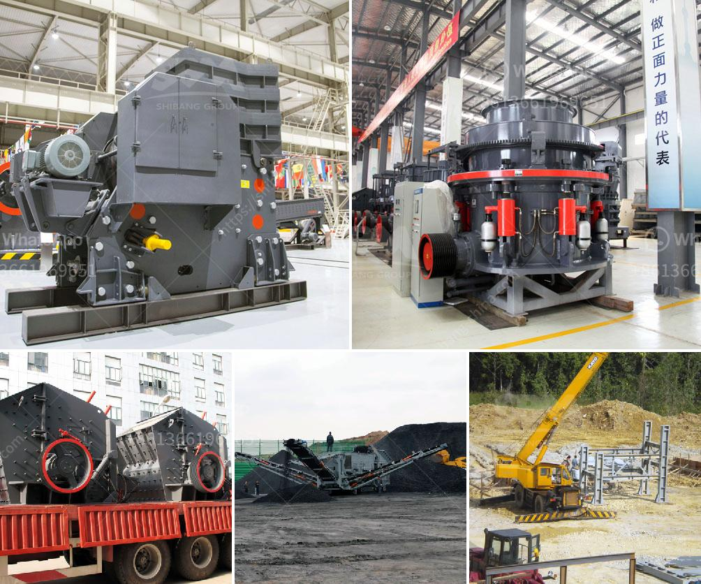

<h3>How to commission a mobile cone crusher?</h3>
If you are in the market for a mobile cone crusher, it is crucial to ensure that you commission the machine properly to maximize its efficiency and performance. Commissioning a mobile cone crusher involves several important steps that should not be overlooked. This article will guide you through the commissioning process, helping you get your crusher up and running smoothly.

1. Site preparation: Before commissioning the crusher, ensure that the site is adequately prepared. This includes clearing the area of any debris, leveling the ground, and ensuring proper drainage. The site should also have the necessary infrastructure in place, such as electrical connections and water supply.

2. Safety measures: Safety should be a top priority during the commissioning process. Make sure all safety features and devices are in place and working properly. Provide the necessary safety training to the operators and ensure they are familiar with the machine's operation and emergency procedures.

3. Pre-commissioning checks: Before starting the crusher, conduct a thorough inspection of all components and connections. Check for loose bolts or fittings, leaks, and any signs of damage. Make sure all the required lubrication points are adequately greased and fill the fuel and hydraulic tanks to the recommended levels.

4. Startup procedures: Follow the manufacturer's guidelines for starting up the crusher. This typically involves switching on the power supply, starting the engine, and allowing the crusher to warm up before beginning operations. Ensure that all controls and gauges are functioning correctly and monitor the crusher's performance during the startup process.

5. Gradual feed: Begin operations by feeding the crusher gradually to avoid overloading it. This will help prevent any potential damage to the machine and ensure a smooth commissioning process. Gradually increase the feed size and adjust the settings as needed to achieve the desired output.

6. Fine-tuning: Once the crusher is running smoothly, fine-tune its settings to optimize its performance. This may involve adjusting the CSS (closed side setting), the speed of the crusher, or the feed and discharge conveyor belts. Consult the manufacturer's guidelines or seek expert advice if necessary.

7. Monitoring and maintenance: Regularly monitor the crusher's performance and conduct routine maintenance as recommended by the manufacturer. This includes checking for wear on the liners and other critical components, inspecting and replacing filters, and ensuring proper lubrication.

8. Training and documentation: Provide training to the operators on the proper operation and maintenance of the crusher. Keep detailed records of the commissioning process, including any adjustments made, maintenance performed, and any issues encountered. This documentation will be valuable for future reference and troubleshooting.

Commissioning a mobile cone crusher requires careful planning and attention to detail. By following these steps, you can ensure a successful commissioning process and get the most out of your investment. Remember to prioritize safety, consult the manufacturer's guidelines, and seek professional assistance if needed. A properly commissioned mobile cone crusher will deliver reliable performance and contribute to your operation's productivity and profitability.
<h3>Contact us</h3><ul><li><strong>Whatsapp:&nbsp;<a href="https://wa.me/8613661969651">+8613661969651</a></strong></li><li><a href="https://swt.shibang-china.com/?git&amp;zhl&amp;How to commission a mobile cone crusher"><strong>Online Service(chat now)</strong></a></li></ul><h3>Related</h3><ul><li><a href='how to install a crusher in a quarry ？.md'>how to install a crusher in a quarry ？</a></li><li><a href='How is dolomite crushed for road building etc.md'>How is dolomite crushed for road building, etc.?</a></li><li><a href='How is mill used in the copper ore mining process.md'>How is mill used in the copper ore mining process?</a></li><li><a href='How to choose the suitable jaw crusher model.md'>How to choose the suitable jaw crusher model?</a></li><li><a href='How do I change the mantle of a cone crusher.md'>How do I change the mantle of a cone crusher?</a></li></ul>