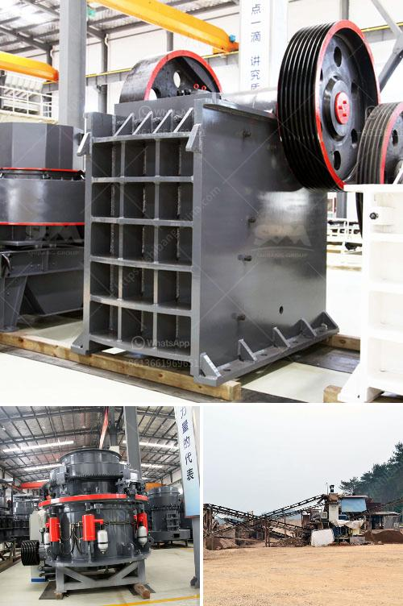

<h3>How to concentrate gold in hard rock?</h3>
Gold has captivated humans for centuries due to its rarity and intrinsic value. While gold is often found in alluvial deposits, it can also be present in hard rock, making the extraction process more challenging. Concentrating gold in hard rock requires a combination of techniques and methods that enhance its recovery. In this article, we will discuss some of the commonly used processes to concentrate gold in hard rock.

The first step in extracting gold from hard rock is to break down the ore containing the precious metal. Crushing the ore into smaller pieces allows for better exposure of the gold particles. This is typically done using large crushers and mills. Grinding the crushed ore further into a fine powder helps increase the surface area for gold recovery during subsequent processes.

Gravity concentration is a commonly used method to separate gold from the lighter gangue minerals present in hard rock. This process relies on the difference in density between gold and the surrounding material. Placer mining techniques, such as panning, rely on gravity concentration. However, more sophisticated tools like sluice boxes, jigs, and centrifugal concentrators can be used to increase gold recovery rates.

Froth flotation is a widely used process for concentrating various minerals, including gold. This method involves adding reagents to the crushed ore mixture to create bubbles, which selectively attach to the gold particles, allowing them to be separated from the rest of the ore. The concentrated gold, now in the form of a froth, is then skimmed off for further processing.

Cyanidation is a popular method for extracting gold from hard rock. The crushed ore is mixed with a weak cyanide solution, which dissolves the gold, forming a soluble gold-cyanide complex. This solution is then separated from the remaining ore and passed through activated carbon, which adsorbs the gold complex, allowing for its later recovery through stripping. Cyanidation is often used for low-grade ores or when the gold is finely disseminated in the rock.

Amalgamation has been used for centuries to concentrate gold, especially in artisanal and small-scale mining operations. This process involves mixing the crushed ore with mercury, forming an amalgam between gold and the mercury. The amalgam is then heated, vaporizing the mercury and leaving behind the gold. However, the use of mercury poses significant environmental and health risks and is being phased out in many countries.

In conclusion, extracting gold from hard rock requires a combination of crushing, grinding, gravity concentration, froth flotation, and other techniques. These methods enhance the concentration of gold within the ore, making it economically viable for later extraction. It is important to note that the choice of a specific concentration method depends on the characteristics of the ore, the scale of the operation, and environmental considerations. Mining companies continuously strive to improve these processes, ensuring the maximum recovery of gold while minimizing environmental impact.
<h3>Contact us</h3><ul><li><strong>Whatsapp:&nbsp;<a href="https://wa.me/8613661969651">+8613661969651</a></strong></li><li><a href="https://swt.shibang-china.com/?git&amp;zhl&amp;How to concentrate gold in hard rock"><strong>Online Service(chat now)</strong></a></li></ul><h3>Related</h3><ul><li><a href='How to set up a crushing plant in the Philippines.md'>How to set up a crushing plant in the Philippines?</a></li><li><a href='How to operate ball mills.md'>How to operate ball mills?</a></li><li><a href='how to limit excess fines in crushing .md'>how to limit excess fines in crushing ?</a></li><li><a href='how to pulverized limestone crusher ？.md'>how to pulverized limestone crusher ？</a></li><li><a href='how to increase vibrating screen capacity ？.md'>how to increase vibrating screen capacity ？</a></li></ul>