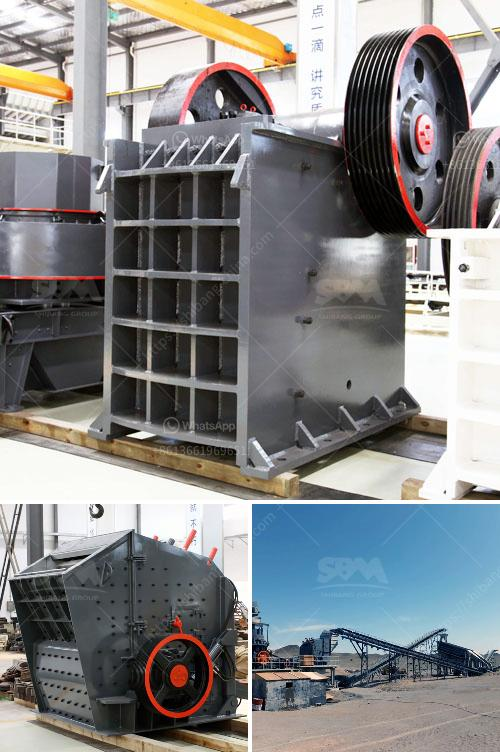

<h3>How to concentrate manganese ore?</h3>
Manganese ore is an essential raw material for the production of steel, and its demand has been steadily growing over the years. In order to meet this demand, it is crucial to concentrate manganese ore to obtain the desired content and quality. Concentration is the process of extracting the economic element from an ore, which in this case is manganese. By concentrating the ore, valuable minerals are separated from the waste material, increasing its economic value. This article will discuss some of the common methods used to concentrate manganese ore.

Gravity separation is one of the oldest and most commonly used methods for concentrating ores. It relies on the differences in density between the ore minerals and the gangue. In the case of manganese ore, the higher density manganese minerals can be separated from the lower density gangue minerals using the force of gravity alone. This is achieved by using techniques such as jigs, shaking tables, and spirals, which create a flowing film of water that separates the different minerals based on their density.

Magnetic separation is another widely used method for concentrating manganese ore. It utilizes the magnetic properties of certain minerals to separate them from the non-magnetic gangue. Manganese minerals, such as pyrolusite and rhodochrosite, are known to be strongly magnetic, while the gangue minerals are non-magnetic. By applying a magnetic field to the ore, the manganese minerals can be attracted to a magnetic surface, allowing for their easy separation from the gangue.

Flotation is a mineral processing technique that is commonly used for concentrating ores. It relies on the differences in surface properties between the ore minerals and the gangue minerals. In the case of manganese ore, the hydrophobic manganese minerals can be separated from the hydrophilic gangue minerals by selectively attaching air bubbles to the manganese minerals. This is achieved by adding certain chemical reagents to the ore slurry, which enhance the hydrophobicity of the manganese minerals, making them float to the surface, while the gangue minerals sink.

Leaching is a process that involves the selective dissolution of the desired mineral from the ore using a chemical solution. In the case of manganese ore, it can be concentrated by leaching the ore with a sulfuric acid solution, which dissolves the manganese minerals, leaving behind the insoluble gangue. The dissolved manganese can then be precipitated and recovered as a concentrate.

In conclusion, concentrating manganese ore is a crucial step in obtaining the desired content and quality for the production of steel. Gravity separation, magnetic separation, flotation, and leaching are some of the common methods used to concentrate manganese ore. Each method has its advantages and limitations, and the choice of method depends on factors such as the mineralogy of the ore and the desired final product. By utilizing these concentration techniques, manganese ore can be processed effectively, ensuring its economic value is maximized.
<h3>Contact us</h3><ul><li><strong>Whatsapp:&nbsp;<a href="https://wa.me/8613661969651">+8613661969651</a></strong></li><li><a href="https://swt.shibang-china.com/?git&amp;zhl&amp;How to concentrate manganese ore"><strong>Online Service(chat now)</strong></a></li></ul><h3>Related</h3><ul><li><a href='how to size a limestone screen？.md'>how to size a limestone screen？</a></li><li><a href='How to install a cone crusher.md'>How to install a cone crusher?</a></li><li><a href='How to set up a crushing production line station ？.md'>How to set up a crushing production line station ？</a></li><li><a href='How to measure the theoretical output of a jaw crusher .md'>How to measure the theoretical output of a jaw crusher ?</a></li><li><a href='How to install a conveyor belt down a crusher.md'>How to install a conveyor belt down a crusher?</a></li></ul>