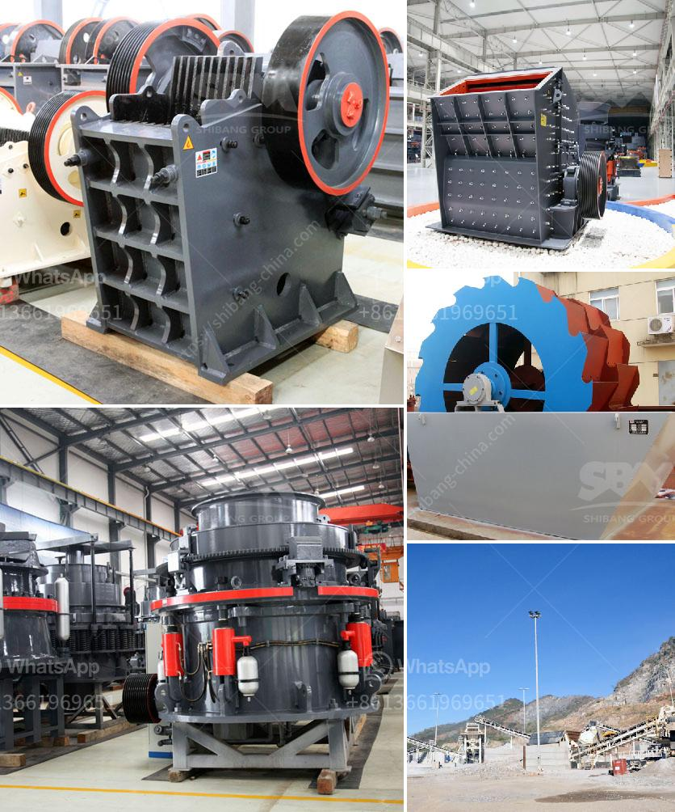

<h3>How to configure a granite gravel production line?</h3>
Granite gravel is a durable and versatile natural stone material that is commonly used in construction projects. To configure a granite gravel production line, careful planning and attention to detail are crucial. This article will provide a step-by-step guide on how to configure a granite gravel production line efficiently.

1. Geological survey and site selection: Conduct a thorough geological survey of the area to ensure that there is an abundant supply of granite gravel. Consider factors such as availability, quality, and the proximity to transportation routes. Select a site that is suitable for the operation of a production line, taking into account factors such as space, access to utilities, and environmental regulations.

2. Equipment selection: Determine the equipment required for the production line based on the desired output and capacity. Essential equipment includes crushers, vibrating feeders, conveyors, and screens. Choose reliable and efficient equipment from reputable manufacturers to ensure excellent performance and minimize downtime.

3. Crushing process design: Design the crushing process to ensure that the granite gravel is processed efficiently and meets the required specifications. Consider factors such as the feed size, output size, and the hardness of the granite. Choose the appropriate type of crusher, such as a jaw crusher or a cone crusher, based on these factors. Configure the crushing circuit to optimize the production process and minimize the generation of fines.

4. Screening process design: Design the screening process to remove any oversized or undersized granite gravel particles. Utilize vibrating screens with different deck sizes to efficiently separate the gravel into different grades. Adjust the inclination angle and the vibration intensity of the screens to achieve the desired screening efficiency.

5. Washing and scrubbing process: If required, incorporate a washing and scrubbing process to remove any impurities or clay present in the granite gravel. Use water, detergents, or specialized washing equipment to achieve the desired level of cleanliness.

6. Stockpiling and delivery: Plan the layout of the production line to facilitate the stockpiling and delivery of the finished granite gravel. Allocate appropriate spaces for stockpiles, taking into account factors such as the size of the stockpiles, stockpile management, and ease of loading and unloading. Ensure that the delivery process is smooth and efficient, with proper access for trucks or conveyor belts.

7. Safety and environmental considerations: Prioritize safety and environmental factors throughout the configuration process. Install appropriate safety devices, such as guards and emergency stop buttons, on all equipment. Follow environmental regulations regarding dust control, noise reduction, and water management. Implement regular maintenance and inspection procedures to ensure the safe and sustainable operation of the production line.

In conclusion, configuring a granite gravel production line requires careful planning and consideration of various factors. By conducting a geological survey, selecting the right equipment, designing efficient processes, and prioritizing safety and environmental regulations, you can successfully configure a granite gravel production line that meets the desired output and quality requirements.
<h3>Contact us</h3><ul><li><strong>Whatsapp:&nbsp;<a href="https://wa.me/8613661969651">+8613661969651</a></strong></li><li><a href="https://swt.shibang-china.com/?git&amp;zhl&amp;How to configure a granite gravel production line"><strong>Online Service(chat now)</strong></a></li></ul><h3>Related</h3><ul><li><a href='How mobile crushing plant can realize the recycling of construction waste .md'>How mobile crushing plant can realize the recycling of construction waste ?</a></li><li><a href='How to extract manganese from ore.md'>How to extract manganese from ore?</a></li><li><a href='How to operate a calcite crusher plant.md'>How to operate a calcite crusher plant?</a></li><li><a href='How to increase the output of ball mill.md'>How to increase the output of ball mill?</a></li><li><a href='How to select a Highquality sand making machine.md'>How to select a High-quality sand making machine?</a></li></ul>