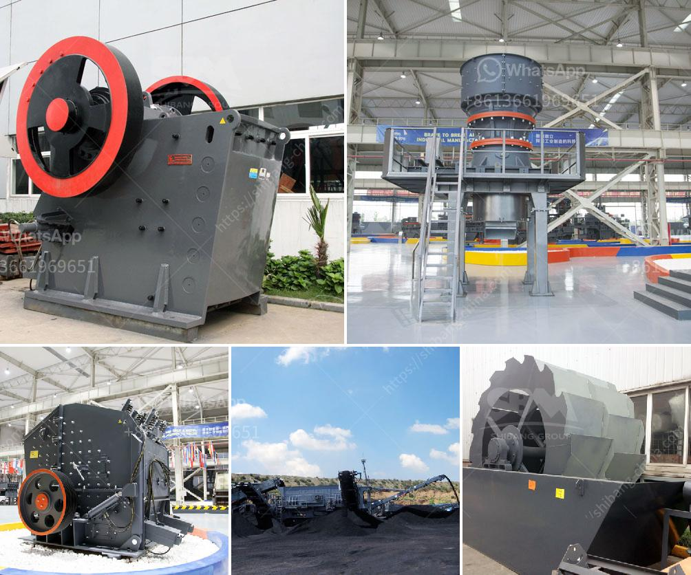

<h3>How to construct a ramp for a granite crushing plant?</h3>
Setting up a granite crushing plant requires careful planning and consideration of several factors to ensure the efficiency, safety, and profitability of the operation. One important aspect to consider is the construction of a suitable ramp that provides easy access to the crushing plant and facilitates the movement of heavy machinery. This article will outline step-by-step instructions on how to construct a ramp for a granite crushing plant.

Before beginning the ramp construction, it is crucial to evaluate the site thoroughly. Take into account factors such as the topography, soil composition, drainage, and the location of the crushing plant. Ensure the chosen site is suitable for constructing a ramp.

Engage the services of a professional engineer to design the ramp. The engineer will assess the load-bearing requirements, slope, and dimensions based on the types of equipment, such as loaders and dump trucks, that will be utilized. The design should prioritize safety by ensuring adequate width, slope, and stability.

Before commencing any construction work, obtain the necessary permits and permissions from local authorities. Ensure compliance with all relevant safety regulations and guidelines.

Clear the area where the ramp will be constructed. Remove any vegetation, rocks, or debris that could hinder the construction process.

Mark the layout of the ramp using stakes and string. Ensure the ramp is wide enough to accommodate the equipment while leaving additional space for maneuvering.

Excavate the area following the design specifications and dig the foundation for the ramp. Grade the surface to ensure proper drainage and a stable foundation. Additionally, consider the installation of geotextiles or erosion control measures to prevent soil erosion.

If required, construct retaining walls to prevent soil movement and erosion. The retaining walls should be built using sturdy materials that can withstand the weight and lateral forces exerted by the equipment.

To avoid water pooling and erosion, install appropriate drainage systems along the ramp. This could include culverts, French drains, or other suitable methods based on the site's specific requirements.

To increase the ramp's durability and stability, reinforce the excavated area and foundation with compacted material. Use high-quality fill material, such as crushed stone or gravel, to create a solid base.

Lastly, apply a surface treatment to enhance the ramp's grip and reduce the risk of accidents. Consider using a rough-textured material, such as asphalt, concrete, or aggregates, to improve traction.

In conclusion, constructing a ramp for a granite crushing plant involves careful planning, adherence to safety guidelines, and the engagement of professional expertise. By following the step-by-step instructions outlined in this article, you can create a ramp that ensures easy access to the plant, facilitates the movement of heavy machinery, and promotes a safe and efficient crushing operation.
<h3>Contact us</h3><ul><li><strong>Whatsapp:&nbsp;<a href="https://wa.me/8613661969651">+8613661969651</a></strong></li><li><a href="https://swt.shibang-china.com/?git&amp;zhl&amp;How to construct a ramp for a granite crushing plant"><strong>Online Service(chat now)</strong></a></li></ul><h3>Related</h3><ul><li><a href='How to operate a calcite crusher plant.md'>How to operate a calcite crusher plant?</a></li><li><a href='How to crush the very hard iron ore magnetite.md'>How to crush the very hard iron ore magnetite?</a></li><li><a href='How to crush coal in power plant.md'>How to crush coal in power plant?</a></li><li><a href='How to fit water pipes on vibrating screen in sand washing plant.md'>How to fit water pipes on vibrating screen in sand washing plant?</a></li><li><a href='How to break granite rocks in a double toggle jaw crusher.md'>How to break granite rocks in a double toggle jaw crusher?</a></li></ul>