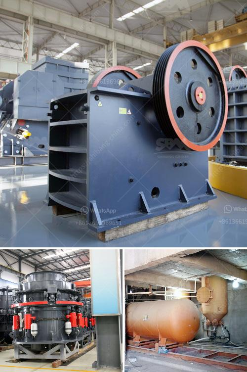

<h3>How to control the dust of stone crusher ?</h3>
Stone crushing industry is an important industrial sector in many countries, especially in developing countries. Over the years, the industry has been considered as a potential source of air pollution due to the emission of large amounts of dust. Therefore, government agencies have introduced various regulations to control the dust generated during the crushing process.

Dust suppression systems are commonly used to control dust at stone crushing sites. These systems consist of three basic components: a pump, a water spray nozzle, and a local exhaust ventilation (LEV) system. The pump is used to create a high pressure water mist, which is then sprayed through the nozzle onto the targeted area. The LEV system helps to capture the dust particles before they escape into the atmosphere.

There are several ways to effectively control the dust at stone crushing sites. The following techniques can be implemented to reduce dust generation and improve air quality:

1. Wet Dust Suppression System: The key to effective dust control is to employ wet suppression techniques. Water spraying at the crusher inlet and outlet can reduce the amount of dust generated during crushing operations. Water sprays greatly reduce the amount of airborne dust but also create wet conditions resulting in slippery roads and reduced visibility.

2. Enclosure and Isolation: The stone crusher should be installed in a residential area with proper enclosure and isolation measures to minimize dust emissions. Additionally, barriers or dust curtains can be installed to prevent dust from spreading outside the site.

3. Proper Maintenance: Regular maintenance of the stone crusher is essential to ensure its efficient operation and prevent excessive dust emissions. Routine inspection and lubrication of the machinery can help to minimize dust generation.

4. Dust Control Measures on Haul Roads: Dust generated during transportation of crushed stones can be a significant source of air pollution. Proper dust control measures should be implemented on haul roads, such as watering or paving the roads to prevent dust from becoming airborne.

5. Employee Training and Awareness: Employees working at stone crushing sites should be trained on the importance of dust control and the use of personal protective equipment (PPE) to minimize their exposure to airborne dust. They should also be educated about the potential health risks associated with prolonged dust exposure.

6. Regular Air Quality Monitoring: Regular air quality monitoring should be conducted at stone crushing sites to assess the effectiveness of dust control measures and identify areas that require improvement. This will help to ensure that the implemented measures are successful in reducing dust emissions.

In conclusion, effective dust control measures are crucial for minimizing air pollution and protecting the environment. Implementing the techniques mentioned above can greatly reduce dust emissions at stone crushing sites. However, it is important for all stakeholders, including government agencies, stone crusher operators, and local communities, to work together to ensure compliance with regulations and the adoption of best practices. By doing so, the stone crushing industry can play its part in creating a cleaner and healthier environment.
<h3>Contact us</h3><ul><li><strong>Whatsapp:&nbsp;<a href="https://wa.me/8613661969651">+8613661969651</a></strong></li><li><a href="https://swt.shibang-china.com/?git&amp;zhl&amp;How to control the dust of stone crusher "><strong>Online Service(chat now)</strong></a></li></ul><h3>Related</h3><ul><li><a href='How to design a cement processing plant.md'>How to design a cement processing plant?</a></li><li><a href='How to choose the suitable location of crusher in open pit mining.md'>How to choose the suitable location of crusher in open pit mining?</a></li><li><a href='How to change the HP cone crusher mantle.md'>How to change the HP cone crusher mantle?</a></li><li><a href='How to prevent crusher equipment from rusting .md'>How to prevent crusher equipment from rusting ?</a></li><li><a href='How to Use Cone Crusher and Jaw Crusher ？.md'>How to Use Cone Crusher and Jaw Crusher ？</a></li></ul>