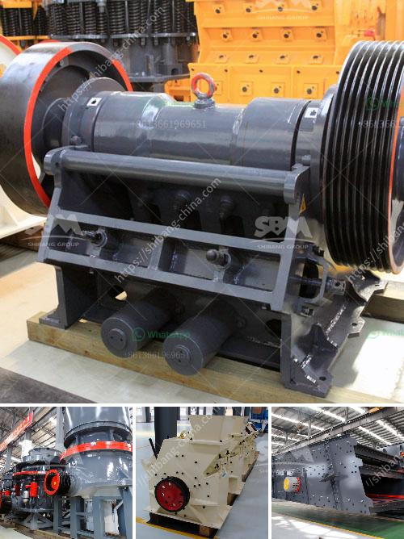

<h3>How to control the feed size of the ball mill?</h3>
The feed size of the ball mill plays a crucial role in determining its productivity and efficiency. The feed size varies depending on the nature of the material and the grinding requirements, which range from coarse to fine. However, it is essential to ensure that the feed size is within the specified limits to avoid excessive wear and inefficient grinding. In this article, we will discuss some effective methods to control the feed size of the ball mill.

1. Proper Ore Blending: One of the vital steps in controlling the feed size of the ball mill is proper ore blending. This involves mixing various types of ores in the desired proportions to achieve the target feed size. By blending ores with different characteristics, such as hardness and grindability, it is possible to optimize the feed size and improve the mill's overall performance.

2. Crushing and Grinding Circuit Optimization: Prior to feeding the ball mill, the material needs to go through a crushing and grinding circuit. This circuit's efficiency can be improved by optimizing the equipment involved, such as crushers and mills. By selecting the appropriate crusher and optimizing the grinding process, the feed size can be controlled more effectively.

3. Screen Classification: Screen classification is another method to control the feed size of the ball mill. By using screens with different opening sizes, it is possible to separate the oversized or undersized particles from the desired feed size range. This ensures that only the particles within the specified range are fed into the mill, improving its efficiency and reducing wear.

4. Feed Rate Control: The feed rate to the ball mill is also crucial in controlling the feed size. By adjusting the feed rate, it is possible to control the amount of material entering the mill, thereby regulating the grinding process. A higher feed rate results in a coarser grind, while a lower feed rate leads to a finer grind. Therefore, maintaining the optimal feed rate is essential for controlling the feed size.

5. Mill Liner Design: The design of the mill liner can also influence the feed size control. A well-designed liner can ensure the proper movement of the grinding media within the mill, resulting in efficient grinding and controlled feed size. Additionally, the correct liner design can minimize wear and increase the longevity of the mill.

In conclusion, controlling the feed size of the ball mill is crucial for optimizing its productivity and efficiency. By implementing proper ore blending, optimizing the crushing and grinding circuit, utilizing screen classification, regulating the feed rate, and designing suitable mill liners, it is possible to achieve the desired feed size control. These methods not only improve the mill's performance but also reduce wear and save energy, resulting in significant cost savings for the operators.
<h3>Contact us</h3><ul><li><strong>Whatsapp:&nbsp;<a href="https://wa.me/8613661969651">+8613661969651</a></strong></li><li><a href="https://swt.shibang-china.com/?git&amp;zhl&amp;How to control the feed size of the ball mill"><strong>Online Service(chat now)</strong></a></li></ul><h3>Related</h3><ul><li><a href='How industry crush graphite.md'>How industry crush graphite?</a></li><li><a href='How to determine the value of a rock quarry.md'>How to determine the value of a rock quarry?</a></li><li><a href='How to choose a stone grinding machine ？.md'>How to choose a stone grinding machine ？</a></li><li><a href='How to Grind Manganese Ores Using a Ball Mill.md'>How to Grind Manganese Ores Using a Ball Mill?</a></li><li><a href='How to Use a Hammer Mill Kenya ？.md'>How to Use a Hammer Mill Kenya ？</a></li></ul>