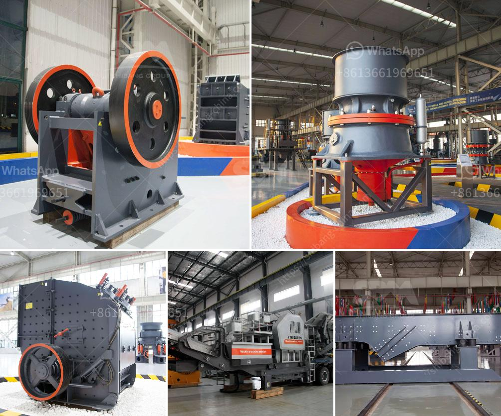

<h3>How to control vibrating screen ?</h3>
Vibrating screens are widely used in industries like mining, building materials, refractory materials, coal, and others to separate and grade materials. The vibrating screen consists of a screen box, a support device, a vibration exciter, and a motor. It utilizes the vibration exciter to drive the screen box to make jumping movement. The materials on the sieve surface are thrown up and moved forward in a straight line, achieving the purpose of screening and grading.

However, sometimes the vibrating screen may have some problems, such as unstable amplitude, abnormal sound or bearing heating. These issues can affect the screening efficiency and even damage the equipment. Therefore, it is vital to control the vibrating screen properly. Let's explore some effective ways to achieve this:

1. Regular maintenance: Regular maintenance is crucial to ensure the smooth operation of the vibrating screen. Check the screen box and support device regularly for any wear and tear. Tighten loose bolts and ensure the screen surface is clean and free from any blockage. Grease the bearings regularly to reduce friction and prevent overheating.

2. Adjust the excitation force: The vibration exciter is responsible for providing the necessary force for the vibrating screen to operate. Adjusting the excitation force can help control the amplitude of the screen. If the vibrating screen has unstable amplitude, it may be necessary to increase the excitation force. On the other hand, if the amplitude is too large, reducing the excitation force can help stabilize it.

3. Select appropriate mesh size: The mesh size of the vibrating screen plays a vital role in achieving the desired screening performance. If the mesh size is too large, some materials may pass through without being properly screened. On the other hand, if the mesh size is too small, the screening efficiency will decrease and may cause blockage. It is essential to choose the appropriate mesh size based on the material being screened and the desired grade.

4. Optimize feeding conditions: Proper feeding conditions can greatly affect the performance of the vibrating screen. Ensure a consistent and uniform feed rate to prevent overloading the equipment. Avoid overloading the screen with too much material as it can lead to decreased screening efficiency and excessive vibration.

5. Regularly check and replace worn-out parts: The vibrating screen consists of various parts like screen mesh, beam, spring, and others. Constant use may cause wear and tear in these components, affecting the overall performance of the vibrating screen. It is important to check regularly and replace any worn-out parts to maintain the proper functioning of the equipment.

In conclusion, controlling the vibrating screen is crucial to ensure its efficient operation and prolong its lifespan. Regular maintenance, adjusting the excitation force, selecting appropriate mesh size, optimizing feeding conditions, and replacing worn-out parts are some effective ways to control the vibrating screen effectively. By implementing these measures, industries can achieve higher screening efficiency, reduce downtime, and improve overall production quality.
<h3>Contact us</h3><ul><li><strong>Whatsapp:&nbsp;<a href="https://wa.me/8613661969651">+8613661969651</a></strong></li><li><a href="https://swt.shibang-china.com/?git&amp;zhl&amp;How to control vibrating screen "><strong>Online Service(chat now)</strong></a></li></ul><h3>Related</h3><ul><li><a href='how to grinder calcium carbonate stone crusher machine.md'>how to grinder calcium carbonate stone crusher machine?</a></li><li><a href='How to operate rock crusher equipment safely .md'>How to operate rock crusher equipment safely ?</a></li><li><a href='How to crush limestone.md'>How to crush limestone?</a></li><li><a href='How to choose the suitable jaw crusher model.md'>How to choose the suitable jaw crusher model?</a></li><li><a href='How to choose a generator for a crusher plant .md'>How to choose a generator for a crusher plant ?</a></li></ul>