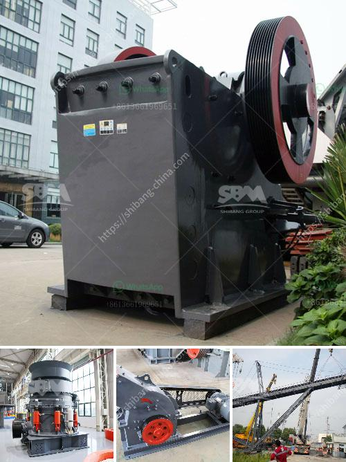

<h3>How to crush aggregates?</h3>
Aggregates, which refer to crushed stone, gravel, or sand, are essential materials used for various construction purposes. From building foundations to road bases, aggregates form the backbone of any infrastructure project. Crushing aggregates is the process of turning large rocks into smaller pieces to create a more manageable and suitable size for construction applications. In this article, we will delve into the steps involved in crushing aggregates effectively.

The first step in crushing aggregates is to select the appropriate equipment. Various machines are available for this purpose, such as jaw crushers, cone crushers, impact crushers, and gyratory crushers. The choice of equipment depends on factors like the size of the rocks, the desired product size, and the required capacity.

Once the right equipment is chosen, the next step is to feed the aggregates into the crusher. This task is typically performed using a vibrating feeder, which evenly distributes the rocks over the crusher. It is important to ensure a consistent and controlled feed to maximize the efficiency of the crushing process.

The actual crushing of aggregates occurs when the rocks are subjected to a continuous force, either by compression or impact. Compression crushers, like jaw crushers and gyratory crushers, apply pressure to the material, gradually breaking it down. Impact crushers, on the other hand, use the principle of rapid impact to shatter the rocks into smaller pieces.

During the crushing process, it is crucial to monitor the product size. The desired product size can be achieved by adjusting the crusher settings, such as the closed side setting (CSS) or the gap between the mantle and concave in a cone crusher. Regularly checking the product size ensures that the final aggregates meet the required specifications for the intended use.

To enhance the efficiency of the crushing process, it is advisable to utilize a screening system to separate the crushed aggregates into different sizes. This process, known as screening, removes any unwanted fines or oversized particles from the final product. Screeners come in various types, such as inclined screens, horizontal screens, or vibrating screens, and can be customized based on the specific requirements of the project.

After the aggregates are crushed and screened, they can be further processed or stockpiled for immediate use. Processing may involve additional steps, such as washing the aggregates to remove impurities or shaping them into specific sizes using a shaping machine.

In conclusion, crushing aggregates is a crucial step in the construction process, as it transforms large rocks into smaller, more manageable pieces suitable for various applications. By selecting the right equipment, ensuring a consistent feed, and monitoring the product size, the crushing process can be optimized for maximum efficiency. Adding a screening system and considering additional processing steps can further enhance the quality of the final aggregates. With proper crushing techniques, aggregates can be crushed effectively, meeting the desired specifications and contributing to the development of robust and reliable infrastructure.
<h3>Contact us</h3><ul><li><strong>Whatsapp:&nbsp;<a href="https://wa.me/8613661969651">+8613661969651</a></strong></li><li><a href="https://swt.shibang-china.com/?git&amp;zhl&amp;How to crush aggregates"><strong>Online Service(chat now)</strong></a></li></ul><h3>Related</h3><ul><li><a href='How to create a business plan for crushers in Brazil.md'>How to create a business plan for crushers in Brazil?</a></li><li><a href='How to choose the specification of jaw crusher？.md'>How to choose the specification of jaw crusher？</a></li><li><a href='How to choose the right primary crusher for your plant.md'>How to choose the right primary crusher for your plant?</a></li><li><a href='How to Configure Crusher Indonesia ？.md'>How to Configure Crusher Indonesia ？</a></li><li><a href='How to replace the hammer of a hammer crusher.md'>How to replace the hammer of a hammer crusher?</a></li></ul>