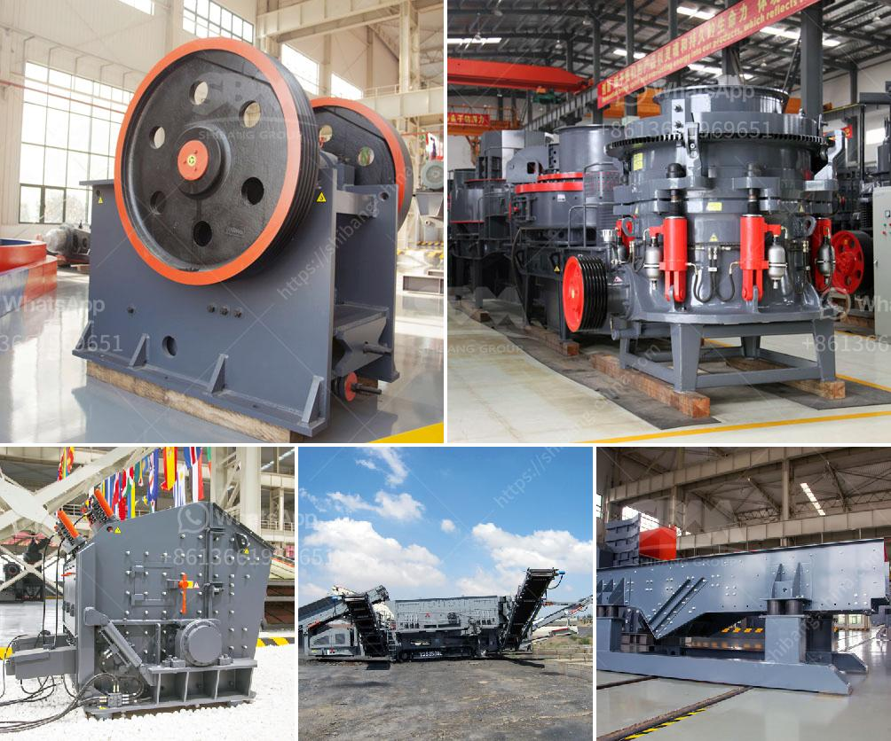

<h3>How to crush and clean stone?</h3>
Stone crushing and cleaning is a crucial part of various construction and industrial processes. Whether you're working on a construction site or a landscaping project, breaking down large stones into smaller pieces and cleaning them is essential to ensure their usability and aesthetic appeal. In this article, we will guide you through the process of crushing and cleaning stones effectively and safely.

Before starting any stone-crushing and cleaning process, it's vital to prioritize safety. Wear appropriate personal protective equipment (PPE), including safety glasses, gloves, and steel-toed boots, to protect yourself from sharp edges, dust, and potential flying debris. Always follow safety guidelines and adhere to local regulations.

Start by selecting the right tools and equipment for the job. You'll need a stone crusher or a rock breaker, which can be purchased or rented from a machinery rental store or construction supply company. Additionally, gather other essential tools such as a shovel, wheelbarrow, broom, and hose for the cleaning process.

a. Position the stone crusher or rock breaker near the stones to be crushed. Ensure it's stable and properly maintained before using it.

b. Place the stones inside the crusher or breaker and apply a consistent and gradual force to crush them. Avoid applying excessive force, as it may result in damaging the stones or the equipment.

c. Keep a firm grip and maintain control over the tool, especially when crushing larger stones. This will help prevent accidents and injuries.

Once the stones are crushed, it's time to clean them thoroughly. Follow these steps to achieve a clean and presentable end result:

b. Remove any large debris or clumps of crushed stone from the wheelbarrow, ensuring that only properly sized crushed stones remain.

c. Rinse the stones with a hose to remove any dust or dirt. Take your time and thoroughly clean each stone, making sure all surfaces are free from debris.

Properly dispose of any waste generated during the crushing and cleaning process. Consult local regulations or waste management guidelines to determine the appropriate disposal methods for any leftover materials.

After completing the crushing and cleaning process, clean and maintain your equipment to ensure its longevity and efficiency. Regularly inspect and replace any worn-out parts and lubricate moving components as instructed by the manufacturer.

In conclusion, stone crushing and cleaning play a vital role in many construction and landscaping projects. By following safety guidelines, selecting the right tools, and properly cleaning the crushed stones, you can achieve a successful outcome. Remember to prioritize safety and cleanliness throughout the process to ensure both your well-being and the quality of the end product.
<h3>Contact us</h3><ul><li><strong>Whatsapp:&nbsp;<a href="https://wa.me/8613661969651">+8613661969651</a></strong></li><li><a href="https://swt.shibang-china.com/?git&amp;zhl&amp;How to crush and clean stone"><strong>Online Service(chat now)</strong></a></li></ul><h3>Related</h3><ul><li><a href='How to extract iron ore flow chart.md'>How to extract iron ore flow chart?</a></li><li><a href='How to Build Your Own Rock Crusher in the Philippines ？.md'>How to Build Your Own Rock Crusher in the Philippines ？</a></li><li><a href='How to move and install a mobile rock crusher.md'>How to move and install a mobile rock crusher?</a></li><li><a href='how much is an iron ore crushr machine？.md'>how much is an iron ore crushr machine？</a></li><li><a href='How to start a gold ore mining business.md'>How to start a gold ore mining business?</a></li></ul>