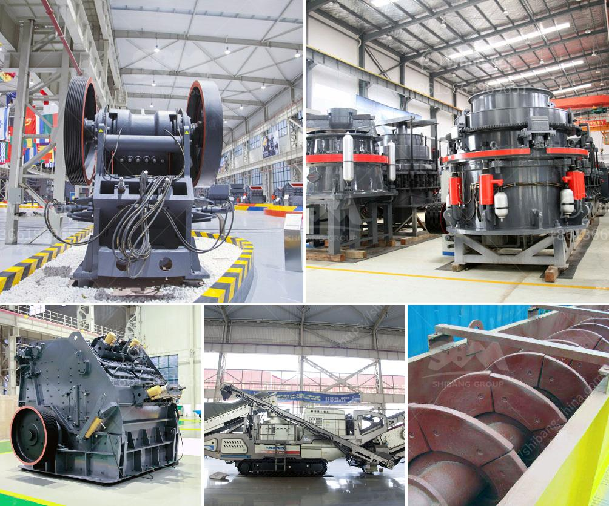

<h3>How to crush basalt rock?</h3>
Basalt is a type of igneous rock that is commonly found in the Earth's crust. It is known for its durability and excellent heat resistance, making it a popular choice for construction and landscaping projects. However, if you're working on a project that requires crushed basalt rock, you may be wondering how to crush it efficiently and effectively. In this article, we will guide you through the process of crushing basalt rock step by step.

Before you begin the crushing process, it's important to understand the properties of basalt rock. Knowing its hardness, density, and chemical composition will help you determine the most appropriate crushing method and equipment. Basalt is typically a hard rock with a Mohs hardness scale rating of 5-7. It is dense and can contain various minerals such as feldspar and pyroxene.

To crush basalt rock, you will need a crushing machine that can handle large pieces of rock. Jaw crushers and impact crushers are two common options. Jaw crushers are generally utilized for primary crushing, while impact crushers are commonly used for secondary or tertiary crushing. Selecting the appropriate equipment will depend on the size of the rocks you need to crush and the desired output size.

Before feeding the basalt rock into the crusher, you should carefully prepare it to ensure a smooth and efficient crushing process. Remove any loose debris or dirt from the rock's surface, as this can cause damage to the crusher. Additionally, inspect the rock for any oversized pieces or foreign objects that could potentially cause blockages or machine failures.

Once your basalt rock is prepared, it's time to start the crushing process. Depending on the chosen equipment, adjust the settings to achieve the desired output size. Gradually feed the rock into the crusher's hopper until it is entirely processed. Remember to follow the manufacturer's instructions and maintain a consistent feed rate to ensure optimal performance.

While the crushing process is underway, closely monitor the crusher's performance. Regularly check the settings, such as the gap between the jaws or impact plates, to ensure smooth operation and prevent uneven wear. If necessary, make adjustments to maintain the desired output size. Additionally, keep an eye out for any unusual noises or vibrations that may indicate a mechanical issue.

Once your basalt rock has been crushed to the desired size, it's time to collect the finished product. Use a conveyer belt or another method to move the crushed material to a storage area or a transportation vehicle. Take care to avoid mixing different sizes of crushed rock if you require specific grading for your project.

In conclusion, crushing basalt rock requires careful planning, appropriate equipment selection, and consistent monitoring. By following the steps outlined in this guide, you can crush basalt rock efficiently and achieve the desired output size for your construction or landscaping project. Remember to prioritize safety and consult with professionals when needed. With the right approach, crushing basalt rock can be an efficient and successful process.
<h3>Contact us</h3><ul><li><strong>Whatsapp:&nbsp;<a href="https://wa.me/8613661969651">+8613661969651</a></strong></li><li><a href="https://swt.shibang-china.com/?git&amp;zhl&amp;How to crush basalt rock"><strong>Online Service(chat now)</strong></a></li></ul><h3>Related</h3><ul><li><a href='how does the hydraulic cone crusher works .md'>how does the hydraulic cone crusher works ?</a></li><li><a href='How to set up a granite processing plant.md'>How to set up a granite processing plant?</a></li><li><a href='How iron ore mining is conducted.md'>How iron ore mining is conducted</a></li><li><a href='how to design conveyor belt.md'>how to design conveyor belt</a></li><li><a href='How to separate gold ore from rock.md'>How to separate gold ore from rock?</a></li></ul>