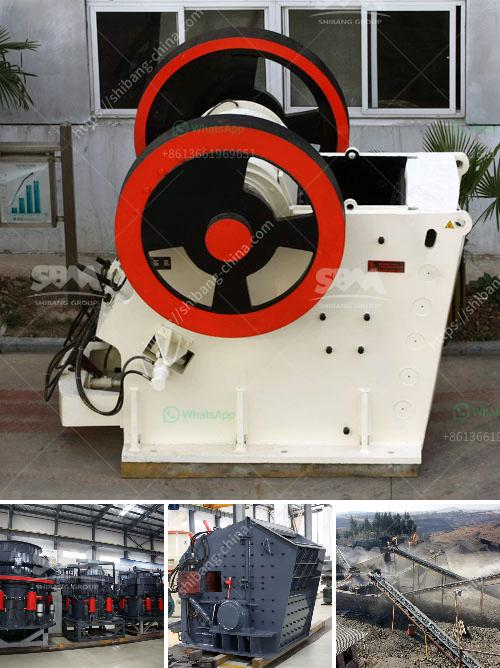

<h3>How to crush borax ?</h3>
Borax is a versatile and useful mineral that has numerous applications, ranging from cleaning to pest control, and even as a DIY ingredient in crafts. However, sometimes you may find the need to crush borax into a finer powder, whether for an experiment or to enhance its efficacy in a particular task. If you're wondering how to accomplish this, look no further! This article will guide you on how to crush borax effectively and safely.

Before we delve into the actual process, it is essential to emphasize safety precautions. When working with any type of powdered substance, it is wise to wear protective gear like safety goggles and a dust mask. These will help prevent particles from getting into your eyes or respiratory system.

1. Borax: Gather the desired amount of borax that you want to crush. Measure it based on your specific needs or application.

2. Airtight bag or plastic wrap: To prevent the borax from spilling or dispersing during the crushing process, it is best to contain it. Use an airtight bag or tightly wrap it in plastic.

3. Hammer or mallet: A solid tool like a heavy hammer or mallet will be required to apply force and crush the borax effectively.

1. Prepare the borax: Take the measured amount of borax and place it in the airtight bag or wrap it tightly in plastic. Ensure that the seal is secure, as this will prevent any accidental spills or airborne particles.

2. Find a suitable surface: Find a sturdy surface, preferably outdoors or in a well-ventilated area, where you can safely crush the borax without causing damage. A concrete or solid workbench would be ideal.

3. Crushing the borax: Hold the bag or plastic wrap containing the borax in one hand and firmly strike it using the hammer or mallet. Aim for a repetitive, controlled motion instead of one strong blow. This will help break down the crystals into smaller pieces. Continue until you achieve the desired consistency, generally resembling a fine powder.

4. Packaging: Once the borax is crushed, carefully open the bag or unwrap the plastic wrap. Transfer the crushed borax into an airtight container or resealable bag for convenient storage and future use.

Remember to clean up your work area by properly disposing of any remaining borax particles and wiping down surfaces to prevent any accidents or potential contamination.

In conclusion, crushing borax can be a simple process with the right tools and safety precautions in place. By following these steps, you can turn your borax crystals into a fine powder, enhancing its usability in various applications. Just remember to always prioritize safety, wear protective gear, and work in a well-ventilated area. Happy crushing!
<h3>Contact us</h3><ul><li><strong>Whatsapp:&nbsp;<a href="https://wa.me/8613661969651">+8613661969651</a></strong></li><li><a href="https://swt.shibang-china.com/?git&amp;zhl&amp;How to crush borax "><strong>Online Service(chat now)</strong></a></li></ul><h3>Related</h3><ul><li><a href='how to cal belt conveyor length for stone crusher ？.md'>how to cal belt conveyor length for stone crusher ？</a></li><li><a href='How can I get more production out of my impact crusher.md'>How can I get more production out of my impact crusher?</a></li><li><a href='How to import stone crusher machine from China to Canada.md'>How to import stone crusher machine from China to Canada?</a></li><li><a href='how does a limestone ball mill working .md'>how does a limestone ball mill working ?</a></li><li><a href='how to give a seminar on jaw crusher .md'>how to give a seminar on jaw crusher ?</a></li></ul>