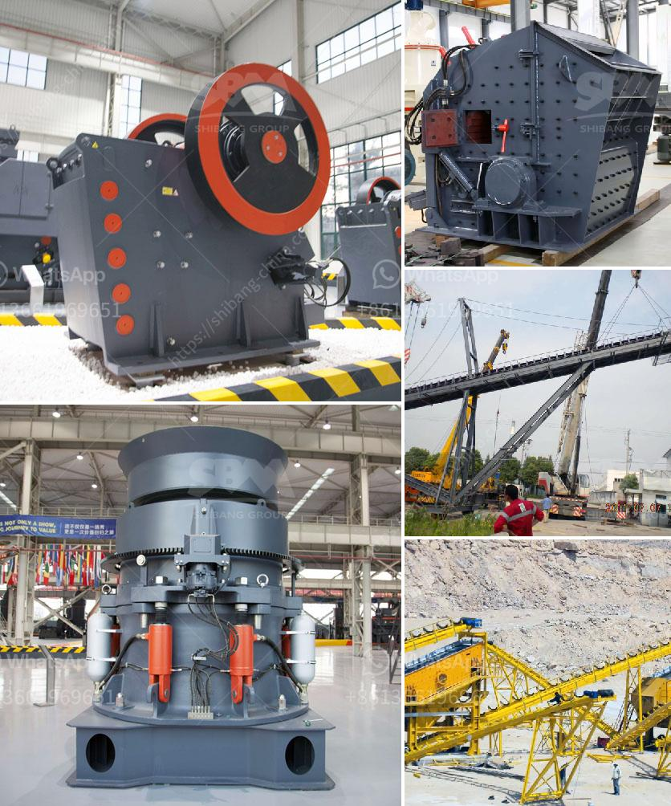

<h3>How to crush calcite lumps?</h3>
Calcite is a natural mineral with a unique crystal structure that gives it a variety of industrial and commercial uses. However, in its raw form, calcite can sometimes exist in the form of lumps, making it challenging to use in practical applications. Crushing these lumps into a fine powder can unlock the potential of calcite and make it more accessible for various industries. In this article, we will explore the steps to effectively crush calcite lumps.

Calcite lumps usually have irregular shapes and sizes, ranging from small pebbles to larger chunks. The first step in crushing calcite lumps is to identify the nature of the lumps and determine the appropriate technique.

One option to crush calcite lumps is the use of a jaw crusher, a primary crusher that can reduce large lumps into smaller pieces. Jaw crushers work best when dealing with large amounts of material and can process both hard and soft materials. However, it is important to consider the specific characteristics of calcite, such as its brittleness, and adjust the settings of the crusher accordingly to avoid excessive breakage.

Another method to crush calcite lumps is to use a cone crusher, which can provide a finer particle size. Cone crushers are often used in the secondary or tertiary crushing stages and can efficiently crush calcite lumps into finer particles. The advantage of using a cone crusher lies in its ability to produce a uniform particle shape, which is crucial for certain applications.

For smaller calcite lumps, a hammer crusher can be employed. Hammer crushers consist of rotating hammers that strike the lumps with high speed to break them into smaller pieces. The size of the final crushed calcite can be adjusted by changing the gap between the hammers and the screen.

After choosing the appropriate crushing method, it is important to ensure the proper operation of the crusher to achieve the desired result. Regular maintenance and inspection of the crusher are essential to prevent any breakdowns that could hinder the crushing process.

Once calcite lumps have been crushed into smaller sizes, they can be further processed for various applications. The fine powder obtained from crushing calcite lumps can be used as fillers in products such as paints, coatings, and plastics due to its superior whiteness and brightness. Calcite powders are also used in the manufacturing of cement, rubber, and fertilizers.

In conclusion, crushing calcite lumps is an essential step to unlock the potential of this versatile mineral. The appropriate crushing technique, whether with a jaw crusher, cone crusher, or hammer crusher, can effectively break down calcite lumps into smaller particles. Careful operation and maintenance of the crusher are crucial to ensure a successful crushing process. Once crushed, calcite can be further processed and utilized in various industrial applications.
<h3>Contact us</h3><ul><li><strong>Whatsapp:&nbsp;<a href="https://wa.me/8613661969651">+8613661969651</a></strong></li><li><a href="https://swt.shibang-china.com/?git&amp;zhl&amp;How to crush calcite lumps"><strong>Online Service(chat now)</strong></a></li></ul><h3>Related</h3><ul><li><a href='How does a mobile crushing plant work.md'>How does a mobile crushing plant work?</a></li><li><a href='How is dolomite crushed for road building etc.md'>How is dolomite crushed for road building, etc.?</a></li><li><a href='How to Buy a Stone Crusher in India ？.md'>How to Buy a Stone Crusher in India ？</a></li><li><a href='How can you tell the head has come up on of cone crusher.md'>How can you tell the head has come up on of cone crusher?</a></li><li><a href='How to increase the production capacity of stone grinding machine ？.md'>How to increase the production capacity of stone grinding machine ？</a></li></ul>