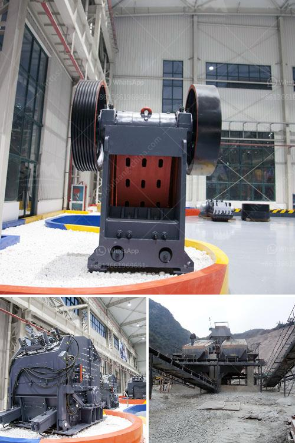

<h3>How to crush calcium carbonate?</h3>
Calcium carbonate is a chemical compound commonly found in rocks, shells, and minerals such as calcite, limestone, and marble. It is widely used in various industries, including construction, pharmaceuticals, agriculture, and manufacturing. Crushing calcium carbonate is an essential step in many production processes, as it transforms large chunks into smaller particles suitable for further processing.

Calcium carbonate often occurs in its natural form as large rock formations or sedimentary deposits. However, for various applications and industries, it needs to be crushed into smaller particles. The process of crushing calcium carbonate is important for a variety of reasons:

1. Size Reduction: Crushing reduces the particle size of calcium carbonate, making it easier to handle and process. Smaller particles dissolve more readily, increasing the compound's effectiveness in applications such as pharmaceuticals and agriculture.

2. Homogeneous Distribution: Crushing ensures an even distribution of calcium carbonate particles, which is crucial for achieving consistent results in the desired application. Homogeneity is especially critical in the production of building materials and chemical additives.

3. Enhanced Reactivity: Smaller particles of calcium carbonate have a larger surface area, leading to increased reactivity. This property is beneficial in applications that require a fast and efficient reaction, such as in the production of cement or other chemical compounds.

While there are different methods to crush calcium carbonate, the following guide provides a generalized overview:

1. Preparing the Material: Before crushing, it is essential to prepare the calcium carbonate. Ensure that the material is dry, as moisture can affect the crushing process negatively.

2. Choose the Crushing Equipment: Select a suitable crushing machine based on the nature of the calcium carbonate and the desired particle size. Jaw crushers, impact crushers, cone crushers, or hammer mills are commonly used for this purpose.

3. Crushing Process: Depending on the initial size of calcium carbonate, different types of equipment may be required. In general, the process involves feeding calcium carbonate rocks or sediment into the crushing machine, which mechanically breaks them down into smaller pieces.

4. Sieving and Grinding: Once the material has been crushed into smaller particles, it is often sieved to separate different size fractions. The desired particle size can be achieved by adjusting the sieve used. For finer particles, further grinding may be necessary using specialized equipment such as ball mills or attritors.

5. Storage and Further Processing: Once the calcium carbonate has been crushed and processed to the desired particle size, it can be stored in suitable containers for further use or transported to the respective industry for specific applications.

Crushing calcium carbonate is a crucial step in various industries where its particle size properties significantly impact the final product's quality and performance. Whether it is for pharmaceuticals, agriculture, or manufacturing, crushing calcium carbonate into smaller particles enhances its effectiveness and reactivity. By following this step-by-step guide, one can successfully crush and process calcium carbonate to meet their specific needs.
<h3>Contact us</h3><ul><li><strong>Whatsapp:&nbsp;<a href="https://wa.me/8613661969651">+8613661969651</a></strong></li><li><a href="https://swt.shibang-china.com/?git&amp;zhl&amp;How to crush calcium carbonate"><strong>Online Service(chat now)</strong></a></li></ul><h3>Related</h3><ul><li><a href='how to realize the feeding control of raymond mill .md'>how to realize the feeding control of raymond mill ?</a></li><li><a href='how to remove the roller of  vertical roller mill.md'>how to remove the roller of  vertical roller mill</a></li><li><a href='How to prevent crusher equipment from rusting .md'>How to prevent crusher equipment from rusting ?</a></li><li><a href='How to Splice Crusher Belt Conveyor ？.md'>How to Splice Crusher Belt Conveyor ？</a></li><li><a href='How to use the sand making machine.md'>How to use the sand making machine?</a></li></ul>