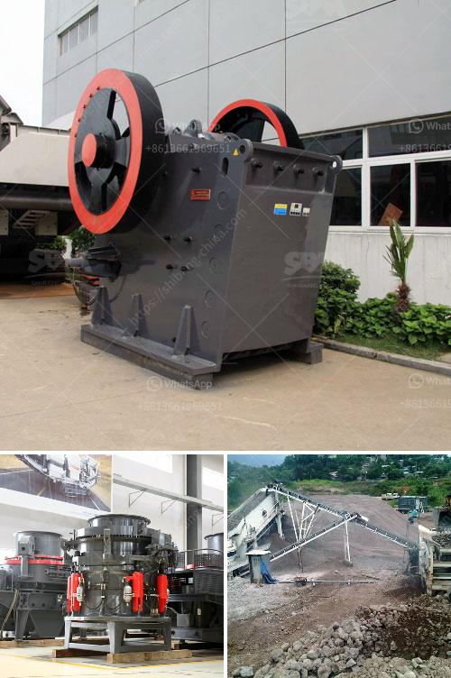

<h3>How to crush coal in power plant?</h3>
Coal has been one of the primary sources for electricity generation for decades. To ensure a steady supply of energy, coal needs to be crushed into a fine powder before it can be used in power plants. Crushing coal in a power plant is a vital process that plays a crucial role in the overall efficiency and reliability of the facility. In this article, we will explore the steps involved in crushing coal in a power plant.

The first step in the coal crushing process is extraction. Coal is typically mined from underground or open-pit mines. Once extracted, the coal is loaded onto trucks or conveyor belts for transportation to the power plant. The coal may undergo a preliminary crushing before being transported to the plant, depending on its size and quality.

At the power plant, coal is received and stored in large bunkers or silos. These storage facilities can hold hundreds of tons of coal and are strategically placed adjacent to the power plant to ensure a continuous supply. From the storage facility, the coal is fed into a crusher.

The crusher is a machine designed to reduce the size of large rocks or coal into smaller rocks or coal particles. It uses mechanical force, such as compression, to achieve this. Typically, a primary crusher is used to reduce the size of the coal to a manageable size. The primary crusher may be equipped with a grizzly feeder that allows large rocks or coal to be separated from finer particles.

After the primary crushing, the coal is further reduced in size by secondary crushers. These crushers can be cone crushers, jaw crushers, or impact crushers. The secondary crushers break down the coal into smaller particles, ensuring a more consistent and uniform size.

Once the coal is crushed to the desired size, it is then transported to the power plant for combustion. The crushed coal is typically transported using conveyor belts or pneumatic systems. Care must be taken during transportation to prevent any losses or degradation of the crushed coal.

In the power plant, the crushed coal is then pulverized into a fine powder. This is achieved using pulverizing mills, which grind the coal into a powder with the desired fineness. These powdered coal particles are then blown into a furnace, where they are ignited to produce steam. The steam, in turn, drives turbines connected to generators, producing electricity.

Crushing coal in a power plant is an intricate process that requires careful planning and execution. Proper crushing ensures the coal is adequately prepared for combustion and maximizes the efficiency of the power plant. By breaking down the coal into smaller particles, the surface area is increased, allowing for better combustion and heat transfer.

In conclusion, crushing coal in a power plant is a crucial step in the energy generation process. Through a series of crushers and pulverizing mills, the coal is prepared for combustion, ultimately producing electricity. Energy companies must ensure the proper equipment and processes are in place to crush the coal efficiently and reliably, ensuring a steady supply of electricity for consumers.
<h3>Contact us</h3><ul><li><strong>Whatsapp:&nbsp;<a href="https://wa.me/8613661969651">+8613661969651</a></strong></li><li><a href="https://swt.shibang-china.com/?git&amp;zhl&amp;How to crush coal in power plant"><strong>Online Service(chat now)</strong></a></li></ul><h3>Related</h3><ul><li><a href='How to make sand from rocks.md'>How to make sand from rocks?</a></li><li><a href='How to set up a mine crushing station in the Philippines ？.md'>How to set up a mine crushing station in the Philippines ？</a></li><li><a href='How to crush drain rock using a crusher.md'>How to crush drain rock using a crusher?</a></li><li><a href='How to design an iron ore processing facility with crushing and beneficiation.md'>How to design an iron ore processing facility with crushing and beneficiation?</a></li><li><a href='How to improve coal crusher hammer life .md'>How to improve coal crusher hammer life ?</a></li></ul>