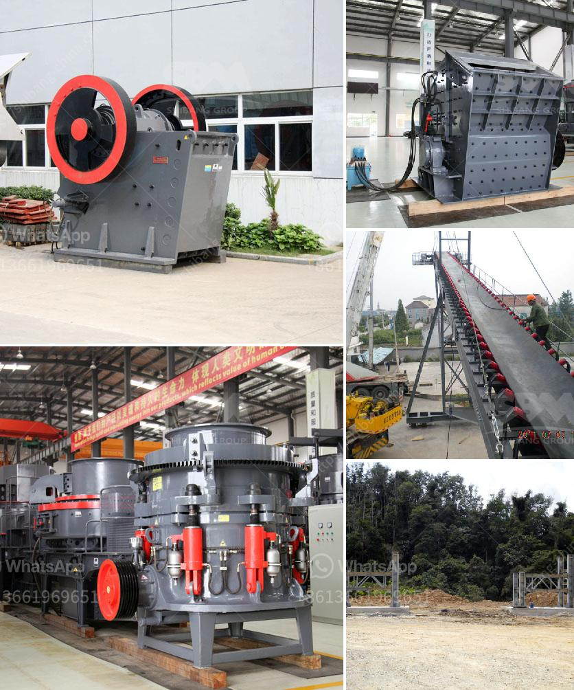

<h3>How to crush concrete for recycling ?</h3>
Concrete is a versatile and durable building material that is widely used in construction projects. However, there comes a time when concrete structures reach the end of their life cycle, and they need to be demolished or replaced. Instead of disposing of the concrete waste, it can be crushed to create recycled aggregates that have a variety of uses in new construction projects. Crushing concrete for recycling is not only economically viable, but also provides an environmentally friendly solution by reducing the need for extracting natural resources and minimizing waste.

1. A portable concrete crusher or a tracked crusher is the ideal equipment for recycling concrete. These crushers are designed to process construction waste into a crushed recycled concrete aggregate (RCA). This process involves feeding the concrete into the crusher and then breaking it down into smaller pieces.

2. Jaw crushers are the most commonly used crushers for crushing concrete. They are often used as primary crushers because they can handle large amounts of material at once. The concrete is fed into the jaw crusher on a vibrating grizzly feeder, which prevents the material from sticking to the jaws.

3. Impact crushers are another popular choice for crushing concrete. They work by using a spinning rotor with blow bars that strike the material, causing it to break down into smaller pieces. Impact crushers are suitable for both primary and secondary crushing of concrete.

4. Cone crushers can also be used to crush concrete. The material is fed into a chamber that has a concave surface, which rotates and crushes the concrete against a fixed concave wall. Cone crushers are mainly used for secondary or tertiary crushing of concrete.

5. Excavators with hydraulic breakers or jackhammers can be used to break down large concrete pieces before they are fed into crushers. This method is particularly useful for concrete with reinforced steel, as the hydraulic breakers can easily break the steel bars and separate them from the concrete.

6. Once the concrete has been crushed, it can be screened to remove any contaminants and separate the different sizes of aggregate. This provides a clean and uniform recycled concrete aggregate that can be used in various construction applications, such as road base, drainage layers, and even new concrete production.

Crushing concrete for recycling offers many benefits. Firstly, it helps reduce landfill waste by reusing the material instead of disposing of it. Secondly, it reduces the need for extracting and processing new natural resources, such as gravel and sand, as recycled concrete can be used as a substitute. Lastly, crushing concrete for recycling reduces greenhouse gas emissions by minimizing the need for transportation and processing of new materials.

In conclusion, crushing concrete for recycling is a sustainable and environmentally friendly practice that contributes to the circular economy. By following the methods and using the appropriate equipment, concrete waste can be transformed into valuable recycled aggregates. This not only minimizes the environmental impact but also offers cost-effective solutions for construction projects. Together, we can promote sustainability in the construction industry by adopting such practices and reducing our reliance on natural resources.
<h3>Contact us</h3><ul><li><strong>Whatsapp:&nbsp;<a href="https://wa.me/8613661969651">+8613661969651</a></strong></li><li><a href="https://swt.shibang-china.com/?git&amp;zhl&amp;How to crush concrete for recycling "><strong>Online Service(chat now)</strong></a></li></ul><h3>Related</h3><ul><li><a href='How does a stone crushing plant work.md'>How does a stone crushing plant work?</a></li><li><a href='How to prevent crusher equipment from rusting .md'>How to prevent crusher equipment from rusting ?</a></li><li><a href='How to choose manganese ore crushing machinery.md'>How to choose manganese ore crushing machinery?</a></li><li><a href='How to use concrete ball mill ？.md'>How to use concrete ball mill ？</a></li><li><a href='How to build a manganese ore concentrator What crushing machinery do you need.md'>How to build a manganese ore concentrator? What crushing machinery do you need?</a></li></ul>