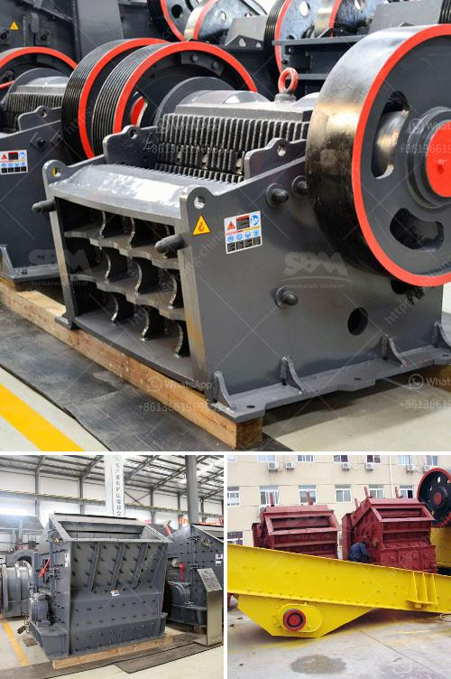

<h3>How to crush drain rock using a crusher?</h3>
Drain rock, or aggregate, is a popular material used in various construction projects and landscaping designs. It is primarily made up of small, sharp-edged stones that provide excellent drainage capabilities. However, sometimes drain rock needs to be crushed into smaller sizes to meet specific project requirements. Using a crusher is an effective way to break down drain rock into more manageable pieces. In this article, we will explore how to crush drain rock using a crusher.

The first step in crushing drain rock is to select the appropriate crusher for the job. There are various types of crushers available, each with its unique features and capabilities. Some common options include jaw crushers, cone crushers, impact crushers, and gyratory crushers. Consider factors such as the desired size of the crushed drain rock, the amount of crushing required, and the budget when selecting the crusher.

Before crushing the drain rock, it is essential to prepare it appropriately. Remove any large debris or foreign objects that could damage the crusher or hinder the crushing process. Ensure that the drain rock is clean and free from excess moisture, as excessive dampness can impact the crusher's efficiency and result in subpar crushed material.

Once the drain rock is ready, it needs to be loaded into the crusher. Depending on the type of crusher being used and the available equipment, this process can vary. For jaw crushers, a vibrating feeder or grizzly can be used to transfer the rocks to the crusher. Cone crushers often have a built-in system for automatically feeding the material. Regardless of the method, it is crucial to follow the manufacturer's guidelines to load the crusher safely and efficiently.

Proper crusher settings are vital to achieve the desired size and quality of the crushed drain rock. Depending on the crusher type, adjustments can be made to control the size of the output. Jaw crushers often have a toggle plate that can be adjusted to regulate the opening at the bottom of the jaws. Cone crushers typically come with a hydraulic system that allows for the adjustment of the crusher's closed side setting (CSS). Follow the manufacturer's instructions to ensure accurate and precise adjustments.

Operating the crusher safely is paramount to avoid accidents and injuries. Familiarize yourself with the crusher's operating manual and safety guidelines. Always wear appropriate personal protective equipment (PPE), such as safety glasses, safety shoes, and earmuffs, when operating the crusher. Regularly inspect and maintain the crusher to ensure its safe and efficient operation.

Once the drain rock is crushed to the desired size, it can be collected and utilized. There are various applications for crushed drain rock, such as drainage systems, road construction, landscaping projects, and concrete production. Dispose of any excess or unwanted crushed material responsibly, following local regulations.

In conclusion, crushing drain rock using a crusher is a straightforward process that requires careful planning and adherence to safety guidelines. Selecting the appropriate crusher, preparing the drain rock, loading the crusher properly, adjusting the crusher settings, operating the crusher safely, and effectively utilizing the crushed material are the key steps in successfully crushing drain rock. By following these steps, you can ensure a smooth and efficient process that meets your project's requirements.
<h3>Contact us</h3><ul><li><strong>Whatsapp:&nbsp;<a href="https://wa.me/8613661969651">+8613661969651</a></strong></li><li><a href="https://swt.shibang-china.com/?git&amp;zhl&amp;How to crush drain rock using a crusher"><strong>Online Service(chat now)</strong></a></li></ul><h3>Related</h3><ul><li><a href='how to realize the feeding control of raymond mill .md'>how to realize the feeding control of raymond mill ?</a></li><li><a href='How to make sand from rocks.md'>How to make sand from rocks?</a></li><li><a href='How does a stone crusher work.md'>How does a stone crusher work?</a></li><li><a href='How to start a business stone mining .md'>How to start a business stone mining ?</a></li><li><a href='How to select the screen size for a crusher plant.md'>How to select the screen size for a crusher plant?</a></li></ul>