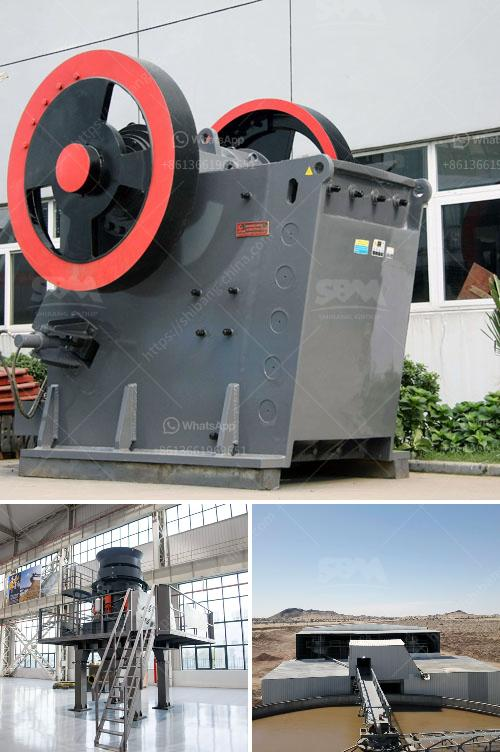

<h3>How to crush feldspar with impact crusher ？</h3>
Feldspar is a common raw material used in glassmaking, ceramics, and other industrial applications. It is a group of minerals consisting of aluminum silicates with potassium, sodium, and calcium as the major components. To meet the demand for feldspar, it is necessary to crush feldspar into small particles for further processing. One of the most efficient ways to crush feldspar is with an impact crusher.

An impact crusher is a machine that uses striking impacts to crush materials. The materials are fed into the machine through a feed opening and are struck by rapidly rotating hammers. As the hammers strike the materials, they are shattered into smaller pieces. This process is repeated until the desired size is achieved.

1. Preparation: Before entering the impact crusher, feldspar needs to be thoroughly processed. The raw material should be screened to remove impurities such as soil, rocks, or any other debris. This step ensures that only clean and pure feldspar enters the crusher, maximizing its efficiency.

2. Selection of the right impact crusher: Choosing the right impact crusher is crucial for effective crushing. Factors to consider include the desired output size, the hardness and abrasiveness of the feldspar, the type of impact crusher (horizontal or vertical shaft), and the capacity requirements. Consulting with experts or engineers can help determine the most suitable impact crusher for the specific application.

3. Adjusting the impact crusher: Once the impact crusher is selected, it needs to be set up correctly for feldspar crushing. This includes adjusting the rotor speed, the impact plates, and the clearance between the hammers and the impact plates. These adjustments ensure optimal crushing efficiency and prevent excessive wear on the machine.

4. Feeding the feldspar: Proper feeding of the impact crusher is essential for optimal performance. The feldspar should be evenly distributed across the entire width of the crusher's feed opening. It is important to avoid overloading the crusher, as this can result in reduced productivity and increased wear on the machine.

5. Monitoring and maintenance: Regular monitoring and maintenance of the impact crusher are crucial to ensure its longevity and efficient performance. This includes checking the wear parts, such as the hammers, impact plates, and liners, and replacing them when necessary. Lubrication and inspection of the crusher's internal components should also be carried out regularly.

By following these steps, it is possible to crush feldspar efficiently with an impact crusher. This machine offers high capacity and excellent reduction ratios, making it a popular choice for feldspar crushing in various industries. However, it is important to select the right impact crusher and properly maintain it to ensure long-term performance. With the correct approach, crushing feldspar becomes a straightforward and efficient process, helping meet the demand for this important industrial material.
<h3>Contact us</h3><ul><li><strong>Whatsapp:&nbsp;<a href="https://wa.me/8613661969651">+8613661969651</a></strong></li><li><a href="https://swt.shibang-china.com/?git&amp;zhl&amp;How to crush feldspar with impact crusher ？"><strong>Online Service(chat now)</strong></a></li></ul><h3>Related</h3><ul><li><a href='How to commission a limestone crusher first.md'>How to commission a limestone crusher first?</a></li><li><a href='How to Use Cone Crusher and Jaw Crusher ？.md'>How to Use Cone Crusher and Jaw Crusher ？</a></li><li><a href='How does a stone crushing plant work.md'>How does a stone crushing plant work?</a></li><li><a href='How to install a gyratory crusher 7 steps are critical.md'>How to install a gyratory crusher? 7 steps are critical</a></li><li><a href='How To Build Your Own Rock Crusher Plant？.md'>How To Build Your Own Rock Crusher Plant？</a></li></ul>