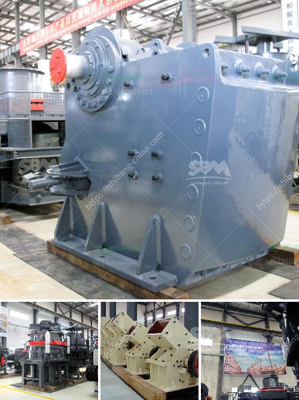

<h3>How to crush granite?</h3>
Granite, with its stunning beauty and durability, has become a popular choice for countertops, flooring, and other construction applications. But what do you do when you need to crush granite for a specific project? Crushing granite can be a challenging task, especially if you're not equipped with the right tools and knowledge. In this article, we'll guide you through the process of crushing granite, providing you with valuable insights and helpful tips.

Before you begin any crushing operations, prioritize safety. Wear protective gear such as gloves, safety glasses, and a dust mask to protect yourself from potential hazards, like flying debris or dust particles. Make sure the area is clear of any obstructions and follow all safety protocols to prevent accidents.

Start by determining the purpose of crushing granite. Are you looking to create small crushed granite pieces for landscaping, or do you need finely crushed granite for construction purposes? The end goal will help you determine the type and size of equipment you'll need. It's also wise to study the surface area and consider any potential obstacles that may impede the process.

The primary tool you'll need to crush granite is a crushing machine. There are several types to choose from, such as jaw crushers, cone crushers, and impact crushers. Each crusher has its own set of features and specifications, so make sure you choose one that is suitable for your specific needs. Additionally, consider the required production capacity and maintenance requirements.

Before placing the granite into the crusher, ensure all large pieces are broken down into smaller, more manageable sizes. This can be done using a sledgehammer or any other heavy tool. Removing any excess dirt or debris from the granite will make the crushing process more efficient.

Once you have prepared the granite, feed it carefully into the crusher. Use the appropriate controls to adjust the settings and ensure a consistent feed rate. Avoid overloading the crusher, as this may cause damage to the machine or result in poor-quality crushed granite. Regularly inspect the crushing machine for any signs of wear or potential issues.

Throughout the crushing process, keep a close eye on the output size of the crushed granite. Ideally, the crushed granite should have a uniform size for the intended application. If necessary, adjust the crusher's settings to achieve the desired output size. Regularly check the crushed granite for any impurities or uneven pieces.

Once the granite has been crushed to the desired size, collect and store it properly. Use appropriate containers or bags to prevent contamination and ensure easy transportation. Store the crushed granite in a dry and secure area until it's ready for use.

In conclusion, crushing granite requires attention to safety precautions, careful planning, and the use of suitable equipment. By following the steps outlined in this guide, you'll be well-equipped to crush granite efficiently and effectively. Whether you're a contractor or a DIY enthusiast, successfully crushing granite will open up numerous possibilities for its use in various applications.
<h3>Contact us</h3><ul><li><strong>Whatsapp:&nbsp;<a href="https://wa.me/8613661969651">+8613661969651</a></strong></li><li><a href="https://swt.shibang-china.com/?git&amp;zhl&amp;How to crush granite"><strong>Online Service(chat now)</strong></a></li></ul><h3>Related</h3><ul><li><a href='How to calculate the payback period for a coal mine.md'>How to calculate the payback period for a coal mine?</a></li><li><a href='How to choose a supplier of stone crushers.md'>How to choose a supplier of stone crushers?</a></li><li><a href='How to select a Highquality sand making machine.md'>How to select a High-quality sand making machine?</a></li><li><a href='How to start a stone quarry business.md'>How to start a stone quarry business?</a></li><li><a href='How to choose a limestone hammer mill ？.md'>How to choose a limestone hammer mill ？</a></li></ul>